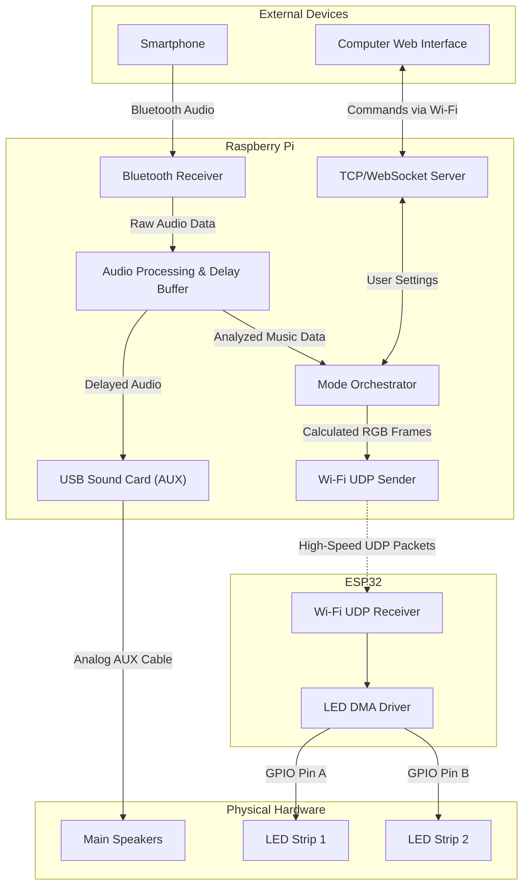

# Audio Lookahead & Hardware Pipeline Implementation Plan

This document outlines the architecture and software changes required to implement the 5-second Audio Lookahead system within the Vialactée project.

## 1. Hardware Pipeline Overview

To achieve perfect synchronization and offload Bluetooth processing, the physical architecture will be wired as follows:

1. **The Brain (Raspberry Pi):**

   * Acts as the primary Bluetooth A2DP Sink to receive the audio stream directly from the user's phone.
   * Vialactée Python code processes the audio instantly for FFT and music analysis.
   * Queues the audio in a 5-second delay buffer and pushes the delayed audio out via a high-quality analog output (e.g., USB Sound Card) directly to the main Speakers.
   * Runs the asynchronous TCP/WebSocket server for the Wabb-Interface to manage user settings.
   * Calculates the LED math and broadcasts the RGB frames via Wi-Fi UDP.
2. **LED Controller (ESP32):**

   * Receives pre-calculated RGB UDP packets from the Raspberry Pi over the local Wi-Fi router.
   * Uses a DMA driver to push data in parallel to two WS2812B NeoPixel strips (e.g., 650 LEDs each), achieving 50+ FPS without needing to compute the heavy audio DSP or process Bluetooth.

### Architecture Diagram

## 2. Software Changes Needed in Vialactée

To support this "Audio Lookahead" system, we need to modify the internal Python engine. The processing must happen instantly, but the audio output and LED visualization must be delayed to match.

### Phase 1: Upgrading `Local_Microphone.py`

Currently, `Local_Microphone.py` only listens. It must be upgraded to a duplex stream (listen and broadcast).

* **Implement a Ring Buffer:** Create a large NumPy array in `__init__` to hold exactly 5 seconds of audio. At a sample rate of 44,100 Hz, this buffer will be `220,500` samples long.
* **Upgrade to Full Duplex `sd.Stream`:** Replace `sd.InputStream` with `sd.Stream` so the callback receives both `indata` and `outdata` arrays.
* **Modify the `audio_callback`:**
  1. Immediately forward the chunk in `indata` to the FFT and Beat Detection engine (the "future" logic).
  2. Pull the oldest chunk from the 5-second ring buffer and write it to the `outdata` array (sending it instantly over Aux to the speakers).
  3. Overwrite the pulled data in the ring buffer with the new `indata` chunk.

### Phase 2: Synchronizing the LEDs (`Listener.py` / `Mode_master.py`)

If the audio is delayed by 5 seconds, the visual LED commands must also understand this delay, otherwise the LEDs will flash 5 seconds before the speakers play the sound.

* **Calculate Total System Latency:**
  * Let $D_{buffer} = 5.0$ seconds.
  * Let $L_{AUX}$ = The physical latency of the Aux cable (0.0 seconds).
  * Let $L_{UDP}$ = The network latency to the ESP32 LED driver (e.g., ~0.02 seconds).
  * The LEDs must be delayed by exactly: $Delay_{visuals} = D_{buffer} - (L_{AUX} + L_{UDP})$ = e.g., 4.98 seconds.
* **Implementing the Delay:**
  * *Option A (Delay the visual trigger):* Instruct `Mode_master` to push calculated frames into a First-In-First-Out (FIFO) queue for ~4.78 seconds before sending them to `Connector.py`.
  * *Option B (Delay the DSP output):* Have `Listener.py` queue its output metrics (`fft_band_values`, `chroma_values`, beat flags) for ~4.78 seconds before `Mode_master` reads them to render the frame.

### Phase 3: Setup & Testing Requirements

* **Linux Audio Configuration:** The Raspberry Pi's ALSA/PulseAudio system must have the USB Sound Card set as both the default recording device AND the default output device (`hw:1,0` usually).
* **Latency Calibration Mode:** Because we eliminated the unpredictable Bluetooth Jitter using a physical Aux cable, calibration is mathematically flawless. The $L_{UDP}$ offset can simply be hardcoded to `~0.015s`, yielding a rock-solid `4.985s` LED delay.

## 3. Algorithmic Processing Engine: Dual-Flux Tracker

The continuous rhythm processing has recently been upgraded to successfully bypass the limitations seen in non-causal standard analyzers (like `librosa.beat.beat_track`):

* **Frequency Decoupling:** The 8 custom audio frequency bands have been explicitly decoupled into `bass_flux` (bands 0 and 1) and `treble_flux` (bands 6 and 7).
* **Strict Phase Inertia:** Instead of simply following the loudest peak in an ODF buffer (which can momentarily switch to Hi-Hats during an EDM drop or drum break), the tracker maintains a Gaussian Phase Inertia (variance=0.20) that brutally punishes any 180-degree phase inversions.
* **Dual Magnetic Lookahead Snapping:**
  * Once a "Main Beat" passes through the 5-second `future_queue`, it seeks its exact local maximum peak evaluating **only** the `bass_flux`.
  * "Sub-beats" are separately snapped evaluating **only** the `treble_flux`.
  * This guarantees we do not falsely shift our Main beats up onto adjacent snares.
