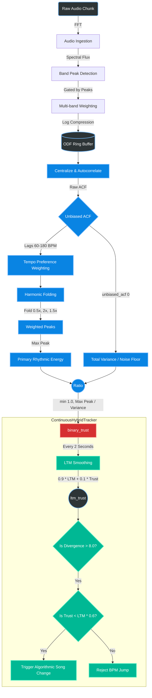

# BPM Trust Architecture

This document maps out exactly how the BPM Trust is calculated in the `ContinuousHybridTracker.ipynb` simulation loop, starting from the raw audio waveform down to the smoothed Long Term Memory (LTM) Trust that gatekeeps BPM jumps.

## The Data Flow

## Step-by-Step Explanation

### 1. The ODF (Onset Detection Function)
The system continuously calculates **Spectral Flux** (the positive rise in volume across frequencies). When a peak is detected, it applies a heavy logarithmic compression (`np.log1p`) to equalize loud bass drums and quiet hi-hats. This energy is added to an 8.5-second sliding history buffer called the `odf_buffer`.

### 2. Autocorrelation (ACF)
The `odf_buffer` is centered (mean subtracted) and multiplied against itself (Autocorrelation). This reveals recurring periodic patterns. 
* We extract `unbiased_acf[0]`, which is the correlation at lag 0. This mathematically represents the **absolute variance** (or total rhythmic energy/noise) currently present in the 8.5-second window.

### 3. Harmonic Folding
The system scans the ACF for peaks corresponding to tempos between 60 and 180 BPM. To ensure complex drum patterns don't penalize the primary beat, it performs **Polyrhythmic Folding**. If there is energy at double-time (e.g., 8th notes) or triplets (1.5x), that energy is stacked back onto the fundamental, slower tempo peak.

### 4. The `binary_trust` Calculation (`AudioAnalyzer.py`)
This is the core mathematical heart of the confidence score:
`binary_trust = min(1.0, max_peak / variance)`

It divides the energy of the strongest folded tempo peak by the total variance of the entire buffer. 
* **High Trust (~1.0):** If a single steady 4/4 beat dominates the audio, the strongest peak contains almost all the variance in the buffer. The ratio hits 1.0.
* **Low Trust (~0.1):** If the audio is ambient noise, vocals, or chaotic splashing, the energy is scattered randomly. The variance is high, but no single tempo peak stands out, resulting in a tiny fraction.

### 5. Long-Term Smoothing (`ContinuousHybridTracker.ipynb`)
Because instantaneous trust can jitter wildly during drum fills or vocal breaks, the simulation loop samples `binary_trust` every 2 seconds (120 frames).
It applies an exponential moving average:
`ltm_trust = (0.9 * ltm_trust) + (0.1 * binary_trust)`

This creates the smooth green line in your plot. 

### 6. The Gatekeeper
If the tracker suddenly wants to jump to a vastly different BPM (e.g., divergence > 8.0 BPM), it looks at the current `binary_trust` compared to `ltm_trust`. If the current trust has dropped significantly (`< 60%` of the moving average), it knows the jump is due to a breakdown in the rhythm (like a quiet bridge or song transition), and it permits a hard reset. If the trust remains high, it rejects the jump as an algorithmic hallucination.
