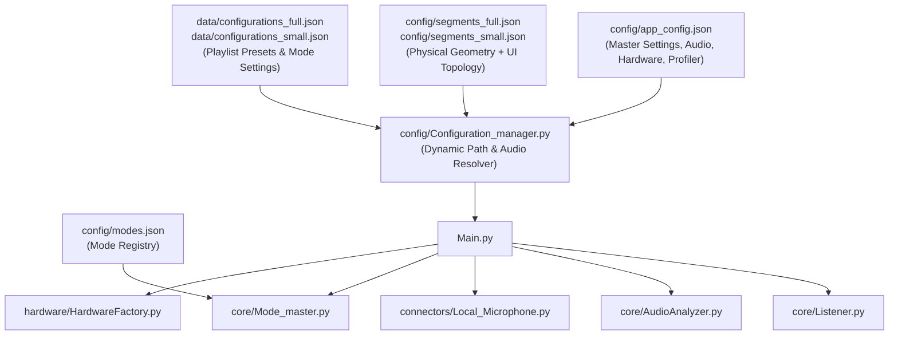

# Configuration Master Reference (`config_descriptions.md`)

> **Location:** `.agents/docs/config_descriptions.md`  
> **Scope:** Comprehensive guide to every configuration file, parameter, environment flag, hardware profile, audio preset, and segment topology in the *Vialactée* project.

---

## 1. Architecture of the Configuration Subsystem

Vialactée uses a centralized, dynamic configuration architecture. Configuration is split into three main layers:



### Invariant Rules
1. **Never Hardcode File Paths:** Never import static strings like `"config/segments_full.json"`. Always use:
   * `Configuration_manager.resolve_segments_file_path(infos)`
   * `Configuration_manager.resolve_configurations_file_path(infos)`
2. **Synchronized `infos` Dictionary:** In `Main.py`, `app_config.json` is loaded into a dictionary (`infos`), passed to `Configuration_manager.resolve_audio_config(infos)`, and then passed into subsystems (`Listener`, `Local_Microphone`, `Mode_master`, `HardwareFactory`).
3. **Live Deck Persistence:** Changes made to `luminosity` or `sensibility` via the Web UI or runtime are persisted back to `config/app_config.json` by `Mode_master`.

---

## 2. Master Configuration: `config/app_config.json`

The root configuration file governing server launch, audio ingestion, hardware drivers, and profiling.

### Full Schema Reference Table

| Key | Type | Default | Accepted Values | Subsystem | Description |
| :--- | :--- | :--- | :--- | :--- | :--- |
| `audio_preset` | string | `"spotify"` | `"spotify"`, `"spotify_aux"`, `"aux"`, `"mic"`, `"custom"` | `Configuration_manager`, `Local_Microphone`, `AudioAnalyzer` | High-level audio routing preset. Automatically sets device IDs, channels, and delay. |
| `useMicrophone` | boolean | `true` | `true`, `false` | `Local_Microphone`, `AudioIngestion` | Master switch for audio capture. If `false`, audio ingestion is disabled entirely. |
| `input_device_id` | int / string / null | `null` | Device index or partial name | `Local_Microphone` | Explicit input audio device override. Ignored unless preset is `"custom"` or device not found. |
| `output_device_id` | int / string / null | `null` | Device index or partial name | `Local_Microphone` | Explicit output audio device override for delayed lookahead playback. |
| `fakeDelay` | float | `5.0` | $\ge 0.0$ (typically `0.0` or `5.0`) | `AudioAnalyzer`, `Listener`, `Local_Microphone` | Lookahead anticipation duration in seconds. When $> 0$, audio is delayed before speaker output. |
| `hardware_profile` | string | `"full"` | `"full"`, `"small"` | `Configuration_manager`, `HardwareFactory`, `Mode_master` | Physical chandelier profile. `"full"` (1,304 LEDs, 11 segs, 2 channels) or `"small"` (249 LEDs, 3 segs, 1 channel). |
| `HARDWARE_MODE` | string | `"auto"` | `"auto"`, `"simulation"`, `"esp32"`, `"rpi"` | `HardwareFactory` | Hardware execution mode. See Section 4 for driver resolution logic. |
| `esp32_ip` | string | `"192.168.0.26"` | IPv4 string | `HardwareFactory`, `Udp_Sender` | Target IP address of the physical ESP32 controller when in `"esp32"` or `"auto"` mode. |
| `startServer` | boolean | `false` | `true`, `false` | `Main.py`, `Connector` | If `true`, starts the aiohttp REST and WebSocket server on `0.0.0.0:8080`. |
| `startWebApp` | boolean | `true` | `true`, `false` | `Main.py` | If `true` (and `startServer` is true), automatically runs `npm run dev` to serve Vite UI on `:5173`. |
| `show_music_analyser_panel` | boolean | `true` | `true`, `false` | `Main.py`, `Fake_leds` | In simulation, overlays the real-time DSP HUD (FFT bands, flux, BPM, beat triggers) on Pygame. |
| `luminosity` | int | `50` | `0` to `100` | `AudioIngestion`, `Mode_master` | Master brightness percentage. Persisted across sessions when altered via Web UI. |
| `sensibility` | int | `50` | `1` to `100` | `AudioIngestion`, `Mode_master` | Audio sensitivity gain percentage. Lower = less reactive, higher = triggers on quiet sounds. |
| `auto_transition_time` | int | `80` | $\ge 10$ (seconds) | `Mode_master`, `Transition_Director` | Interval between automatic playlist preset transitions. |
| `log_level` | string | `"INFO"` | `"DEBUG"`, `"INFO"`, `"WARNING"`, `"ERROR"` | `Main.py` | Logger verbosity level for console and `vialactee.log` rotating file handler. |
| `latency` | float | `0.0` | Seconds (float) | `AudioAnalyzer` | Hardware output latency offset added to phase calculation ($T_{\text{speaker}}$). |
| `decay_base` | float | `0.98` | Float in $(0.90, 0.999)$ | `AudioAnalyzer` | Exponential decay rate applied to ODF peaks and running beat trust. |
| `printCpuFpsInfo` | boolean | `false` | `true`, `false` | `Mode_master`, `Profiler` | If `true`, outputs execution metrics and FPS logs to stdout at profiler intervals. |
| `profiler` | object | `{...}` | JSON object | `Profiler` | Detailed loop profiling configuration. See Section 5. |

---

## 3. Audio Presets (`audio_preset`)

The `"audio_preset"` setting automates audio input and output device selection and sets the appropriate delay mode without requiring manual device IDs.

```json
{
    "audio_preset": "spotify"
}
```

### Supported Presets Detailed

#### 1. `"spotify"` (Default — Spotify In, PC Speakers Out with 5s Prediction)
* **Goal:** Play Spotify on your computer, analyze 5s ahead for predictive lights, and play out through the **computer's built-in speakers** with 5s delay.
* **Input Device:** Virtual Audio Cable (`"Line 1 (Virtual Audio Cable)"` / `"CABLE Output"`).
* **Output Device:** Computer Speakers (`"Speakers (Realtek(R) Audio)"` / `"Haut-parleurs"`).
* **`fakeDelay`:** `5.0s`.
* **Setup Required:** In Windows Volume Mixer, route Spotify's output to *Line 1 (Virtual Audio Cable)*. Make sure Python's volume is set to 100%.

#### 2. `"spotify_aux"` (Spotify In, AUX Jack Out with 5s Prediction)
* **Goal:** Play Spotify on your computer, analyze 5s ahead for predictive lights, and play out through the **3.5mm AUX jack** to an external sound system / speakers with 5s delay.
* **Input Device:** Virtual Audio Cable (`"Line 1 (Virtual Audio Cable)"` / `"CABLE Output"`).
* **Output Device:** AUX / Headphone Jack (`"Speakers 2"`, `"Casque"`, `"Headphones"`, or external output).
* **`fakeDelay`:** `5.0s`.
* **Setup Required:** In Windows Volume Mixer, route Spotify's output to *Line 1 (Virtual Audio Cable)*. Connect external sound system to the 3.5mm AUX jack.

#### 3. `"aux"` (External Player / Phone into AUX Jack with 5s Prediction)
* **Goal:** An external phone, DJ deck, or instrument is plugged into the computer's 3.5mm jack.
* **Input Device:** Line In / Mic In (`"line in"`, `"entrée ligne"`, `"aux"`).
* **Output Device:** PC Speakers (`"speakers"`, `"haut-parleur"`).
* **`fakeDelay`:** `5.0s`.
* **Audio Flow:** Audio enters through the 3.5mm jack, is analyzed 5s in advance, and plays out of the speakers 5 seconds later in sync with the chandelier.

#### 4. `"mic"` (Ambient Room Microphone — Real-Time)
* **Goal:** Chandelier reacts to live music or voices in the room via the laptop/PC microphone.
* **Input Device:** Default system microphone.
* **Output Device:** `None` (read-only `sd.InputStream`, output muted to prevent room acoustic feedback).
* **`fakeDelay`:** `0.0s`.

#### 5. `"custom"` (Manual Hardware Control)
* **Goal:** Explicit manual device routing.
* **Behavior:** `resolve_audio_config` will not touch your config. It strictly uses whatever `input_device_id`, `output_device_id`, and `fakeDelay` you write in `app_config.json`.

---

## 4. Hardware Driver Modes (`HARDWARE_MODE`)

The `HARDWARE_MODE` setting in `app_config.json` dictates how frames generated by `Mode_master` are dispatched to LEDs.

```json
{
    "HARDWARE_MODE": "auto",
    "hardware_profile": "full",
    "esp32_ip": "192.168.0.26"
}
```

### Driver Resolution Options:

| Mode | On Windows | On Raspberry Pi | Purpose |
| :--- | :--- | :--- | :--- |
| `"auto"` (Default) | Spawns `Fake_ESP32` UDP listener and opens Pygame simulation window. | Uses `Udp_Sender` to stream packets to `esp32_ip`. | Zero-config cross-platform default. |
| `"simulation"` | Spawns `Fake_ESP32` subprocess listening on `127.0.0.1:9001/9002` + Pygame GUI. | Same as Windows (launches X11 Pygame GUI). | Forced local visualizer. |
| `"esp32"` | Sends UDP packets over network to `esp32_ip` ports 9001/9002. | Sends UDP packets over network to `esp32_ip` ports 9001/9002. | Production network streaming to microcontroller. |
| `"rpi"` | Falls back to simulation with warning. | Uses direct GPIO DMA NeoPixels (`board.D21`, `board.D18`) via `rpi_ws281x`. | Legacy direct GPIO connection on Raspberry Pi. |

### Channel Specification Overrides
When using multiple LED channels, `HardwareFactory` defaults to:
* **Full Profile**: Channel 1 (785 LEDs, port `9001`, pin `D21`), Channel 2 (519 LEDs, port `9002`, pin `D18`). Total: 1,304 LEDs.
* **Small Profile**: Channel 1 (249 LEDs, port `9001`, pin `D21`). Total: 249 LEDs.

You can override channel counts and ports in `app_config.json`:
* `led_count1`, `led_count2`
* `led_port1`, `led_port2`
* `led_pin1`, `led_pin2`

---

## 5. Performance Profiler Configuration (`profiler`)

Granular loop profiling parameters inside `app_config.json`:

```json
"profiler": {
    "interval_seconds": 5.0,
    "format": "dashboard",
    "target_fps": 30,
    "alert_threshold_ms": 35.0,
    "track_slowest_mode": true
}
```

| Parameter | Type | Default | Description |
| :--- | :--- | :--- | :--- |
| `interval_seconds` | float | `5.0` | Time between profiler output summaries in stdout. |
| `format` | string | `"compact"` | Output style: `"compact"` (single-line summary), `"dashboard"` (ASCII box metrics), or `"alerts_only"` (silent unless a frame exceeds `alert_threshold_ms`). |
| `target_fps` | int | `30` | Expected render framerate baseline for calculating overhead percentages. |
| `alert_threshold_ms` | float | `35.0` | Frame execution time (in ms) above which an alert warning is logged. |
| `track_slowest_mode` | boolean | `true` | Tracks and displays the mode that consumed the most CPU time over the interval. |

---

## 6. Mode Registry: `config/modes.json`

Maps human-readable visual mode names to Python module and class names in `/modes/`.

```json
{
  "standard_modes": [
    {
      "name": "Rainbow",
      "module": "Rainbow_mode",
      "class": "Rainbow_mode"
    },
    {
      "name": "Hyper Strobe",
      "module": "Hyper_strobe_mode",
      "class": "Hyper_strobe_mode"
    }
  ]
}
```

* **Dynamic Discovery:** `Mode_master` reads `modes.json` at startup and dynamically imports `modes.<module>.<class>`.
* **Adding a New Mode:** To register a custom mode, write `modes/My_custom_mode.py` inheriting from `modes.Mode`, then append an entry to `modes.json`.

---

## 7. Physical Geometry & UI Topology: `segments_full.json` & `segments_small.json`

These files represent the **single source of truth** uniting physical LED mapping with the Wabb Topology Web UI.

### Segment Definition Schema

```json
{
  "name": "v1",
  "size": 133,
  "orientation": "vertical",
  "start": { "x": 0, "y": 0 },
  "step": { "x": 0, "y": 1 },
  "order": 0,
  "channel": 1,
  "ui": {
    "id": "v1",
    "col": 1,
    "row": 2,
    "w": 1,
    "h": 4,
    "color": "#4A90E2"
  }
}
```

* **Physical Geometry (for spatial transitions & visualizer):**
  * `size` (or `length`): Number of physical LEDs on this strip.
  * `orientation`: `"horizontal"`, `"vertical"`, `"vertical_up"`.
  * `start` & `step`: 2D spatial coordinate vectors used by `Configurations_manager.get_segment_coordinates()` to compute spatial wave effects across strips.
  * `channel`: Hardware output channel (1 or 2).
* **UI Grid Topology (for Wabb React Interface):**
  * `ui.col`, `ui.row`, `ui.w`, `ui.h`: Studio grid positioning and sizing in the topology designer.
  * `ui.color`: Display accent color on the web interface.
* **`cables` Array (Top-level):**
  * Defines Bezier curve connections (`start`, `end`, `cp1`, `cp2`) rendered as patch cables on the Web UI.

---

## 8. Presets & Playlists: `data/configurations_*.json`

Saved playlists and segment assignments live in:
* `data/configurations_full.json` (for `hardware_profile: "full"`)
* `data/configurations_small.json` (for `hardware_profile: "small"`)

### Structure of a Configuration Entry:
```json
{
  "name": "Cosmic Drift",
  "segments": {
    "v1": { "mode": "Rainbow", "direction": 1 },
    "v2": { "mode": "Rainbow", "direction": -1 },
    "h00": { "mode": "Hyper Strobe", "direction": 1 }
  },
  "modeSettings": {
    "Rainbow": { "speed": 1.5 },
    "Hyper Strobe": { "strobe_flux_threshold": 0.65 }
  }
}
```
* `segments`: Maps each logical segment name to an active mode and animation direction (`1` for forward, `-1` for reversed).
* `modeSettings`: Configuration-scoped parameter overrides passed to mode instances.

---

## 9. Quick Configuration Recipes

### Recipe A: Studio Desktop Testing (Spotify on PC, Pygame Simulation)
```json
{
    "startServer": false,
    "useMicrophone": true,
    "audio_preset": "spotify",
    "HARDWARE_MODE": "simulation",
    "hardware_profile": "small",
    "show_music_analyser_panel": true,
    "log_level": "INFO"
}
```

### Recipe B: Live Party with External Sound System (Spotify 5s Lookahead to AUX)
```json
{
    "startServer": true,
    "startWebApp": true,
    "useMicrophone": true,
    "audio_preset": "spotify_aux",
    "HARDWARE_MODE": "esp32",
    "hardware_profile": "full",
    "esp32_ip": "192.168.1.50",
    "luminosity": 85,
    "sensibility": 60,
    "auto_transition_time": 90
}
```

### Recipe C: Guest DJ via AUX Cable
```json
{
    "useMicrophone": true,
    "audio_preset": "aux",
    "HARDWARE_MODE": "esp32",
    "hardware_profile": "full",
    "luminosity": 100,
    "sensibility": 50
}
```
