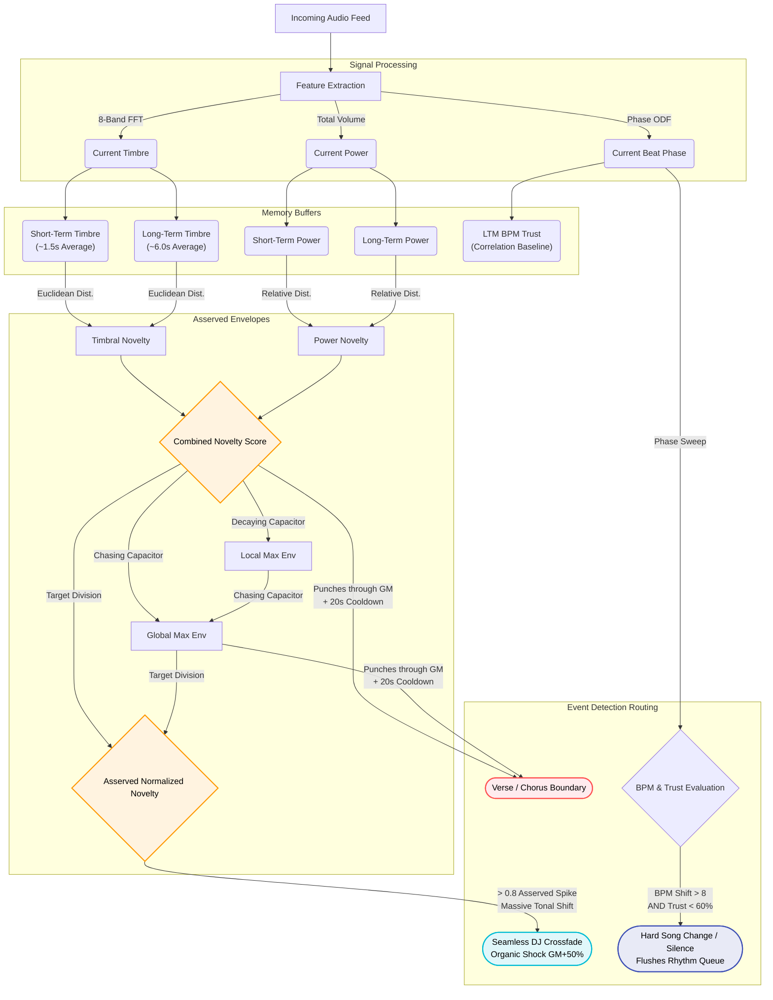

# Structural Music Events: The Architecture of Novelty

Our Hybrid Rhythm Tracker does not just output timestamps; it fundamentally "understands" the macro-structure of the music it is listening to. It is capable of autonomously drawing intelligent boundaries around **Verses/Choruses**, while reliably detecting full-blown **Song Changes** regardless of whether they are sharp cuts or seamless DJ crossfades.

This is accomplished by continuously processing the tension between the audio's **Short-Term Memory (STM)** and **Long-Term Memory (LTM)** across multiple sonic dimensions, smoothed inside elegant self-adjusting mathematical envelopes.

---

## 1. The Core Metrics

### Timbre (Texture)
The system calculates the proportion of audio power distributed across 8 frequency bands. 
- **Timbral Novelty** is mathematically derived by taking the Euclidean distance between what the song sounds like *right now* (STM: ~1.5s smoothing) against what the song has sounded like *recently* (LTM: ~6.0s smoothing).

### Power (Energy)
The system tracks the raw total volume moving through the track.
- **Power Novelty** is tracked as the relative percentage difference between the STM and LTM. This ensures a loud drop triggers identically to an acoustic breakdown fading out.

### Rhythmic Trust (Confidence)
Every 1.5 seconds, the rhythm tracker performs a massive mathematical phase sweep against the audio grid to find the exact BPM. It returns a `bpm_trust` score (how perfectly the grid correlated with the actual bass drum hits). We maintain an `LTM Trust Baseline` to know what the current track's rhythm normally feels like.

> [!NOTE]
> The **Combined Novelty Score** is the heartbeat of this entire system. It tightly merges Timbre and Power together using the formula:
> `Combined Novelty = Timbral Novelty + (0.2 * Power Novelty)`

---

## 2. Event Detection Logic (Asserved Envelopes)

Instead of using hard thresholds that break when ambient songs are too quiet or EDM drops are too loud, the engine dynamically wraps the raw Combined Novelty inside a **Local Max Envelope (LM)** and a **Global Max Envelope (GM)**. This automatically creates a perfect **Asserved Normalized Signal (0.0 to 1.0)** that intelligently adapts to any genre's energy floor.

> [!TIP]
> **Frame Rate Decoupling:** All mathematical decay envelopes (including STM/LTM memory weights, ADSR filters, and GM/LM ceilings) are dynamically raised to the power of `fps_ratio` (derived from physical `delta_time`). This strictly decouples audio analysis from hardware logic loops, ensuring that a "20-second decay" physically spans 20 seconds, even if loop speed stutters or drops on a Raspberry Pi.

### A. The Verse / Chorus Boundary
**Rule:** `Raw Novelty > Global Max Envelope`

When the song goes from a quiet acoustic verse into a loud synthesized chorus, the raw structural novelty leaps vertically.
- If the Combined Score explicitly punches *through* the Global Max Ceiling (i.e., making a completely unseen new peak), the system declares a structural change.
- **The Cooldown Protocol:** To prevent the tracker from rapid-firing boundary markers during chaotic EDM drops, a rigid **20-second cooldown** is enforced. The algorithm literally refuses to slice a new structural boundary until the dust has settled.

### B. The Seamless DJ Crossfade (Song Change type I)
**Rule:** `Asserved Novelty > 0.8` (Absolute Anomalous Spike)

Sometimes, a DJ will crossfade two continuous tracks that have the *exact same tempo*. The bass drums hit identically, so the Rhythmic Phase Tracker never skips a beat or loses trust. 
- However, the Normalized Asserved novelty climbs violently to 1.0. If the Asserved Score breaches `0.8` after normalization, the tracker mathematically deduces a brand new track has taken over.
- **The Organic Shock Absorber:** It instantly jacks up the Global Max Envelope by +50% (`GM = Novelty * 1.5`). This artificially blinds the tracker for the next 10 seconds, stopping a massive chain reaction of false verse boundaries.
- **Action:** The system flushes the standalone queue to immediately lock onto the new transient fingerprints.

### C. The Hard Song Cut (Song Change type II)
**Rule:** `ΔBPM > 8.0` AND `Current Trust < (LTM Trust * 0.6)`  *(or True Silence > 1.5s)*

When a playlist jumps tracks, or a DJ hard-cuts into a brand new BPM, the rhythm completely shatters.
- The system notices its calculated BPM has radically shifted away from its expected grid.
- It simultaneously verifies that its mathematical correlation ("Trust") has collapsed below 60% of the song's established baseline.
- **Action:** The system violently Flushes all rhythmic lookahead queues, resets its memory buffers, and surgically snaps its Phase alignment directly onto the new tempo to physically recover the groove within a fraction of a second.

### D. The Acoustic Breakdown
**Rule:** `bass_flux` flatlines AND `treble_flux` remains high.

If the bass drum cuts out entirely but vocals or synths continue, the system flags an "Acoustic Breakdown."
- **Action:** Triggers a delicate, slow fade configuration and suppresses aggressive strobes until the bass returns.

---

## 3. The Pre-Cog Architecture (5-Second Lookahead)

Because the visual pipeline is delayed by exactly 5 seconds relative to the live microphone ingestion, the system has **5 seconds of guaranteed future knowledge**. 

When a structural event or song change is detected on the live audio, the system simultaneously executes two tasks:
1. **Synchronous Triggers:** It injects the 1-frame boolean trigger (`is_song_change`, `is_verse_chorus_change`) into the `spectral_delay_queue`. This guarantees that when the `Listener` property is read, it fires *flawlessly* in sync with the delayed FFT visual rendering.
2. **Proactive Countdowns:** It immediately sets a public countdown timer (e.g., `upcoming_song_change_countdown = 5.0`). This timer counts down to 0.0, allowing the `Transition_Director` to be **proactive rather than reactive**—preparing fade-to-black sequences or crossfades *before* the drop hits the speakers.

---

## 4. The Architecture Diagram

Here is exactly how the data flows from the audio signal directly into event triggers.

---

## 5. API & Orchestration Integration

The real-time calculations from the rhythm tracker are translated into simple properties and countdowns. In Python, your instances of the `Transition_Director` or `Mode_master` should read these variables directly from the `Listener.py` object every frame loop.

| Property | When it is `True` / Triggered | Recommended Action |
| --- | --- | --- |
| `listener.upcoming_song_change_countdown` | Depletes from 5.0s to 0.0s when a song change is incoming. | Proactively start massive crossfades or fade-to-black sequences. |
| `listener.upcoming_structural_change_countdown` | Depletes from 5.0s to 0.0s when a Verse/Chorus boundary is incoming. | Proactively begin shifting generative palettes or preparing intense drops. |
| `listener.is_song_change` | True for exactly one frame. **Perfectly synchronized** with the delayed audio stream. | Finalize transition sequences. Restart generative palettes from seed parameters. |
| `listener.is_verse_chorus_change` | True for exactly one frame. **Perfectly synchronized** with the delayed audio stream. | Execute dramatic blackout strobes or instant palette swaps. |
| `listener.is_beat` | Instantly hits true roughly every 500ms aligned mathematically with the grid. | Execute step-advances on color matrices, ripple effect expansions. |
| `listener.is_sub_beat` | Hits exactly half-way between primary `is_beat` ticks. | Flash tertiary strobe layers, inverse color staggers. |
| `listener.vocals_present` | Active over chunks of time when Harmonic Product Spectrum isolates singing. | Activate secondary ACAPELLA modes, deactivate erratic strobes. |
