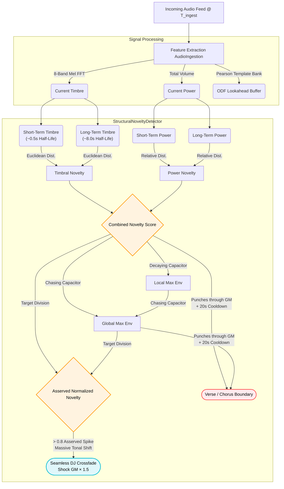

# Structural Music Events: The Architecture of Novelty

> **Status:** Current Production Architecture  
> **See Also:** Prospective event detection concepts (Hard Song Cuts, HPS Vocal Isolation, Mood Triad) are archived in [music_events_architecture_potential_ideas.md](./music_events_architecture_potential_ideas.md).

The Vialactée music analysis pipeline does not just output timestamps; it fundamentally understands the macro-structure of the music it is listening to. Implemented in [`core/StructuralNoveltyDetector.py`](file:///c:/Users/Users/Desktop/vialact%C3%A9e/vialactee/core/StructuralNoveltyDetector.py) and configured via [`core/RhythmConfig.py`](file:///c:/Users/Users/Desktop/vialact%C3%A9e/vialactee/core/RhythmConfig.py), it autonomously draws intelligent boundaries around **Verses/Choruses**, while reliably detecting full-blown **Song Changes** regardless of whether they are sharp drops or seamless DJ crossfades.

This is accomplished by continuously processing the tension between the audio's **Short-Term Memory (STM)** and **Long-Term Memory (LTM)** across multiple sonic dimensions, smoothed inside elegant self-adjusting mathematical envelopes.

---

## 1. The Core Metrics

### Timbre (Texture)
The system calculates the proportion of audio power distributed across 8 Mel frequency bands (`AudioIngestion.band_proportion`). 
- **Timbral Novelty** is mathematically derived by taking the Euclidean distance between what the song sounds like *right now* (STM: `stm_retention_base = 0.98`, ~0.5s half-life) against what the song has sounded like *recently* (LTM: `ltm_retention_base = 0.9985`, ~8.0s half-life).

### Power (Energy)
The system tracks the raw total volume moving through the track (`AudioIngestion.smoothed_total_power`).
- **Power Novelty** is tracked as the relative percentage difference between the STM and LTM. This ensures a loud drop triggers identically to an acoustic breakdown fading out.

### Rhythmic Trust (Confidence)
The rhythm tracker evaluates the 5-second lookahead buffer using the $O(1)$ Pearson Template Bank and Logarithmic Base-Tempo (LBT) class metric in [`core/AudioAnalyzer.py`](file:///c:/Users/Users/Desktop/vialact%C3%A9e/vialactee/core/AudioAnalyzer.py). It computes a real-time `beat_confidence` score (how strongly the physical audio transients correlate with the periodic template grid).

> [!NOTE]
> The **Combined Novelty Score** is the heartbeat of this entire system. It tightly merges Timbre and Power together using the formula:
> `Combined Novelty = Timbral Novelty + (power_novelty_weight * Power Novelty)`
> where `power_novelty_weight = 0.2` (configured in `RhythmConfig`).

---

## 2. Event Detection Logic (Asserved Envelopes)

Instead of using hard thresholds that break when ambient songs are too quiet or EDM drops are too loud, the engine dynamically wraps the raw Combined Novelty inside a **Local Max Envelope (LM)** and a **Global Max Envelope (GM)**. This automatically creates a perfect **Asserved Normalized Signal (0.0 to 1.0)** that intelligently adapts to any genre's energy floor.

> [!TIP]
> **Frame Rate Decoupling:** All mathematical decay envelopes (including STM/LTM memory weights, ADSR filters, and GM/LM ceilings) are dynamically raised to the power of `fps_ratio` (derived from physical `delta_time`). This strictly decouples audio analysis from hardware logic loops, ensuring that a "20-second decay" physically spans 20 seconds, even if loop speed stutters or drops on a Raspberry Pi.

### A. The Verse / Chorus Boundary
**Rule:** `Raw Novelty > Global Max Envelope`

When the song goes from a quiet acoustic verse into a loud synthesized chorus, the raw structural novelty leaps vertically:
- If the Combined Score explicitly punches *through* the Global Max Ceiling (i.e., establishing an unprecedented peak), the system declares a structural change (`is_verse_chorus_change = True`).
- **The Cooldown Protocol:** To prevent the tracker from rapid-firing boundary markers during chaotic EDM drops, a rigid cooldown (`structural_cooldown_seconds = 20.0`) is enforced. The algorithm refuses to slice a new structural boundary until the cooldown expires.

### B. The Seamless DJ Crossfade (Song Change Type I)
**Rule:** `Asserved Novelty > song_novelty_asserved_th` (Default: `0.8`, Absolute Anomalous Spike)

Sometimes, a DJ crossfades two continuous tracks that have the exact same tempo. The bass drums hit identically, so the Rhythmic Phase Tracker never skips a beat:
- However, the Normalized Asserved novelty climbs violently to 1.0. If the Asserved Score breaches `0.8` after normalization, the tracker mathematically deduces a brand new track has taken over.
- **The Organic Shock Absorber:** It instantly raises the Global Max Envelope by +50% (`GM = Novelty * gm_shock_multiplier`, default `1.5`) and engages the cooldown (`structural_cooldown_seconds = 20.0`), preventing a chain reaction of false verse boundaries.
- **Action:** Triggers `is_song_change = True`, resets beat count, and allows transition handlers to react.

### C. The Silence Drop (Song Change Type II)
**Rule:** `current_power < silence_power_threshold` (Default `5.0`) for `> 1.5s` (`silence_threshold_seconds`)

- When audio input drops below the silence floor for more than 1.5 seconds, the detector raises `is_song_change = True` (with a 5-second silence cooldown: `silence_cooldown_seconds = 5.0`).
- **Action:** Clears audio buffers, triggers ambient/chill rotations, and resets the beat phase.

---

## 3. The Pre-Cog Architecture (5-Second Lookahead)

Because the visual pipeline is delayed by exactly 5 seconds relative to the live microphone ingestion, the system has **5 seconds of guaranteed future knowledge**. 

When a structural event or song change is detected on the live audio, the system simultaneously executes two tasks:
1. **Synchronous Triggers:** It injects the 1-frame boolean trigger (`is_song_change`, `is_verse_chorus_change`) into the `spectral_delay_queue`. This guarantees that when the `Listener` property is read, it fires *flawlessly* in sync with the delayed FFT visual rendering.
2. **Proactive Countdowns:** `Transition_Director` monitors `listener.live_is_song_change` and sets a countdown timer (`upcoming_song_change_countdown = 5.0`). This timer counts down to 0.0, allowing the director to log and prepare upcoming lighting changes before the drop hits the speakers.

---

## 4. The Architecture Diagram

```mermaid
graph TD
    A[Incoming Audio Feed @ T_ingest] --> B[Feature Extraction AudioIngestion]
    
    subgraph Signal Processing
        B -->|8-Band Mel FFT| C(Current Timbre)
        B -->|Total Volume| D(Current Power)
        B -->|Pearson Template Bank| E(ODF Lookahead Buffer)
    end
    
    subgraph StructuralNoveltyDetector
        C --> F("Short-Term Timbre<br>(~0.5s Half-Life)")
        C --> G("Long-Term Timbre<br>(~8.0s Half-Life)")
        D --> H(Short-Term Power)
        D --> I(Long-Term Power)
        
        F & G -->|Euclidean Dist.| K[Timbral Novelty]
        H & I -->|Relative Dist.| L[Power Novelty]
        K & L --> M{Combined Novelty Score}
        
        M -->|Decaying Capacitor| R[Local Max Env]
        M & R -->|Chasing Capacitor| S[Global Max Env]
        M & S -->|Target Division| T{Asserved Normalized Novelty} 

        M & S -->|Punches through GM<br>+ 20s Cooldown| N([Verse / Chorus Boundary])
        T -->|> 0.8 Asserved Spike<br>Massive Tonal Shift| O([Seamless DJ Crossfade<br>Shock GM × 1.5])
    end

    style N fill:#ffebee,stroke:#ff5252,stroke-width:2px,color:#000
    style O fill:#e0f7fa,stroke:#00bcd4,stroke-width:2px,color:#000
    style M fill:#fff3e0,stroke:#ff9800,stroke-width:2px,color:#000
    style T fill:#fff3e0,stroke:#ff9800,stroke-width:2px,color:#000
```

---

## 5. API & Orchestration Integration

The real-time calculations from the novelty detector are exposed through `AudioAnalyzer` delegation properties and surfaced via `Listener.py`:

| Property | Type | When it is `True` / Triggered | Recommended Action |
| --- | :---: | --- | --- |
| `listener.is_song_change` | `bool` | True for exactly 1 frame in sync with delayed audio stream. | Finalize transition sequences. Restart generative palettes from seed parameters. |
| `listener.is_verse_chorus_change` | `bool` | True for exactly 1 frame in sync with delayed audio stream. | Execute dramatic blackout strobes or instant palette swaps. |
| `listener.live_is_song_change` | `bool` | True on the live ingestion feed (5s before physical playback). | Sets `upcoming_song_change_countdown = 5.0` in `Transition_Director`. |
| `listener.live_is_verse_chorus_change` | `bool` | True on the live ingestion feed (5s before physical playback). | Sets `upcoming_structural_change_countdown = 5.0` in `Transition_Director`. |
| `listener.asserved_novelty` | `float` | Continuous $[0.0, 1.0]$ delayed asserved novelty score. | Modulates background aura intensity and shimmer speed. |
| `listener.combined_novelty` | `float` | Continuous un-asserved composite novelty score. | Diagnostic and audio-reactive drive metric. |
| `listener.is_beat` | `bool` | True every grid cycle completion ($0.0 \rightarrow 1.0$). | Step-advances on color matrices, ripple effect expansions. |
| `listener.is_real_beat` | `bool` | True only when a **physical drum transient** hits at $T_{\text{speaker}}$. | Punchy strobe flashes, kick explosions, high-energy reactivity. |
| `listener.is_dropped_beat` | `bool` | True when the grid clicks but the song drops the beat (silence/solo). | Subtle ambient sweeps, suppressing intense strobes. |
| `listener.beat_tag` | `str` | Spectral classification (`"Bass/Kick"`, `"Snare/Mid"`, `"Hi-hat/Cymbal"`). | Instrument-specific color triggers (Red kick, Green snare, Blue hi-hat). |
| `listener.beat_confidence` | `float` | Continuous $[0.0, 1.0]$ Pearson correlation score. | Gate complex choreography to only trigger when rhythm is locked ($>0.30$). |
| `listener.beat_phase` | `float` | Continuous $[0.0, 1.0)$ progression in speaker time. | Continuous smooth wave animations and rotary sweep tracking. |
| `listener.beat_count` | `int` | Monotonically increasing discrete beat counter. | Multi-beat musical bar synchronization. |
| `listener.dynamic_audio_latency` | `float` | Live calculated latency in seconds ($ADC + window\_center$). | Phase calibration telemetry. |
