# Continuous Hybrid Rhythm Tracker: Architecture Summary

The **Continuous Hybrid Rhythm Tracker** is a robust, real-time capable algorithmic pipeline designed to perfectly synchronize high-level musical events (Beats, Sub-beats) with physical audio transients. It merges the stability of a Phase-Locked Loop (PLL) Flywheel with the sub-resolution precision of localized Continuous Phase Sweeps.

## Core Components

The architecture consists of four primary engines:

1. **High-Resolution FFT Microphone (Transient Extractor via AudioIngestion)**
2. **AudioAnalyzer.py (The Coarse Flywheel)**
3. **Localized Continuous Phase Sweep (The Fine-Tuner)**
4. **5-Second Rigid Delay Execution Engine (The Lookahead Queue)**

### 1. High-Resolution Transient Extractor
The raw audio chunk is passed through an FFT using customizable Mel-scale bands. A high-resolution **Onset Detection Function (ODF)** (or Spectral Flux) is generated by calculating the positive energy difference from the previous frame. This isolates physical transients (kicks, hi-hats, claps).

### 2. The Coarse Flywheel (`AudioAnalyzer.py`)
This element acts as the momentum engine. It uses autocorrelation on the recent ODF buffer to produce a "coarse" BPM guess. It is stable but lacks the exact float precision required to avoid phase-drift over a 5-minute song. Its primary job is to establish a **Search Radius**.

### 3. Localized Continuous Phase Sweep
Periodically (e.g., every 0.4 seconds), the tracker halts relying exclusively on the coarse flywheel and runs a heavy sub-resolution correlation sweep (increments of `0.1 BPM`). To save 95% of computation time, it only searches in a tiny radius around the flywheel's coarse BPM guess.

It overlays a continuous-phase generic template across the 5-second ODF buffer. The template uses:
- **Main Beat Weight:** `1.5`
- **Sub-Beat Weight:** `0.6`
- **Sub-Sub-Beat Weight:** `0.0` (Neutral)
- **Off-beat Penalty:** `-0.2`

The highest-scoring BPM and Phase are then softly fed back into the Standalone Phase engine, correcting any drift.

### 4. Rigid Delay Execution Engine (Lookahead)
Because the visual pipeline is delayed by exactly 5 seconds, we use a Lookahead buffer to ensure beats are popped with perfect mathematical grid precision.

When the Standalone Phase crosses `0.0` (Main Beat) or `0.5` (Sub-beat), a trigger is placed in the future queue. The Execution Engine waits exactly 5 seconds, allowing the queue to age. When the frame is popped, the mathematically locked beat is triggered exactly in sync with the delayed FFT visual stream.

*(Previously, this step used a local "magnetic snapper", but it has been replaced by a rigid execution model to guarantee steady, EDM-style locked beats, eliminating erratic local snapping).*

---

## Data Flow Diagram

```mermaid
flowchart TD
    %% Define styles
    classDef io fill:#e3f2fd,stroke:#0d47a1,stroke-width:2px,color:#0d47a1
    classDef engine fill:#e8f5e9,stroke:#1565c0,stroke-width:2px,color:#0d47a1
    classDef logic fill:#fff3e0,stroke:#2e7d32,stroke-width:2px,color:#1b5e20
    classDef data fill:#fce4ec,stroke:#e65100,stroke-width:1px,color:#e65100

    AudioIn(["Raw Audio Chunks"]):::io
    
    subgraph "1. Feature Extraction"
        FFT["High-Res FFT Microphone\nCalculate Mel Bands"]:::engine
        ODF[("Spectral Flux / ODF Buffer")]:::data
    end

    subgraph "2. Coarse Estimation"
        Listener["AudioAnalyzer.py Flywheel\n(Autocorrelation)"]:::engine
        CoarseBPM["Coarse BPM Guess\nCreates Search Radius"]:::logic
    end

    subgraph "3. Precision Tuning (Periodic)"
        PhaseSweep["Localized Phase Sweep\n0.1 BPM Resolution"]:::engine
        Template["Apply Phase Template\nReward: 1.5, Penalty: -0.2"]:::logic
        TargetPhase["Target BPM & Precise Phase"]:::data
    end

    subgraph "4. Real-time Phase Generation"
        StandalonePhase["Standalone Phase Accumulator\nSteadily advances 0.0 to 1.0"]:::engine
        SoftReset{"Soft Align to\nTarget Phase"}:::logic
        TriggerQueue[("Future Queue + Lookahead")]:::data
    end

    subgraph "5. Output Execution"
        MagSnap["Rigid Delay\nExecution"]:::engine
        PenaltyCalc{"Wait for 5.0s\nAge Limit"}:::logic
        PhysicalSnap["Pop exact\nmathematical beat"]:::logic
    end

    BeatsOut(["Hybrid Beats & Sub-beats Output"]):::io

    %% Connections
    AudioIn --> FFT
    FFT --> ODF
    ODF --> Listener
    Listener --> CoarseBPM
    
    ODF --> PhaseSweep
    CoarseBPM -->|Limit Search Space| PhaseSweep
    PhaseSweep --> Template
    Template --> TargetPhase
    
    TargetPhase --> SoftReset
    SoftReset --> StandalonePhase
    StandalonePhase -->|Queue Beats| TriggerQueue
    
    TriggerQueue --> MagSnap
    MagSnap --> PenaltyCalc
    PenaltyCalc -->|Queue Time >= 5.0s| PhysicalSnap
    PhysicalSnap --> BeatsOut
    
```

