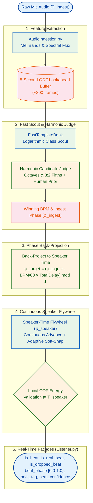

# Anticipation Flywheel ("Oracle") Rhythm Tracker Architecture

The **Anticipation Flywheel ("Oracle")** rhythm tracking engine is a predictive, real-time algorithmic pipeline designed to achieve zero-lag, jitter-free beat synchronization for the Vialactée chandelier. Rather than running a reactive beat tracker and delaying its triggers, it uses the 5-second look-ahead audio buffer to predict incoming tempo and phase, back-projects the phase to the physical speaker time ($T_{\text{speaker}}$), and drives a continuous mechanical flywheel with breakdown coasting and frequency-band beat tagging.

## Core Components

The architecture consists of four primary subsystems:

1. **High-Resolution Transient Extractor (`AudioIngestion.py`)**
2. **$O(1)$ Pearson Template Bank & Fast Scout (`FastTemplateBank` in `AudioAnalyzer.py`)**
3. **Logarithmic Base-Tempo (LBT) Harmonic Judge (`AudioAnalyzer.py`)**
4. **Speaker-Time Freewheeling Flywheel with Back-Projection (`AudioAnalyzer.py`)**
5. **Centralized Configuration & Thresholds ([`core/RhythmConfig.py`](file:///c:/Users/Users/Desktop/vialact%C3%A9e/vialactee/core/RhythmConfig.py))**

---

### 1. High-Resolution Transient Extractor
Raw PCM audio chunks are processed via FFT using Mel-scale filterbanks in `AudioIngestion.py`. In `AudioAnalyzer._compute_spectral_flux()`, a weighted **Onset Detection Function (ODF)** (combining low-end bass and high-end transient flux) is computed and stored into a 5-second ring buffer ($\sim 300\text{ frames}$ at $60\text{ FPS}$) via `_ingest_odf_buffer()`.

### 2. $O(1)$ Precomputed Pearson Template Bank
To eliminate slow Python loops, the system pre-generates normalized triangular beat pulse templates across integer/fractional BPMs ($40$ to $220\text{ BPM}$). Pearson cross-correlation against the zero-mean standardized ODF buffer is computed via a single compiled NumPy dot product:
$$\text{Score}_{\text{Pearson}} = \frac{\mathbf{T}_{\text{norm}} \cdot \mathbf{B}_{\text{centered}}}{\sigma_B}$$
This runs in $<0.4\text{ ms}$ on Raspberry Pi CPU cores.

### 3. Logarithmic Base-Tempo (LBT) & Harmonic Alignment
Tempos are evaluated in circular logarithmic space:
$$f(\text{BPM}) = \log_2\left(\frac{\text{BPM}}{60}\right) \pmod 1$$
- **Fast Scout Sweep (`class_based_phase_sweep`)**: Sweeps circular classes with a Gaussian human prior centered at $125\text{ BPM}$ (`human_prior_center`).
- **Harmonic Alignment (`harmonic_alignment`)**: Evaluates octaves and $3:2$ perfect fifths ($\Delta = \log_2(1.5)$) to avoid polyrhythmic traps and ping-pong jumps.
- **Heavy Judge (`evaluate_specific_bpms`)**: Scores candidate tempos and determines the winning BPM, confidence score, and future phase index.
- Executed via `_run_oracle_sweep()` on transient peaks or every `sweep_interval` ($0.2\text{s}$).

### 4. Phase Back-Projection & Continuous Flywheel
When the future phase $\phi_{\text{ingest}}$ is determined in the lookahead buffer, it is back-projected to speaker playback time $T_{\text{speaker}} = T_{\text{ingest}} - 5.0\text{s}$:
$$\Delta\phi = \frac{\text{BPM}}{60} \times (\text{lookahead\_seconds} + \text{dynamic\_audio\_latency} + \text{hardware\_latency})$$
$$\phi_{\text{target}} = (\phi_{\text{ingest}} - \Delta\phi) \pmod 1$$

In `_advance_flywheel()`, the engine continuously advances `speaker_phase`:
$$\text{speaker\_phase} \leftarrow \text{speaker\_phase} + \frac{\text{BPM}}{60} \times \Delta t$$

- **Adaptive Soft-Snap**: If Pearson confidence $> 0.30$ (`high_confidence_threshold`), snaps by $50\%$ (`high_snap_ratio`) toward $\phi_{\text{target}}$; if $\ge 0.15$ (`moderate_confidence_threshold`), snaps by $15\%$ (`moderate_snap_ratio`).
- **Real vs. Dropped Beat Classification**: When `speaker_phase >= 1.0`, it inspects local ODF energy in the speaker window:
  - `is_real_beat = True` if energy exceeds dynamic baseline (`real_beat_baseline_ratio * rolling_flux_baseline` or `real_beat_energy_floor`).
  - `is_dropped_beat = True` during silent breakdowns (flywheel coasts smoothly).
- **Frequency-Band Tagging**: Classifies the onset into `"Bass/Kick"`, `"Snare/Mid"`, or `"Hi-hat/Cymbal"`.

---

## Data Flow Diagram

```mermaid
flowchart TD
    classDef io fill:#e3f2fd,stroke:#0d47a1,stroke-width:2px,color:#0d47a1
    classDef engine fill:#e8f5e9,stroke:#1565c0,stroke-width:2px,color:#0d47a1
    classDef logic fill:#fff3e0,stroke:#2e7d32,stroke-width:2px,color:#1b5e20
    classDef data fill:#fce4ec,stroke:#e65100,stroke-width:1px,color:#e65100

    AudioIn(["Raw Mic Audio (T_ingest)"]):::io
    
    subgraph "1. Feature Extraction"
        FFT["AudioIngestion.py\nMel Bands & Spectral Flux"]:::engine
        ODF[("5-Second ODF Lookahead Buffer\n(~300 frames)")]:::data
    end

    subgraph "2. Fast Scout & Harmonic Judge"
        Scout["FastTemplateBank\nLogarithmic Class Scout"]:::engine
        Judge["Harmonic Candidate Judge\nOctaves & 3:2 Fifths + Human Prior"]:::logic
        Winner["Winning BPM & Ingest Phase (φ_ingest)"]:::data
    end

    subgraph "3. Phase Back-Projection"
        BackProj["Back-Project to Speaker Time\nφ_target = (φ_ingest - BPM/60 × TotalDelay) mod 1"]:::logic
    end

    subgraph "4. Continuous Speaker Flywheel"
        Flywheel["Speaker-Time Flywheel (φ_speaker)\nContinuous Advance + Adaptive Soft-Snap"]:::engine
        EnergyCheck{"Local ODF Energy\nValidation at T_speaker"}:::logic
    end

    subgraph "5. Real-Time Facades (Listener.py)"
        BeatsOut(["is_beat, is_real_beat, is_dropped_beat\nbeat_phase [0.0-1.0), beat_tag, beat_confidence"]):::io
    end

    %% Connections
    AudioIn --> FFT
    FFT --> ODF
    ODF --> Scout
    Scout --> Judge
    Judge --> Winner
    Winner --> BackProj
    BackProj --> Flywheel
    Flywheel --> EnergyCheck
    EnergyCheck --> BeatsOut
```
