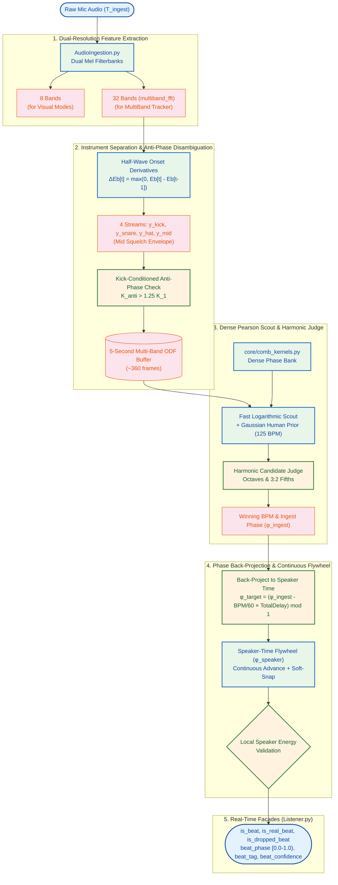

# Anticipation Flywheel ("Oracle") Rhythm Tracker Architecture

The **Anticipation Flywheel ("Oracle")** rhythm tracking engine is a predictive, real-time algorithmic pipeline designed to achieve zero-lag, jitter-free beat synchronization for the Vialactée chandelier. Rather than running a reactive beat tracker and delaying its triggers, it uses the 5-second look-ahead audio buffer to predict incoming tempo and phase, back-projects the phase to the physical speaker time ($T_{\text{speaker}}$), and drives a continuous mechanical flywheel with breakdown coasting, anti-phase disambiguation, and frequency-band beat tagging.

The production engine is implemented in [`core/MultiBandOnsetAudioAnalyzer.py`](file:///c:/Users/Users/Desktop/vialactee/core/MultiBandOnsetAudioAnalyzer.py), backed by standalone C-compiled [`core/comb_kernels.py`](file:///c:/Users/Users/Desktop/vialactee/core/comb_kernels.py). The original single-ODF implementation is retained in [`core/AudioAnalyzer.py`](file:///c:/Users/Users/Desktop/vialactee/core/AudioAnalyzer.py) for baseline comparison and ablations.

## Core Components

The architecture consists of five primary subsystems:

1. **Dual-Resolution Mel Transient Extractor (`AudioIngestion.py`)**
2. **Multi-Band Instrument Separation & Mid Squelch (`MultiBandOnsetAudioAnalyzer.py`)**
3. **Kick-Conditioned Anti-Phase Disambiguation (`MultiBandOnsetAudioAnalyzer.py`)**
4. **Dense Pearson Template Bank & LBT Harmonic Judge (`comb_kernels.py` & `MultiBandOnsetAudioAnalyzer.py`)**
5. **Speaker-Time Freewheeling Flywheel with Back-Projection (`BaseAudioAnalyzer.py`)**

---

### 1. Dual-Resolution Mel Transient Extractor
Raw PCM audio chunks are processed via FFT in [`core/AudioIngestion.py`](file:///c:/Users/Users/Desktop/vialactee/core/AudioIngestion.py) across two parallel Mel-scale filterbanks:
- **8 Mel Bands (`fft_band_values`):** Preserved strictly for lighting modes in [`modes/`](file:///c:/Users/Users/Desktop/vialactee/modes/).
- **32 Mel Bands (`multiband_fft_values`):** Fed into `MultiBandOnsetAudioAnalyzer` to isolate fine-grained acoustic transients (sub-bass 20-80 Hz, kick fundamental 60-120 Hz, snare snap 2-5 kHz, hi-hat shimmer 8-16 kHz).

Per-band half-wave rectified onset derivatives are computed every frame:
$$\Delta E_b[t] = \max\left(0, E_b[t] - E_b[t-1]\right)$$

### 2. Multi-Band Instrument Separation & Mid Squelch
To eliminate the 180° upbeat trap (`PHASE_INVERSION_UPBEAT`) where loud synth arpeggios overpower kick drums, `MultiBandOnsetAudioAnalyzer` separates onset derivatives into 4 distinct instrument streams:
- **Kick Downbeat Stream ($y_{\text{kick}}$):** Sum of sub-bass and low-kick bands ($\sim 20\text{--}180\text{ Hz}$).
- **Snare Backbeat Stream ($y_{\text{snare}}$):** Sum of snare body and crack bands ($\sim 200\text{--}4000\text{ Hz}$).
- **Hi-Hat Offbeat Stream ($y_{\text{hat}}$):** Sum of upper-treble bands ($> 4000\text{ Hz}$).
- **Mid-Melodic Squelch ($y_{\text{mid}}$):** Dynamically suppresses sustained synth arpeggios and guitar sustain via a logistic squelch envelope:
  $$\Gamma_b[t] = \frac{\max_{\tau \in [0, 179]} \Delta E_b[t-\tau]}{\frac{1}{180}\sum_{\tau=0}^{179} \Delta E_b[t-\tau] + \epsilon}, \quad S_b[t] = \frac{1}{1 + \exp\left(-0.5(\Gamma_b[t] - 14.0)\right)}$$
  $$y_{\text{mid}}[t] = 0.20 \cdot \sum_{b \in \mathcal{M}_B} S_b[t] \cdot \Delta E_b[t]$$
- **Combined Novelty Function ($y_{\text{metric}}$):**
  $$y_{\text{metric}}[t] = \max\left(0, y_{\text{kick}}[t] + y_{\text{snare}}[t] + y_{\text{mid}}[t] - 0.35 \cdot \max\left(0, y_{\text{hat}}[t] - y_{\text{kick}}[t]\right)\right)$$

### 3. Kick-Conditioned Anti-Phase Disambiguation
When high-energy tracks exhibit competing correlation peaks between the candidate downbeat phase $\phi_1$ and the 180° anti-phase $\phi_{\text{anti}} = (\phi_1 + 0.5) \bmod 1.0$:
$$K_1 = \mathbb{E}\left[y_{\text{kick}} \mid \text{phase} \approx \phi_1\right], \quad K_{\text{anti}} = \mathbb{E}\left[y_{\text{kick}} \mid \text{phase} \approx \phi_{\text{anti}}\right]$$
If $s(\phi_{\text{anti}}) \ge 0.80 s(\phi_1)$ and $K_{\text{anti}} > 1.25 \cdot K_1$, the engine forces phase alignment to the true acoustic kick downbeat, resolving upbeat inversion.

### 4. Dense Pearson Template Bank & LBT Harmonic Judge
Using standalone compiled [`core/comb_kernels.py`](file:///c:/Users/Users/Desktop/vialactee/core/comb_kernels.py), the engine builds dense triangular pulse template banks across continuous logarithmic tempo classes:
$$f(\text{BPM}) = \log_2\left(\frac{\text{BPM}}{60}\right) \pmod 1$$
- **Fast Scout Sweep:** Evaluates Pearson cross-correlation across tempo classes in $<0.3\text{ms}$ on Raspberry Pi CPU.
- **Harmonic Judge:** Evaluates candidate octaves and $3:2$ perfect fifths ($\Delta = \log_2(1.5)$) with a Gaussian human prior centered at $125\text{ BPM}$.

### 5. Speaker-Time Continuous Flywheel with Back-Projection
The lookahead phase $\phi_{\text{ingest}}$ is back-projected to speaker playback time $T_{\text{speaker}} = T_{\text{ingest}} - 5.0\text{s}$:
$$\Delta\phi = \frac{\text{BPM}}{60} \times (\text{lookahead\_seconds} + \text{dynamic\_audio\_latency} + \text{hardware\_latency})$$
$$\phi_{\text{target}} = (\phi_{\text{ingest}} - \Delta\phi) \pmod 1$$

- **Continuous Advance:** Advanced frame-by-frame via $\text{speaker\_phase} \leftarrow (\text{speaker\_phase} + \frac{\text{BPM}}{60} \cdot \Delta t) \bmod 1.0$.
- **Adaptive Soft-Snap:** Soft-snaps toward $\phi_{\text{target}}$ with backward wrap clamp to prevent jitter.
- **Real vs. Dropped Beat Classification:** On downbeat zero-crossings (`speaker_phase >= 1.0`), local acoustic energy in the speaker window validates real downbeats vs silent breakdown coasting (`is_real_beat` vs `is_dropped_beat`).

---

## Data Flow Diagram

```mermaid
flowchart TD
    classDef io fill:#e3f2fd,stroke:#0d47a1,stroke-width:2px,color:#0d47a1
    classDef engine fill:#e8f5e9,stroke:#1565c0,stroke-width:2px,color:#0d47a1
    classDef logic fill:#fff3e0,stroke:#2e7d32,stroke-width:2px,color:#1b5e20
    classDef data fill:#fce4ec,stroke:#e65100,stroke-width:1px,color:#e65100

    AudioIn(["Raw Mic Audio (T_ingest)"]):::io
    
    subgraph "1. Dual-Resolution Feature Extraction"
        FFT["AudioIngestion.py\nDual Mel Filterbanks"]:::engine
        Bands8["8 Bands\n(for Visual Modes)"]:::data
        Bands32["32 Bands (multiband_fft)\n(for MultiBand Tracker)"]:::data
    end

    subgraph "2. Instrument Separation & Anti-Phase Disambiguation"
        Deriv["Half-Wave Onset Derivatives\nΔEb[t] = max(0, Eb[t] - Eb[t-1])"]:::engine
        Streams["4 Streams: y_kick, y_snare, y_hat, y_mid\n(Mid Squelch Envelope)"]:::data
        AntiPhase["Kick-Conditioned Anti-Phase Check\nK_anti > 1.25 K_1"]:::logic
        ODF[("5-Second Multi-Band ODF Buffer\n(~360 frames)")]:::data
    end

    subgraph "3. Dense Pearson Scout & Harmonic Judge"
        Kernels["core/comb_kernels.py\nDense Phase Bank"]:::engine
        Scout["Fast Logarithmic Scout\n+ Gaussian Human Prior (125 BPM)"]:::engine
        Judge["Harmonic Candidate Judge\nOctaves & 3:2 Fifths"]:::logic
        Winner["Winning BPM & Ingest Phase (φ_ingest)"]:::data
    end

    subgraph "4. Phase Back-Projection & Continuous Flywheel"
        BackProj["Back-Project to Speaker Time\nφ_target = (φ_ingest - BPM/60 × TotalDelay) mod 1"]:::logic
        Flywheel["Speaker-Time Flywheel (φ_speaker)\nContinuous Advance + Soft-Snap"]:::engine
        EnergyCheck{"Local Speaker Energy\nValidation"}:::logic
    end

    subgraph "5. Real-Time Facades (Listener.py)"
        BeatsOut(["is_beat, is_real_beat, is_dropped_beat\nbeat_phase [0.0-1.0), beat_tag, beat_confidence"]):::io
    end

    %% Connections
    AudioIn --> FFT
    FFT --> Bands8
    FFT --> Bands32
    Bands32 --> Deriv
    Deriv --> Streams
    Streams --> AntiPhase
    AntiPhase --> ODF
    ODF --> Scout
    Kernels --> Scout
    Scout --> Judge
    Judge --> Winner
    Winner --> BackProj
    BackProj --> Flywheel
    Flywheel --> EnergyCheck
    EnergyCheck --> BeatsOut
```
