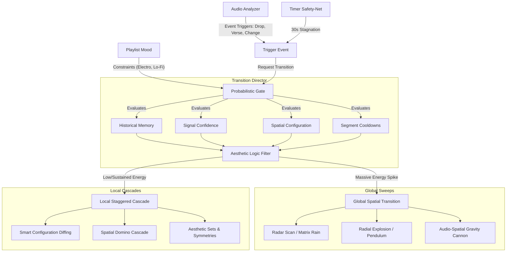

# Transition Architecture: Spatial Orchestration & Logic

The Transition Engine prevents the installation from turning into chaotic visual noise by applying an **Aesthetic Logic Filter** before a transition fires. It operates across Global sweeps, Local staggered cascades, and relies on strict probabilistic state management.

---

## 1. Global vs. Local Decision Matrix (`Transition_Director`)

The decision to change the entire room or just a section is governed by **Audio Context** and **Playlist Mood**:

- **Massive Energy Spikes (GLOBAL Transition):**
  If the `Listener` detects a huge crescendo, an intense volume swell, or the drop of a song, the Director commands a **Global Spatial Transition**. Sweeping the entire physical room mathematically creates a massive, unified release.
  
- **Low/Sustained Energy (LOCAL Transition):**
  If the track is continuing along a standard 4/4 beat or it is a slow ambient song, doing a massive global wipe is jarring. Instead, the Director opts for **Local Staggered Cascades**. The segments ripple into their new modes organically without disrupting the calm baseline.

- **Playlist-Level Constraints:**
  When an "Electro" playlist is selected, it loads aggressive Global Transitions. A "Lo-Fi Lounge" playlist restricts the system strictly to Local cascades and soft fading.

---

## 2. Spatial Output & Mathematical Transitions

Because the architecture successfully tracks absolute geometric physical coordinates `(X, Y)` for every individual LED across the entire room, transition masks are perfectly mapped in 2D space.

### A. Global Spatial Sweeps
1. **The X/Y Radar Scan:** A literal physical beam pushes across the 430-pixel width of the room. Everything to the Left of the beam draws the Old Mode; everything to the Right draws the New Mode.
2. **Gravitational Drop / Matrix Rain:** The Old Mode literally "melts" and drips off the physical bottom of the installation, plummeting towards `Y=0`. Simultaneously, the New Mode falls rapidly from the ceiling (`Y=244`). Drops cross the empty space between floating pieces seamlessly.
3. **Radial Explosion (Supernova Shockwave):** Using `sqrt(x^2 + y^2)`, a center point is chosen (dynamically anchored to the brightest current segment). A physical shockwave blasts outward in a perfect 2D circle across the wall, permanently replacing the old mode with the incoming mode as the boundary hits each physical LED coordinate.
4. **The Pendulum (Clock Wipe):** Using `arctan2`, the geometric center of the installation acts as a pivot. A sweeping line spins 360-degrees, leaving the new mode behind it.
5. **Audio-Spatial Gravity Cannon:** An invisible ray "shoots" up from the floor on massive bass kicks, blowing holes in the Old Mode. Fragments fall via gravity, exposing the New Mode.
6. **Venetian Blinds (Interlaced Geometry):** The Y-axis is sliced into 10-pixel horizontal lines. Even lines render New Mode, odd lines Old Mode. The New Mode bands grow downwards until the installation is saturated.
7. **Black Hole Collapse:** The edges of the Old Mode accelerate towards the center pivot, crushing into a singularity dot, holding for 0.5s of absolute silence, then exploding outward violently revealing the New Mode.

### B. Local & Independent Segment Cascades
Transitions do not have to trigger on every segment at once.
1. **Smart Configuration Diffing:** When the Director selects a new configuration, it checks if `Old_Mode == New_Mode` for specific segments. Segments that aren't changing don't blackout.
2. **The Spatial Domino Cascade:** The Director calculates an escalating physical delay map sequentially across the room based on `[X, Y]` coordinates. The transition "rolls" across the ceiling.
3. **Vertical vs. Horizontal Isolation:** The Director can decide to only change modes on the *Vertical Branches* (e.g., `Vertical_Pillars`), leaving the *Horizontal Core* alone, ensuring the chandelier looks like a deliberate piece of art rather than a randomized algorithm.
4. **Dynamic Override Injections:** `Transition_Director` can take explicit control of grouped subsets (e.g., forcing vertical strips into a furious `Hyper_strobe_mode` during an EDM climax, while the horizontal core runs its base configuration).
5. **Mode-Specific Transitions:** Modes can have bespoke transition states. For example, `Flying_ball_mode` could accelerate the ball, smash it into the boundary, and shatter into the new mode.

### C. Segment Symmetries & Aesthetic Sets
To maintain visual harmony, segments of the same length and direction are grouped into strict **Aesthetic Sets**:
*   `Vertical_Pillars`: `[Segment v1, v2, v3, v4]` (All length ~173). 
*   `Horizontal_Mirrors`: `[Segment h10, h11]` (Lengths ~86).
*   **The Symmetrical Rule:** The Director enforces a rule that if a Local Transition targets `v1`, it *must* simultaneously execute the exact same transition on `v4` to maintain perfect bilateral room symmetry.

---

## 3. The Stateful Probabilistic Model

The system does not tick randomly. It is driven by explicit Event Triggers, while the *Outcome* of those triggers relies on a historically-aware probability matrix.

### The Explicit Triggers
1. **The Audio Event:** A signal from the Music Analyzer (Song Change, Verse, Chorus Drop). This event **SHOULD ALWAYS** trigger a transition.
2. **The Timer Safety-Net:** If the music is stagnant and nothing has organically happened for `~30 seconds`, the Director explicitly triggers a change to prevent visual boredom.

### The Probabilistic Gate
When a trigger fires, the Director must choose what actually happens. The choice is weighted by:
* **Historical Memory:** "I just did a Global Wipe 10 seconds ago, so the probability of picking Global Wipe again is drastically reduced to near 0%."
* **Signal Confidence:** "The music analyzer is 99% confident this is a Massive Chorus Drop. Therefore, the probability of selecting an aggressive new Global State is maximized."
* **Spatial Configuration:** Evaluates if symmetrical branches are paired together and weights transitions that respect that geometry (e.g., transitioning `v1` and `v4` simultaneously to maintain bilateral symmetry).
* **Segment Availability (Cooldowns):** If a local transition targets a segment that already changed mode 5 seconds ago, the request is rejected. *Note: Massive Global Changes implicitly override segment cooldowns.*
