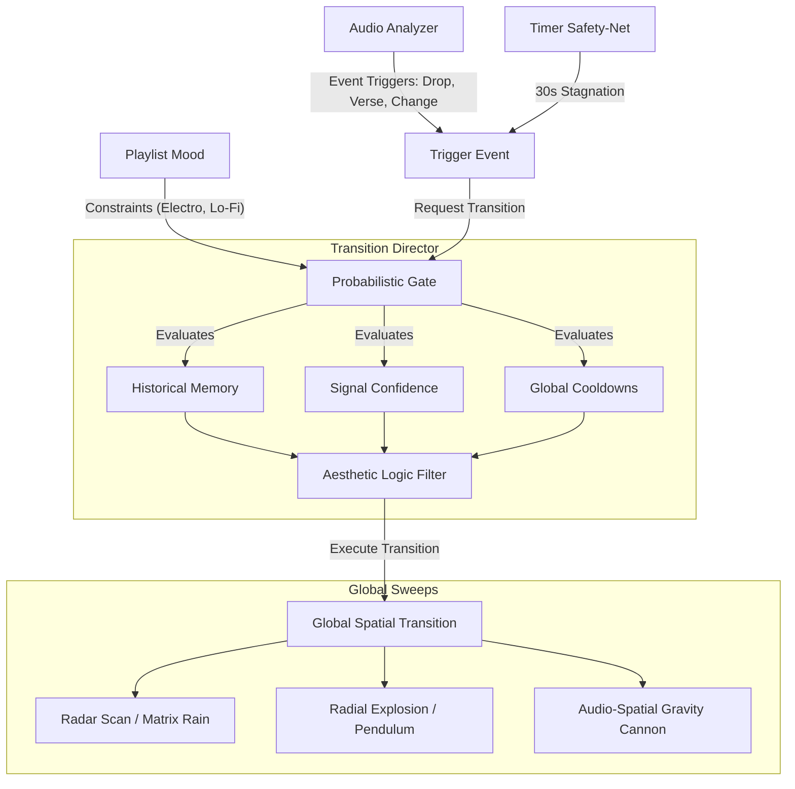

# Transition Architecture: Spatial Orchestration & Logic

The Transition Engine prevents the installation from turning into chaotic visual noise by applying an **Aesthetic Logic Filter** before a transition fires. It operates across Global sweeps and relies on strict probabilistic state management.

---

## 1. The Global Decision Matrix (`Transition_Director`)

The `Transition_Director` operates autonomously, constantly evaluating the audio context and internal timers. When it decides a change is necessary, it issues direct commands (e.g., `change_configuration`) to the `Mode_master`. The `Mode_master` acts purely as an executor, obeying the director's orders without questioning the transition logic.

Transitions are exclusively global by design. The timing and intensity of a global sweep are governed by **Audio Context** and **Playlist Mood**:

- **Massive Energy Spikes:**
  If the `Listener` detects a huge crescendo, an intense volume swell, or the drop of a song, the Director commands a sharp **Global Spatial Transition**. Sweeping the entire physical room mathematically creates a massive, unified release.

- **Playlist-Level Constraints:**
  When an "Electro" playlist is selected, it loads aggressive Global Transitions (like radial explosions). A "Lo-Fi Lounge" playlist restricts the system strictly to soft global fading.

---

## 2. Spatial Output & Mathematical Transitions

Because the architecture successfully tracks absolute geometric physical coordinates `(X, Y)` for every individual LED across the entire room, transition masks are perfectly mapped in 2D space.

### A. Global Spatial Sweeps
1. **The X/Y Radar Scan:** A literal physical beam pushes across the 430-pixel width of the room. Everything to the Left of the beam draws the Old Mode; everything to the Right draws the New Mode.
2. **Gravitational Drop / Matrix Rain:** The Old Mode literally "melts" and drips off the physical bottom of the installation, plummeting towards `Y=0`. Simultaneously, the New Mode falls rapidly from the ceiling (`Y=244`). Drops cross the empty space between floating pieces seamlessly.
3. **Radial Explosion (Supernova Shockwave):** Using `sqrt(x^2 + y^2)`, a center point is chosen (dynamically anchored to the brightest current segment). A physical shockwave blasts outward in a perfect 2D circle across the wall, permanently replacing the old mode with the incoming mode as the boundary hits each physical LED coordinate.
4. **The Pendulum (Clock Wipe):** Using `arctan2`, the geometric center of the installation acts as a pivot. A sweeping line spins 360-degrees, leaving the new mode behind it.
5. **Audio-Spatial Gravity Cannon:** An invisible ray "shoots" up from the floor on massive bass kicks, blowing holes in the Old Mode. Fragments fall via gravity, exposing the New Mode.
6. **Venetian Blinds (Interlaced Geometry):** The Y-axis is sliced into 10-pixel horizontal lines. Even lines render New Mode, odd lines Old Mode. The New Mode bands grow downwards until the installation is saturated.
7. **Black Hole Collapse:** The edges of the Old Mode accelerate towards the center pivot, crushing into a singularity dot, holding for 0.5s of absolute silence, then exploding outward violently revealing the New Mode.

---

## 3. Centralized State Management

The `Transition_Director` completely encapsulates and manages the transition state (`transition_progress`, `transition_type`, and `state`). 
Individual segments no longer track or process their own transition timeline independently. Instead, they receive the centralized `Transition_Director` instance securely during their update loop. 

This architectural constraint guarantees absolute synchronization across the entire room: every physical LED strip processes the mathematical dual-buffer blend using the exact same `transition_progress` timestamp down to the specific frame, strictly preventing visual tearing or desynchronization.

---

## 3. The Stateful Probabilistic Model

The system does not tick randomly. It is driven by explicit Event Triggers, while the *Outcome* of those triggers relies on a historically-aware probability matrix.

### The Explicit Triggers
1. **The Audio Event:** A signal from the Music Analyzer (Song Change, Verse, Chorus Drop). This event **SHOULD ALWAYS** trigger a transition.
2. **The Timer Safety-Net:** If the music is stagnant and nothing has organically happened for `~30 seconds`, the Director explicitly triggers a change to prevent visual boredom.

### The Probabilistic Gate
When a trigger fires, the Director must choose what actually happens. The choice is weighted by:
* **Historical Memory:** "I just did a Global Wipe 10 seconds ago, so the probability of picking Global Wipe again is drastically reduced to near 0%."
* **Signal Confidence:** "The music analyzer is 99% confident this is a Massive Chorus Drop. Therefore, the probability of selecting an aggressive new Global State is maximized."
* **Global Cooldowns:** Ensures transitions do not fire too frequently, preventing the installation from feeling erratic or visually overwhelming.
