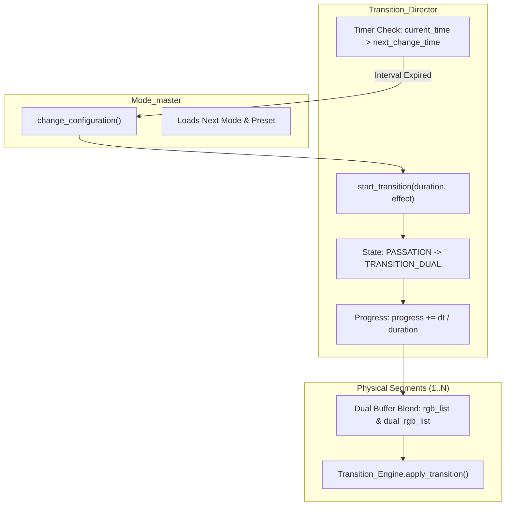

# Transition Architecture: Spatial Orchestration & Engine Reality

> **Status:** Current Production Architecture  
> **See Also:** Prospective and planned transition concepts are archived in [transition_architecture_potential_ideas.md](./transition_architecture_potential_ideas.md).

The Transition Engine prevents the chandelier installation from abruptly snapping between lighting modes. It smoothly blends between active and queued presets across physical 2D space using a centralized state machine and mathematical spatial masks.

---

## 1. The Operational Decision Flow (`Transition_Director`)

The `Transition_Director` operates autonomously inside the asynchronous update loop. When an automated change interval expires, it commands the `Mode_master` to begin a transition:

```mermaid
graph TD
    subgraph Director ["Transition_Director"]
        Timer["Timer Check: current_time > next_change_time"]
        StartTrans["start_transition(duration, effect)"]
        State["State: PASSATION -> TRANSITION_DUAL"]
        Prog["Progress: progress += dt / duration"]
    end

    subgraph Master ["Mode_master"]
        ChangeCfg["change_configuration()"]
        LoadNext["Loads Next Mode & Preset"]
    end

    subgraph Segments ["Physical Segments (1..N)"]
        DualBuf["Dual Buffer Blend: rgb_list & dual_rgb_list"]
        Engine["Transition_Engine.apply_transition()"]
    end

    Timer -->|Interval Expired| ChangeCfg
    ChangeCfg --> StartTrans
    StartTrans --> State
    State --> Prog
    Prog --> DualBuf
    DualBuf --> Engine
```

### Current Trigger Mechanism:
- **Timer Interval (`auto_transition_time`):** Loaded from `config/app_config.json` (or set via the web app Live Deck slider). Transitions trigger when `current_time > self.next_change_time`.
- **Manual Overrides:** The web interface Live Deck exposes a manual DROP trigger and configuration switching, directly invoking `Mode_master.change_configuration()`.
- **Lookahead & Audio Events:** Real-time audio lookahead drops (`live_is_song_change`, `live_is_verse_chorus_change`) are currently tracked for telemetry logging and prospective integration. Production transition triggering is timer- and UI-driven.

---

## 2. Centralized State Machine & Dual-Buffer Blending

The `Transition_Director` encapsulates all transition timing:
- **`PASSATION`**: Normal single-mode execution. `Segment.rgb_list` renders the active mode.
- **`TRANSITION_DUAL`**: Active transition. `Segment.rgb_list` renders the incoming mode, while `Segment.dual_rgb_list` renders the departing mode.

### Execution Invariant:
Segments receive the centralized `Transition_Director` instance during their `update(td)` call. Every physical LED strip processes the mathematical dual-buffer blend using the exact same `td.transition_progress` timestamp down to the frame, strictly preventing visual tearing across strips.

When `transition_progress >= 1.0`, `Transition_Director` switches state back to `PASSATION`, and the segments resume single-buffer rendering.

---

## 3. Production Transition Routines (`core/Transition_Engine.py`)

Because the architecture tracks absolute geometric coordinates `(X, Y)` for every LED derived from the active segment layout, transitions operate seamlessly across 2D space:

| Transition Routine | Identifier / Name | Description |
| :--- | :--- | :--- |
| **Dual Fade** | `"fade_to_black"`, `"fade_in_out"` | Fades departing mode to black during the first half ($progress < 0.5$), then fades incoming mode in from black during the second half. |
| **Linear Crossfade** | `"crossfade"` | Direct linear alpha blend: $RGB = (1 - p) \cdot RGB_{\text{old}} + p \cdot RGB_{\text{new}}$. |
| **Horizontal Wipe** | `"horizontal_wipe"` | Sweeps a vertical boundary line across the X-axis from $X_{\min}$ to $X_{\max}$. LEDs to the left display the new mode; LEDs to the right display the old mode. |
| **Vertical Wipe** | `"vertical_wipe"` | Sweeps a horizontal boundary line down the Y-axis from $Y_{\max}$ to $Y_{\min}$. |
| **Box Wipe** | `"box_wipe"` | Expands an axis-aligned bounding box from the centroid of the room outward. |
| **Radial Explosion** | `"explosion"` | Expands a circular wavefront outward from the geometric center $(X_c, Y_c)$: $r(t) = p \cdot R_{\max}$. LEDs within $r(t)$ render the new mode. |
| **Radial Implosion** | `"implosion"` | Contracts a circular boundary from $R_{\max}$ inward toward $(X_c, Y_c)$. |
| **Weird Glitch** | `"weird_glitch"` | Applies a pseudo-random hash mask across LED indices, generating a digital disintegration effect. |
| **Colorful Glitch** | `"colorful_glitch"` | High-contrast stochastic spatial switch with chromatic aberration. |
| **PNG Spatial Maps** | `assets/transitions/*.png` | Greyscale bitmap masks where pixel luminance maps directly to transition trigger timestamps across 2D space. |

### Dynamic Spatial Bounds (`init_room_bounds`):
Before applying spatial transitions, `Transition_Engine.init_room_bounds(segments)` queries all physical segment coordinate arrays via `Configurations_manager.get_segment_coordinates()` to compute:
- `ROOM_MIN_X`, `ROOM_MAX_X`
- `ROOM_MIN_Y`, `ROOM_MAX_Y`
- Centroid: `ROOM_CENTER_X`, `ROOM_CENTER_Y`
- Maximum spatial radius: $R_{\max} = \sqrt{(X_{\max} - X_{\min})^2 + (Y_{\max} - Y_{\min})^2}$

This guarantees that spatial transitions scale dynamically to both `full` (1,304 LEDs) and `small` (249 LEDs) hardware profiles without hardcoded spatial limits.
