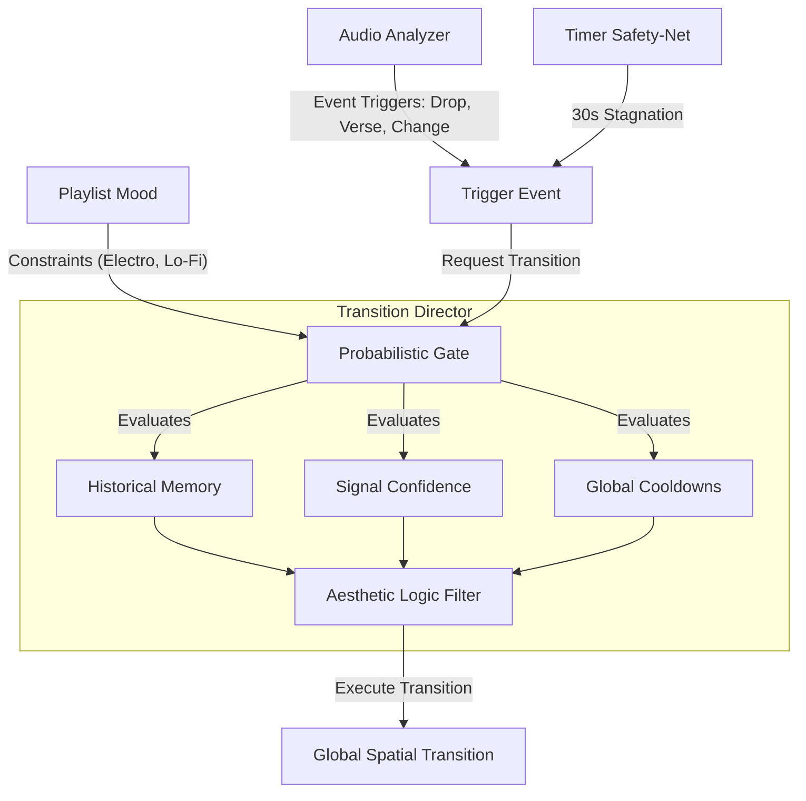

# Transition Architecture: Prospective Concepts & Future Ideas

> **Status:** Prospective / Research & Design Archive  
> **Source:** Extracted from `.agents/docs/transition_architecture.md`  
> **Context:** Captures conceptual transition models, probabilistic gating logic, and complex spatial routines that are not yet active in production code.

---

## 1. The Stateful Probabilistic Gate & Aesthetic Logic Filter

The prospective decision model envisions an autonomous probabilistic engine governing when and how transitions trigger, moving beyond fixed timers:

### Planned Triggering Mechanisms:
1. **Audio Event Triggering:**
   - Automatic triggers on detected Verse/Chorus boundaries, structural drops, and song cuts from `StructuralNoveltyDetector` and `AudioAnalyzer`.
   - Delayed triggers synchronized with physical speaker playback.
2. **The Probabilistic Gate Factors:**
   - **Historical Memory:** Prevent repetitive selection (e.g. "I just performed an explosion transition 15 seconds ago, so reduce its probability to ~0%").
   - **Signal Confidence Weighting:** Scale transition aggressiveness based on analyzer confidence (e.g., massive 99% confident chorus drop triggers high-velocity spatial explosions; low-confidence shifts trigger gentle dual fades).
   - **Global Cooldowns:** Enforce minimum spacing between automatic transitions to prevent chaotic visual strobing.
3. **Playlist-Level Constraints:**
   - "Electro / Peak-Time" playlists restrict available transitions to fast, high-contrast effects (explosions, glitch, rapid wipes).
   - "Lo-Fi / Ambient" playlists restrict transitions to slow crossfades and dual fades.

---

## 2. Prospective Spatial Transition Algorithms

The following mathematical routines are conceptual targets for `Transition_Engine.py`:

1. **Audio-Spatial Gravity Cannon:**
   - An invisible ray shoots upward from the floor on massive bass transients (`band_flux[0]`), punching holes in the Old Mode. Displaced pixels fall via a simulated gravitational field ($y \leftarrow y + \frac{1}{2} g t^2$), revealing the New Mode beneath.
2. **Venetian Blinds (Interlaced Geometry):**
   - The Y-axis is sliced into horizontal bands (e.g., 10-pixel slices). Even bands render the New Mode, odd bands render the Old Mode. The New Mode bands expand vertically until the chandelier is saturated.
3. **Black Hole Collapse (Singularity Shockwave):**
   - Pixels of the Old Mode accelerate inward toward a central pivot $(X_c, Y_c)$, compressing into a dense singularity point.
   - Holds for 0.5s of absolute visual silence.
   - Explodes violently outward in a high-velocity radial wave, revealing the New Mode.
4. **The Pendulum (Clock Wipe):**
   - Using `arctan2(y - y_c, x - x_c)`, the geometric centroid of the chandelier acts as a pivot. A sweeping radial line rotates 360 degrees, wiping the Old Mode into the New Mode.
