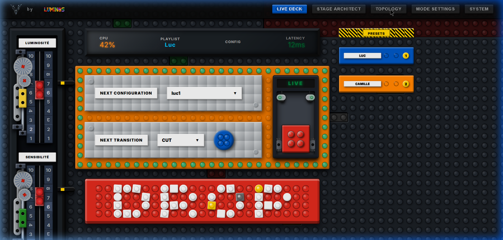
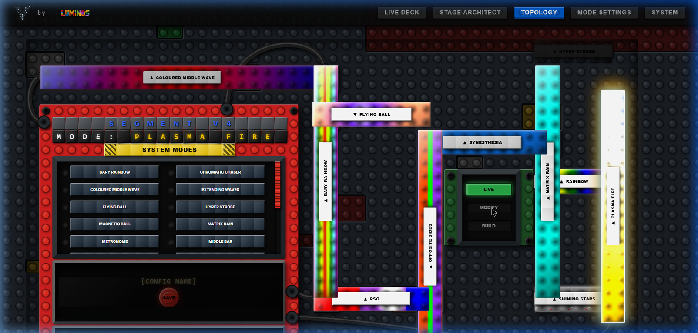
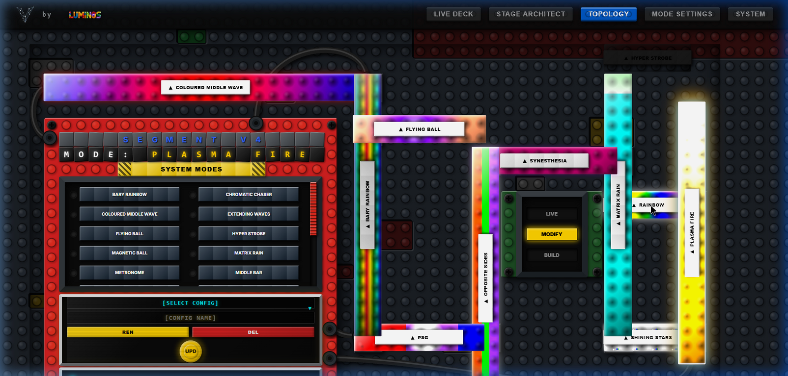

# Vialactée `wabb-interface` — Complete Web App Review

> **Type:** Web App / UI Audit
> **Reviewed:** 2026-05-12 | **Stack:** React 19 + TypeScript 6 + Vite 8 | **Running at:** http://localhost:5173/
> **Reviewer:** Antigravity (UI sub-agent, browser analysis)
> **Template:** `.agents/reviews/template_webapp_review.md`
> **Previous review:** N/A (first web app review)
> **Source:** Originally at `wabb-interface/review/WAPP_REVIEW.md`

---

## Executive Summary

The `wabb-interface` is a React SPA that serves as a physical-metaphor control panel for a 1,304-LED DJ lighting installation. It communicates with a Python backend via WebSocket (port 8080) and a REST API (`/api/configurations`). The UI is intentionally styled as a LEGO Technic control board, with studs, cables, baseplates, and physical toggle switches rendered in CSS.

The application is **visually polished and functionally well-structured** for its stage. The main concerns are around robustness (offline/WS-disconnected state), the incomplete `StageArchitect` tab, hardcoded telemetry values, and a handful of code-quality and UX issues.

---

## Visual Tour

### Tab 1 — Live Deck

**Rating: 8.5 / 10**

What's working:
- LEGO Technic aesthetic is remarkably cohesive — studded baseplate, slider rails, gear mechanisms
- LUMINOSITÉ and SENSIBILITÉ vertical sliders render correctly with scale markers (1–10 on both sides)
- Telemetry bar (CPU 42%, PLAYLIST "Luc", CONFIG, LATENCY 12ms) clearly visible at the top center
- NEXT CONFIGURATION / NEXT TRANSITION panels on the orange baseplate are legible and functional
- Large red DROP button at the bottom is visually prominent and recognizable
- HOLD/LIVE toggle (right of orange baseplate) renders correctly with a 2×2 red stud brick
- Preset brick column (right): "LUC" and "CAMILLE" presets visible with correct color coding
- Overall layout is self-contained, no horizontal scroll at standard resolution

**Issues found:**
1. **CPU (42%) and LATENCY (12ms) are hardcoded** in JSX — they are decorative/static, not real telemetry. Medium risk: could mislead the operator.
2. **CONFIG column in telemetry bar is empty** — it correctly shows empty until a configuration is active, but the label `CONFIG` with blank value looks broken with no placeholder (e.g. `—`).
3. **Preset column gets sparse** — only 2 playlists ("LUC", "CAMILLE") appear. The right-side column has 8 slots defined but 6 are empty, leaving a lot of dead dark grey space.
4. **Slider scale labels appear on both sides** — the `1-2-3…10` marks render on left and right of the slider track. At extreme values, the scale doesn't visually match the thumb position.
5. **No visual feedback when WebSocket is disconnected** — the page renders identically whether the Python backend is running or not. Slider interactions fire `sendInstruction()` silently into a queue.

---

### Tab 2 — Stage Architect

**Rating: 3 / 10 — PLACEHOLDER**

The `StageArchitect.tsx` is a stub:
- Shows the title "STAGE ARCHITECT"
- A dark grey baseplate with placeholder text `[ Interactive SVG Mapper ]`
- A grey inspector panel with `Select a segment to edit...`

This tab is **functionally incomplete** and should either be hidden from the tab bar or clearly marked as `[WIP]`. Currently, navigating to it gives the impression the app is broken or unfinished.

---

### Tab 3 — Topology Editor (LIVE mode)

**Rating: 9 / 10**

What's working:
- Animated LED segments render with CSS mode animations (rainbow, plasma fire, matrix rain, etc.) — spectacular visual effect
- The red inspector panel (left) shows segment name in tile-letter format and current MODE in yellow tile-letter format
- The 3-way LIVE/MODIFY/BUILD switch (top right) is readable and functional
- SVG Bezier cables connecting segments to the inspector panel are visible and add physical realism
- Junction boxes appear at segment intersections
- Segment labels show direction arrow (▲/▼) + mode name
- Clicking segments updates the inspector correctly and immediately

**Issues found:**
1. **Segments clip off the right edge** — `HYPER STROBE`, `MATRIX RAIN`, `PLASMA FIRE`, `SHINING STARS` labels are partially cut. The container width (`calc(35 * var(--stud))`) is insufficient for the full topology map at standard viewport widths.
2. **The top horizontal segment (h00 — "COLOURED MIDDLE WAVE") overflows to the left** of the dark grey background plate. It appears to start at col 0 while the background starts at `MAP_OFFSET_C - 1`.
3. **No horizontal scroll mechanism** — if segments clip, there's no way to pan. The `position: relative; width: 100%` container prevents overflow navigation.
4. **Junction box z-index conflict** — junction boxes use `zIndex: 8` but animated segments use `zIndex: 10`, so junction boxes are invisible behind segments.
5. **`(seg as any).direction` cast** (lines 292, 424, 434, 668) is a type safety weakness — `direction` should be declared on the segment type.

---

### Tab 3 — Topology Editor (MODIFY mode)

**Rating: 8 / 10**

What's working:
- Config panel reveals SELECT CONFIG dropdown, CONFIG NAME input, REN + DEL buttons, and UPD (update/save) button correctly
- The MODIFY mode correctly dims the map with a brightness filter, preventing accidental live edits
- Playlist section (bottom of inspector) shows PLAYLIST label, text input, cycle buttons (< >), and NEW/REN/DEL buttons

**Issues found:**
1. **The inspector panel is cut at the bottom** — the playlist section (at `INSPECTOR_OFFSET_R + 17`) is partially outside the visible viewport at standard screen heights (768px).
2. **The UPD button triggers a native `alert()` on success** — a browser `alert()` dialog is jarring in a custom-styled Technic UI. Should be replaced with an inline styled notification.
3. **`handleRenamePlaylist` doesn't reset `playlistNameDraft`** after a successful rename — the draft input retains the old name.
4. **No confirmation before overwriting in BUILD mode** — if a user types an existing config name in BUILD mode, it silently appends a duplicate without warning.

---

### Tab 4 — Mode Settings

**Rating: 7.5 / 10 (design) / 5 / 10 (empty state)**

What's working:
- Red baseplate background, "MODE SETTINGS" yellow tile header, and "LIVE MODE TUNING" character tiles are all correctly styled
- Scrollable dark panel with 2-column grid for mode cards is well-designed
- Each mode card shows a cyan LED indicator + mode name label + setting controls
- Slider, switch, and list controls are styled consistently with the app aesthetic

**Issues found:**
1. **Empty when backend is offline** — shows `[NO MODES WITH SETTINGS]` in grey text when there's no WebSocket connection. This is the expected state in dev, but the empty panel needs better visual feedback.
2. **Pending edits cleanup can leak** — pending edits are only cleaned when `valuesMatch(liveValue, pendingValue)`. If the backend never confirms a change, the pending ref entry persists indefinitely across WebSocket reconnects.
3. **Redundant `String()` conversion** (line 304): `typeof currentValue === 'boolean' ? String(currentValue) : String(currentValue)` — both branches do the same thing.
4. **"LIVE MODE TUNING" character row** may overflow at narrow viewport widths — the 44-wide character array can exceed the container.

---

### Tab 5 — System

**Rating: 6 / 10**

What's working:
- "SYSTEM & SETUP" label is visible at top
- TELEMETRY section (green border) and DANGER ZONE section (red border) are correctly labeled and visually distinct
- "RESTART PYTHON LOOP" and "REBOOT RASPBERRY PI" buttons are large, prominent, and correctly colored
- Embedded OLED panels (CPU TEMP, PYTHON LOOP) are styled correctly with the digital font

**Issues found:**
1. **All telemetry values are hardcoded** — CPU TEMP `65°C` and PYTHON LOOP `60 FPS` are static JSX strings. The entire Telemetry section is purely decorative and shows no real data.
2. **The System page is sparse** — only 2 OLED tiles and 2 buttons. A lot of dark grey baseplate space is unused.
3. **No confirmation dialog on "REBOOT RASPBERRY PI"** — clicking immediately fires `sendInstruction(...)`. A destructive action with no confirm step is a live-performance risk.
4. **CPU TEMP and PYTHON LOOP data should come from `ModeMasterState`** — the WebSocket state type (`controlBridge.ts`) has no telemetry fields defined, so real data can't flow through.

---

## Architecture & Code Quality

### `controlBridge.ts` — WebSocket Manager

**Strengths:**
- Clean singleton pattern with a proper `ControlBridge` class
- Queue-on-disconnect pattern is correct — outgoing messages are queued and flushed on reconnect
- Subscriber pattern with `Set<StateListener>` correctly handles multi-component subscriptions
- Lazy reconnect with 1500ms debounce timer prevents reconnect storms

**Issues:**
1. **No backoff strategy** — reconnect is always 1500ms flat. Under sustained backend outage, this creates constant polling pressure.
2. **No maximum retry limit** — the reconnect loop is unbounded.
3. **No connection status exposed to components** — `SocketStatus` is private. Components cannot display a connection state indicator.
4. **`onerror` doesn't null `this.socket`** — `this.socket = null` only happens in `onclose`, not in `onerror`. If `onerror` fires without `onclose`, `this.socket` retains a dead reference.
5. **Type cast risk** — `message.payload as ModeMasterState` (line 139) has no runtime validation. A malformed payload silently propagates bad state.

### `configurationStore.ts` — REST API Persistence

**Strengths:**
- Data normalization on load is defensive and handles partial/missing fields correctly
- Validation in `vite.config.ts` POST handler catches malformed schemas before writing to disk

**Issues:**
1. **No concurrency protection** — rapid double-click on UPD fires two simultaneous POST requests. Last writer wins; intermediate state may be lost.
2. **The `/api/configurations` endpoint lives in `vite.config.ts`** — this middleware only exists in dev. There must be a production API server, but it is not documented.
3. **Error from `loadConfigurationStore` is silently swallowed** with only `console.error` in `LiveDeck.tsx` — no user feedback when the config file can't be loaded.

### `TopologyEditor.tsx` — Largest Component (1,183 lines)

**Strengths:**
- `pendingLiveSegmentEditsRef` optimistic update pattern is sophisticated and correct
- `applyModeMasterState` wrapped in `useCallback` correctly memoizes on `[apiPlaylists, editorMode]`
- Playlist and configuration CRUD are all guarded with `window.confirm` where destructive

**Issues:**
1. **Massive component size (1,183 lines)** — the inspector panel, segment map, cables, playlist editor, and config editor are all in one file. Should be split into sub-components.
2. **`(seg as any).direction`** used in 4 places — the local segment type lacks a `direction` field declaration.
3. **Junction calculation runs on every render** (lines 441–456) — O(n²) AABB check runs unconditionally in the render body. Should be wrapped in `useMemo`.
4. **`persistPlaylistStore` calls `setState` inside a `.then()`** — if the component unmounts before the promise resolves, React will log warnings about state updates on unmounted components.

### `App.tsx` — Root Component

1. **`roguePieces` array defined inside the component** — it never changes; should be declared outside or wrapped in `useMemo`.
2. **Tab buttons use `key={index}`** — should use `key={tab.name}` for stable keys.

---

## Prioritized Findings

| # | Issue | Severity | Page | Type |
|---|-------|----------|------|------|
| 1 | Stage Architect tab is a non-functional stub | **HIGH** | Stage Architect | Feature gap |
| 2 | WebSocket disconnect has zero visual indicator | **HIGH** | All | UX / Reliability |
| 3 | CPU / Latency / Temp telemetry values are hardcoded | **HIGH** | Live Deck, System | Data integrity |
| 4 | Segment map clips on the right edge | **HIGH** | Topology | Layout |
| 5 | No confirmation on "REBOOT RASPBERRY PI" | **HIGH** | System | UX Safety |
| 6 | ControlBridge has no backoff / no error state exported | MEDIUM | All | Architecture |
| 7 | `onerror` doesn't null `this.socket` | MEDIUM | All | Bug |
| 8 | Save/UPD uses native `alert()` dialogs | MEDIUM | Topology | UX |
| 9 | TopologyEditor is a 1,183-line monolith | MEDIUM | Topology | Maintainability |
| 10 | `(seg as any).direction` type casts × 4 | MEDIUM | Topology | Type safety |
| 11 | `persistPlaylistStore` async setState after unmount | MEDIUM | Topology | React correctness |
| 12 | Junction box z-index hides behind segments | LOW | Topology | Visual |
| 13 | CONFIG telemetry shows blank with no placeholder | LOW | Live Deck | UX |
| 14 | Pending edits can persist across WS reconnects | LOW | Mode Settings | Logic |
| 15 | Redundant `String(currentValue)` branch | LOW | Mode Settings | Code quality |
| 16 | `roguePieces` recreated on every render in App.tsx | LOW | All | Performance |
| 17 | Junction O(n²) AABB check not memoized | LOW | Topology | Performance |
| 18 | REST API endpoints only exist in Vite dev middleware | LOW | All | Deployment |

---

## Recommendations (Ordered by Priority)

### Immediate
1. **Add a WebSocket connection status badge** to the tab bar — a colored dot (🟢 LIVE / 🔴 OFFLINE). Export `status` from `ControlBridge` via a subscription or React context.
2. **Replace hardcoded telemetry** — extend `ModeMasterState` with real CPU/FPS/latency fields from the Python backend, or mark displays as `—` when disconnected.
3. **Add a `window.confirm` gate** on "REBOOT RASPBERRY PI".
4. **Fix the segment map overflow** — increase container width to accommodate all segments and add `overflow-x: auto`, or recalculate `MAP_OFFSET_C` so no segment exceeds the grid bounds.

### Short Term
5. **Split `TopologyEditor.tsx`** into `SegmentMap`, `InspectorPanel`, `PlaylistEditor`, `ConfigEditor`, and `EditorModeSwitch` sub-components.
6. **Add `direction` to the segment type** in `topologyData.ts` and remove all `(seg as any).direction` casts.
7. **Replace `alert()` on save success** with an inline styled notification (e.g., a glowing cyan LEGO tile that fades out after 2s).
8. **Add exponential backoff** to `ControlBridge.scheduleReconnect()`.
9. **Hide or visually mark Stage Architect as WIP** until implemented.

### Long Term
10. **Define a production API server** (Python Flask/FastAPI) to handle `/api/configurations` GET/POST + WebSocket — the current Vite middleware approach is dev-only.
11. **Add ESLint rules** (`no-explicit-any`, `strict-boolean-expressions`) to catch `as any` at CI time.
12. **Consider a shared WebSocket state store** (React Context or Zustand) rather than duplicating `subscribeModeMasterState` hooks in every page component.

---

## CSS / `index.css` Notes

- `index.css` is **64 KB** — the largest single file in the project. It contains the entire design system: LEGO color variables, stud patterns, slider animations, segment mode keyframes, etc.
- The stud pattern is implemented as CSS custom properties (`--highlight`, `--shadow`) using `radial-gradient` repeated backgrounds — a clever and performant technique.
- Segment mode CSS animations (e.g., `anim-plasma-fire`, `anim-matrix-rain`) are `@keyframes` with `background-position` shifts — visually striking.
- **No scoping** — all rules are global. With React 19, CSS Modules or `@layer` isolation would prevent class name collisions as the component tree grows.
