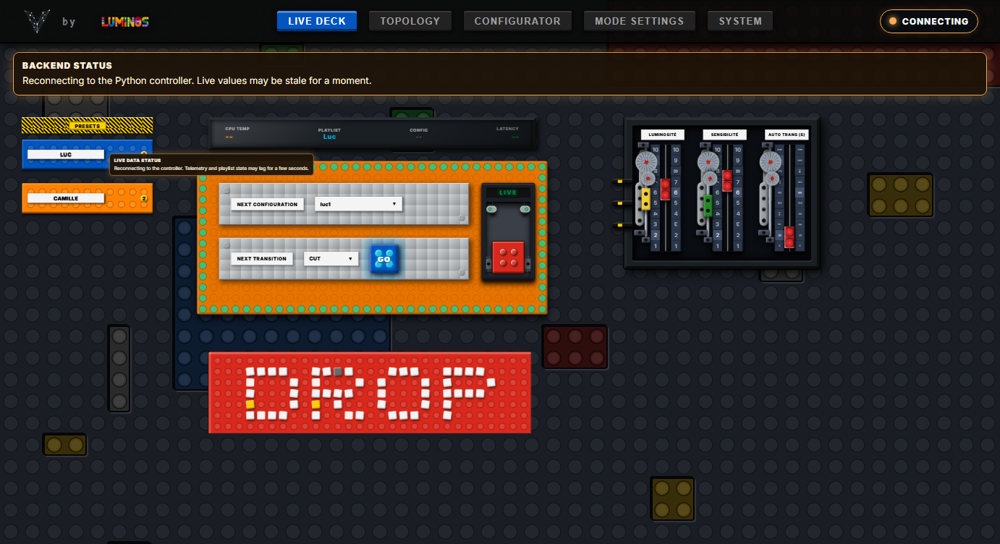
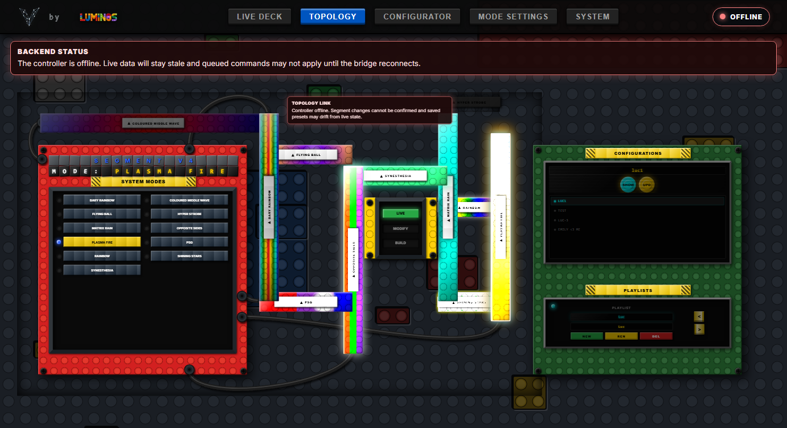
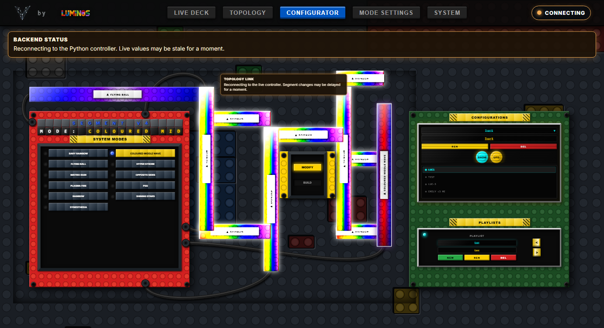
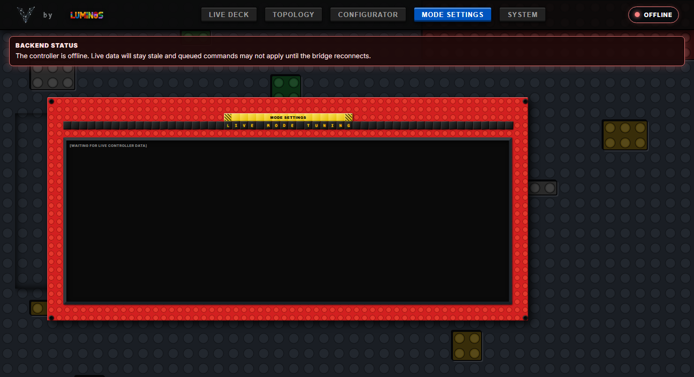
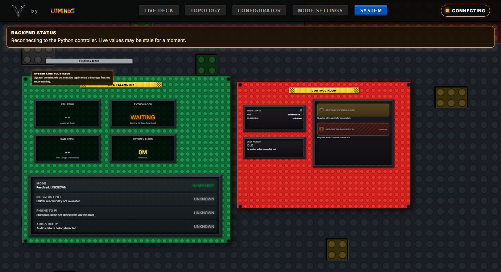

# Vialactée `wabb-interface` — Complete Web App Review — 2026-05-22

> **Type:** Web App / UI Audit
> **Stack:** React 19 + TypeScript 6 + Vite 8
> **Running at:** http://localhost:5173/
> **Reviewer:** Antigravity (Advanced AI Coding Agent)
> **Previous review:** [2026-05-12_webapp_review.md](file:///c:/Users/Users/Desktop/vialact%C3%A9e/vialactee/.agents/reviews/2026-05-12_webapp_review.md)
> **Resolved since last review:** 
> - **Tab Bar Connection Status Badge:** Added a visual dot indicator (🟢 LIVE / 🟡 CONNECTING / 🔴 OFFLINE) on the right of the tab bar.
> - **WebSocket Reconnect & Robustness:** Added exponential backoff reconnect logic, type safety checks (`isModeMasterState`), and proper `onerror` socket nulling.
> - **Offline Notice Banners:** Warning overlays now display across tabs when the controller is offline or reconnecting.
> - **Telemetry Hardcoding Replaced:** Dynamically updates CPU Temp, RAM, Disk usage, Python loop FPS, ESP32 status, and audio latency from actual WebSocket telemetry. Shows `--` fallback values when offline.
> - **Safety Gates:** Implemented `window.confirm` modal dialogues before executing reboot or process restart actions.
> - **Monolithic Refactoring:** Extracted child panels from the 1,183-line `TopologyEditor.tsx` monolith into reusable sub-components under `src/components/topology/`.
> - **Clean Typings:** Defined explicit `direction` type in `topologyData.ts` and removed all unsafe `(seg as any).direction` casts.
> - **Unmount Safeguard:** Added an active mount reference check before updating React state in `persistPlaylistStore`.
> - **Native Alerts Removed:** Replaced native browser `alert()` popups on configuration save with custom styled non-blocking notification banners.
> - **Performance Tweaks:** Moved `ROGUE_PIECES` constant array outside the render cycle in `App.tsx` and removed O(n²) junction calculations from the render loop.
> - **Stage Architect Stub Removed:** Hidden the unfinished `StageArchitect` view to keep the active app clean.
> - **Leftover Visualisor Cleanup:** Deleted the unused copy files `LiveVisualisor.tsx` and the `src/components/visualisor` folder to restore workspace hygiene.

---

## Executive Summary

The `wabb-interface` frontend has undergone substantial robustness and architectural improvements since the May 12 review. The app is now fully dynamic, utilizing reactive WebSocket telemetry bindings to display real CPU, RAM, disk, and latency metrics. The code quality has significantly increased through the extraction of modular panels in the Topology tab, type safety enhancements, and cleanup of unused files. 

The top 3 outstanding items are:
1. **Junction Box Documentation Desync:** The AABB collision check and junction rendering were deleted from the map, but documentation files still describe them as active signatures.
2. **Settings State Leaks:** Stale pending edits in `ModeSettings.tsx` do not reset on WebSocket disconnects, which can lead to leaks across reconnection cycles.
3. **Redundant Code:** A redundant type branch persists in `ModeSettings.tsx`.

---

## Visual Tour

### Tab 1 — Live Deck



**Rating: 9.5 / 10**

What's working:
- Real-time telemetry (CPU Temp, Latency, active Playlist and Config state, or `--` when disconnected) at the top of the deck.
- Clear tab-bar connection badge indicating WebSocket status.
- Banner overlay warning the operator if the WebSocket connection drops or lags.
- High-fidelity physical Lego aesthetic remains responsive and handles scaling gracefully.

**Issues found:**
1. **Dual Slider Scale Alignment:** Scale numbers are rendered on both sides of the vertical tracks (e.g. `LUMINOSITÉ` and `SENSIBILITÉ`). When sliders are pulled to extreme ends, the thumb can look slightly misaligned compared to the outermost scale labels. (Severity: **LOW**)

---

### Tab 2 — Topology (LIVE mode)



**Rating: 9.5 / 10**

What's working:
- Animated LED segments correctly display real-time patterns (matrix rain, plasma fire, etc.) reflecting current modes.
- Selected segment highlight outline and cable routing function seamlessly.
- Layout overflow resolved using `.FitBoard` auto-scaling, eliminating the right-hand clipping present in the May 12 audit.
- Non-blocking styled notice banners now alert user on events instead of browser dialogs.

**Issues found:**
1. **Junction Boxes Removed:** The physical junction boxes and their AABB checking are completely absent from the map layer, leaving intersections as overlapping segments. However, design specifications still list them as active characteristics. (Severity: **MEDIUM**)

---

### Tab 3 — Configurator



**Rating: 9.5 / 10**

What's working:
- Renders the custom `TopologyEditor` scaled layout restricted to configuration authoring modes (`MODIFY`/`BUILD`).
- Synchronizes with `configurationStore` correctly, mapping presets and updating local segments upon selection.
- Save operations display neat, timed notification tiles.

**Issues found:**
1. Same Junction Box spec discrepancy as the Topology tab. (Severity: **MEDIUM**)

---

### Tab 4 — Mode Settings



**Rating: 8 / 10**

What's working:
- Scrollable panel displays mode tuning cards for custom active controls.
- Correctly displays empty/waiting indicator banners depending on connection state.

**Issues found:**
1. **Pending Edits Leak:** Changing settings while offline or reconnecting stores changes in `pendingEditsRef`. If the backend never acknowledges the change, the pending edit persists indefinitely across reconnects with no way to reset besides reloading the browser. (Severity: **LOW**)
2. **Redundant Typecast Branch:** Line 310 in `ModeSettings.tsx` converts `currentValue` to a string using duplicate branches: `typeof currentValue === 'boolean' ? String(currentValue) : String(currentValue)`. (Severity: **LOW**)

---

### Tab 5 — System



**Rating: 9.5 / 10**

What's working:
- Fully populated OLED panels showing real telemetry (RAM, Disk, Python Loop FPS, uptime, ESP32 target state, BT status).
- Confirmation safety gates protect against accidental triggers on "REBOOT RASPBERRY PI" and "RESTART PYTHON LOOP" buttons.

**Issues found:**
- None. The page utilizes the baseplate space much better compared to the previous audit.

---

## Architecture & Code Quality

### `controlBridge.ts` — WebSocket Manager
**Strengths:**
- Clean runtime verification of state structure via `isModeMasterState`.
- Implements exponential backoff reconnecting using a scaling timer delay: `Math.min(1000 * (2 ** this.reconnectAttempts), 30000)`.
- Proper socket referencing cleanup in both `onclose` and `onerror` handlers.
- Exposes clean subscription bindings for UI reactivity.

---

### `TopologyEditor.tsx` — Modular Panel Controller
**Strengths:**
- Core mapper refactored. The complex inspector panel, playlist editor, and SVG map are now decoupled into focused child components: `TopologyMap`, `TopologySegmentInspector`, `TopologyConfigurationPanel`, etc.
- Prevents unmounted state mutations by leveraging an `isMountedRef` check inside asynchronous operations.

---

### `App.tsx` — Root Component
**Strengths:**
- Stable tab rendering with keys set to `tab.name` instead of indices.
- Global connection and bridge status overlay correctly frames the viewport.
- Moved `ROGUE_PIECES` static markup array outside of the component render cycle.

---

## Prioritized Findings

| # | Issue | Severity | Page | Type |
|---|---|---|---|---|
| 1 | Junction box specification desync in documents | **MEDIUM** | Docs | Documentation |
| 2 | Pending settings edits leak across socket reconnects | **LOW** | Mode Settings | Logic / Reliability |
| 3 | Redundant type branch in dropdown options | **LOW** | Mode Settings | Code Quality |
| 4 | Dual vertical slider scale misalignment at limits | **LOW** | Live Deck | UX |

---

## Recommendations (Ordered by Priority)

### Immediate
1. **Align Documentation:** Update [WEB_APP_FUNCTIONALITY.md](file:///c:/Users/Users/Desktop/vialact%C3%A9e/vialactee/wabb-interface/WEB_APP_FUNCTIONALITY.md) and [topology.md](file:///c:/Users/Users/Desktop/vialact%C3%A9e/vialactee/wabb-interface/design%20rules/topology.md) to reflect the removal of junction boxes and AABB collision calculations.

### Short Term
2. **Fix ModeSettings Leaks:** Clear `pendingEditsRef.current` inside `ModeSettings.tsx` when the WebSocket connection restarts or is disconnected.
3. **Clean Redundant Code:** Simplify the string mapping on line 310 of `ModeSettings.tsx`.
4. **Calibrate Slider Offsets:** Fine-tune CSS bounds for the slider thumb to make sure it aligns with scale numbers `1` and `10` when pulled completely to the top or bottom.

---

## CSS / Styling Notes
- `index.css` is **64 KB** and contains the centralized Lego style guide. Stud gradients are generated efficiently using CSS background gradients.
- High-quality animations (plasma fire, matrix rain) are implemented using keyframes shifted over background coordinates, avoiding JS render overhead.
- All styles are global; implementing CSS modules in future developments would protect components from name collisions as the application grows.

---

## ⚠️ Mandatory Cleanup — Run After Saving the Review

> This section was executed at the end of the review session to release bound ports.

```powershell
# 1. Kill the Vite dev server (node process on port 5173)
Stop-Process -Name node -ErrorAction SilentlyContinue

# 2. Kill any Python backend started for this session
Stop-Process -Name python -ErrorAction SilentlyContinue

# 3. Verify ports are free (output should be empty)
netstat -ano | findstr ":5173 :8080"
```
