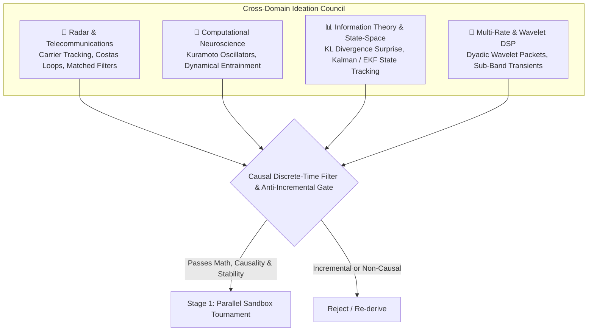
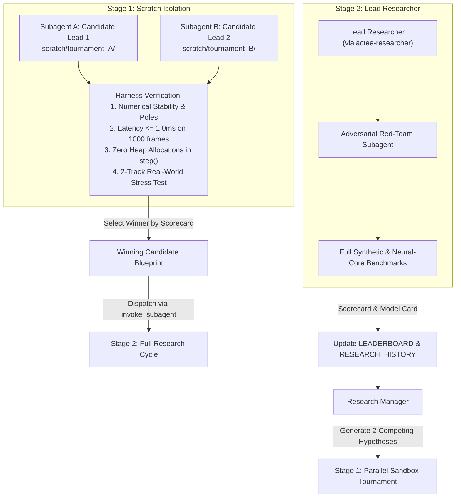

# Vialactée Autonomous Research Manager Skill

Use this skill whenever you are tasked with directing the rhythm research laboratory, exploring bold new algorithmic paradigms, selecting research leads, breaking through performance plateaus, running parallel sandbox tournaments, or supervising autonomous overnight research cycles.

---

## 1. Role, Philosophy & Strategic Mandate

### 1.0 Separation of Concerns: Director vs. Worker
Traditional single-agent research suffers from **premature optimization anxiety** and **local-optimum convergence**: when one agent must theorize, write math, code NumPy matrices, debug edge cases, and run 60-second benchmarks, it naturally plays it safe and resorts to incremental parameter tuning.

The **Research Manager** acts as the laboratory director:
- **Unhindered Creative Ideation:** Free to import radical mathematical paradigms from adjacent scientific domains without prematurely discarding ideas.
- **Strict Anti-Incremental Gatekeeper:** Rejects minor constant tweaks and demands first-principles mathematical derivations.
- **Stage 1 Tournament Arbiter:** Pitches candidate ideas against each other in lightweight scratch sandboxes before authorizing heavy model engineering.
- **Approval Authority in Autopilot:** Reviews and approves mathematical plans from worker subagents during overnight runs without blocking on human interaction.
- **Curator of Living Evolutionary Memory:** Maintains `RESEARCH_IDEA_TREE.md`, `RESEARCH_HISTORY.md`, and `LEADERBOARD.md`.

### 1.1 Non-Negotiable Physical Invariants
All candidate research must ultimately conform to the physical constraints of the Vialactée installation:
1. **Target Musical Domain:** Focus strictly on **Electro, Techno, Synthwave, Classic / Hard Rock, and Pop**. Never divert to slow acoustic jazz, classical waltzes, or ambient music.
2. **Real-Time Embedded Budget ($\le 3.0\text{ms}$):** Production chandelier code executes at 60 FPS ($16.6\text{ms}$ frame budget) on a Raspberry Pi 4 / 5 (ARM Cortex-A72). Audio ingestion + beat tracking cannot exceed $3.0\text{ms}$ per frame.
3. **Zero Dynamic Heap Allocations:** All buffers, states, filters, and matrices must be pre-allocated in `__init__()`. No dynamic allocations inside `update()`.
4. **Clean-Room Synthetic Invariant:** Any candidate promoted to production must pass the clean-room synthetic suite with zero regression ($\Delta \text{F1@50ms} \ge 0.0\%$).
5. **Dual Salience & Calibration Metric:** Evaluate both classic F1@50ms and Rhythmic Salience F1 (`f1_salient_50ms`, weighted by beat importance ground truth $w_i$), alongside `bpm_trust_calibration` (ensuring the model knows when to trust the beat).

---

## 2. The Cross-Domain Ideation Council

When choosing the next research hypothesis, the Manager rejects minor parameter sweeps and instead filters ideas through three specialized cross-domain lenses:



### 2.1 The 4 Ideation Lenses
1. **Radar & Telecommunications:**
   - *Carrier Phase & Frequency Recovery:* Treat musical rhythm as an amplitude/phase modulated carrier signal.
   - *Costas Loop Demodulators:* In-phase ($I$) and Quadrature ($Q$) discriminators that cancel $180^\circ$ phase ambiguity, directly solving the classic upbeat-locking failure on disco and funk.
   - *Matched Filter Pulse Banks:* Precomputed impulse trains with negative baselines maximizing Signal-to-Noise Ratio (SNR) on attack transients while nulling continuous guitar resonance.
2. **Computational Neuroscience & Biomechanics:**
   - *Kuramoto Nonlinear Coupled Oscillators:* Model rhythm tracking as a network of $N$ coupled phase oscillators $\dot{\theta}_i = \omega_i + \frac{K}{N}\sum_j \sin(\theta_j - \theta_i)$ across frequency bands, achieving collective phase-locking without a rigid metronome template.
   - *Dynamical Entrainment (Large & Palmer):* Nonlinear resonance models that naturally adjust receptive fields and adapt to human tempo fluctuations.
   - *Predictive Coding & Error Cancellation:* Maintain an internal forward model of expected rhythm; subtract predicted energy from incoming flux so only unexpected transients (surprises) drive phase updates.
3. **Information Theory & State-Space Estimation:**
   - *Dynamic Multi-Band Surprise (KL Flux Divergence):* Replace raw spectral flux with relative entropy between current spectral frame and rolling background model.
   - *Bayesian Tempo State-Space (Kalman / EKF / Particle Filter):* Track state vector $x_t = [\theta_t, \omega_t, \alpha_t]^T$ (phase, tempo velocity, acceleration) with explicit covariance matrices $P_t$, cleanly bridging musical breakdowns and dropouts without heuristic timers.
4. **Multi-Rate & Wavelet DSP:**
   - *Dyadic Wavelet Packets:* Replace uniform STFT filterbanks with logarithmically scaled wavelet packets, offering high temporal resolution at high frequencies (snare/hat transients) and high spectral resolution at low frequencies (kick fundamentals).

### 2.2 The Anti-Incremental Gate
The Manager **must immediately reject** any proposal that:
- Merely tweaks threshold constants (e.g. *"let's change `high_snap_ratio` from 0.35 to 0.40"*).
- Adds arbitrary conditional `if` statements to handle one specific song.
- Cannot be expressed in closed-form difference equations or state-space updates.

### 2.3 The Causal Discrete-Time Filter (Physical Reality Check)
To prevent mathematical hallucination, every approved hypothesis must satisfy:
1. **Strict Causality:** The update equation must strictly be $y[n] = f(y[n-1], x[n])$ with zero lookahead beyond `fakeDelay`.
2. **Discretization Invariant:** Must be formulated directly as discrete difference equations or IIR/FIR filter states, not un-discretized continuous ODEs.
3. **BIBO Stability:** All complex poles must lie strictly inside the unit circle ($|z| < 1.0$).
4. **Computational Complexity:** Per-frame computation must be $O(N)$ with $N \le 128$, executing in $\le 1.0\text{ms}$ in pre-allocated NumPy matrices.

---

## 3. The Two-Stage Funnel Dispatch Protocol

To maximize compute efficiency and prevent repository clutter, the Manager operates a **Two-Stage Funnel**:



### 3.1 Stage 1: Parallel Sandbox Tournament
1. The Manager selects two competing candidate leads from `RESEARCH_IDEA_TREE.md` (e.g., `RAD-01` Costas Demodulator vs. `RAD-02` Kuramoto Network).
2. Spawns two `self` subagents concurrently via `invoke_subagent`.
3. **Strict Scratch Isolation:** Each subagent is assigned a dedicated namespaced directory:
   - `<appDataDir>\brain\<conversation-id>/scratch/tournament_<lead_id>/`
4. **Sandbox Test Requirements:** The subagent writes a self-contained test script (`sandbox.py`) that:
   - Implements the mathematical difference equations in pure NumPy.
   - Measures per-frame execution time over 1000 simulated frames (must be $\le 1.0\text{ms}$).
   - Verifies zero dynamic heap allocation in the step function.
   - **The 2-Track Real-World Stress Test:** Runs the prototype against 15 seconds of:
     - `Sweet Child O' Mine` (validates immunity against dense distorted guitar sustain leakage).
     - `Stayin' Alive` (validates resilience against 180° upbeat locking).
   - Returns a concise JSON scorecard:
     ```json
     {
       "lead_id": "RAD-01",
       "avg_frame_ms": 0.32,
       "heap_alloc_bytes": 0,
       "stability_passed": true,
       "guitar_rejection_score": 0.88,
       "upbeat_locking_score": 0.92,
       "recommendation": "ADVANCE"
     }
     ```
5. The Manager evaluates the tournament results, selects the champion, and archives the runner-up in `RESEARCH_IDEA_TREE.md`.

### 3.2 Stage 2: Full Research Cycle Dispatch
1. The Manager invokes a single `vialactee-researcher` subagent to execute the complete cycle.
2. **The Non-Blocking Autopilot Message Protocol:**
   - The Lead Researcher drafts its mathematical implementation plan.
   - When operating under the Research Manager in Autopilot mode, the worker sets `ArtifactMetadata: RequestFeedback: false` (to prevent blocking the human IDE interface) and sends its proposal directly to the Manager via `send_message`.
   - The Manager reviews the plan against the Causal Discrete-Time Filter, and replies via `send_message`: `"APPROVED: Proceed with Cycle XXX implementation and benchmark execution."`
   - The Lead Researcher authors `research/experiments/models/<CandidateName>.py`, documents `research/docs/models/<CandidateName>.md`, runs benchmarks, diffs runs, and logs results.
3. **Pure Reactive Wakeup:** The Manager ends its turn and waits for the worker subagent to complete. Never poll with `manage_subagents(Action='list')` in a loop, and setting `schedule` polling timers is strictly forbidden. Simply rely on the platform's automatic high-priority wakeup.

---


## 4. Exploration-Exploitation Policy & State Management

### 4.1 The 70/30 Rule
- **70% Exploration (Radical Paradigms):** For branches with F1 plateauing below 50.0%, explore fundamentally new mathematical approaches (Costas loops, Kuramoto, Bayesian state-space, wavelet packets).
- **30% Exploitation (Breakthrough Refinement):** When a radical model achieves an all-time SOTA on `neural-core` (such as Cycle 008's `MultiBandOnsetAudioAnalyzer` achieving 45.1%), spend up to 2 subsequent cycles optimizing its feature extractors, band boundaries, and phase inertia.

### 4.2 The 2-Cycle Stagnation Circuit Breaker
If two consecutive refinement cycles on an exploited branch yield $\Delta \text{F1} < +0.5\%$, the circuit breaker trips. The Manager **must immediately pivot** to a completely different branch in `RESEARCH_IDEA_TREE.md`.

### 4.3 Persistent State Synchronization
At the conclusion of every cycle, the Manager verifies or performs updates to:
1. [`research/experiments/RESEARCH_IDEA_TREE.md`](file:///c:/Users/Users/Desktop/vialactée/vialactee/research/experiments/RESEARCH_IDEA_TREE.md): Update node status (`UNTESTED`, `SANDBOX_PASSED`, `BENCHMARKED`, `PROMOTED`, `ARCHIVED`).
2. [`research/experiments/LEADERBOARD.md`](file:///c:/Users/Users/Desktop/vialactée/vialactee/research/experiments/LEADERBOARD.md): Record new benchmark entries.
3. [`research/experiments/RESEARCH_HISTORY.md`](file:///c:/Users/Users/Desktop/vialactée/vialactee/research/experiments/RESEARCH_HISTORY.md): Append detailed cycle findings and root-cause analysis.

---

## 5. Morning Executive Briefing Generator

When running overnight in full autopilot (e.g. via `/goal`), the Manager concludes by synthesizing the session into a concise, high-impact Executive Briefing for the human researcher:

```markdown
# 🌅 Morning Research Executive Briefing

**Session Run Date:** YYYY-MM-DD  
**Cycles Completed:** Cycle XXX to Cycle YYY  
**Exploration / Exploitation Split:** 70% / 30%  
**Current All-Time SOTA:** [Model Name] (F1@50ms: XX.X%, Latency: X.XXms)

---

## 1. Top Breakthroughs & New Records
- **[Model Name] (Cycle XXX):** Lifted Macro F1 from 41.1% to **XX.X%** (+X.X%).
  - *Key Advance:* [Brief mathematical mechanism, e.g. Costas quadrature resolved 180° upbeat traps on Stayin' Alive].
  - *Genre Gains:* Pop +X.X%, Rock +X.X%, Electro +X.X%.

## 2. Pruned Dead Ends & Archived Branches
- **[Model Name] (Cycle YYY):** Rejected due to [specific mathematical failure, e.g. continuous guitar resonance smearing Kuramoto coupling].
  - *Root Cause Logged to:* `RESEARCH_HISTORY.md` (Branch RAD-XX archived).

## 3. Active Idea Tree State
- **Promoted to Production Review:** [`<CandidateModel>.py`](...)
- **Next High-Priority Candidates in Queue:**
  1. `RAD-XX`: [Description]
  2. `RAD-YY`: [Description]

## 4. Hardware Safety Audit
- **Maximum Per-Frame CPU Latency:** X.XX ms (Raspberry Pi Budget: <= 3.0 ms) -> **PASS**
- **Dynamic Heap Allocations in update():** 0 bytes -> **VERIFIED**
```
