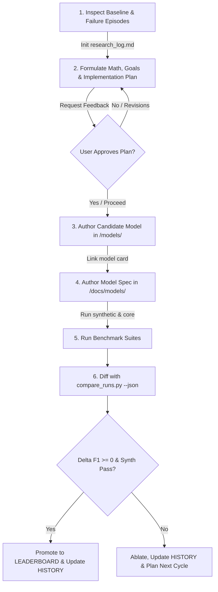

# Vialactée Autonomous Research Agent Skill

Use this skill whenever you are tasked with conducting Music Information Retrieval (MIR) research, evaluating or tuning beat tracking algorithms, creating candidate models, investigating failure episodes, or benchmarking against the neural ground-truth suite in `/research/`.

---

## 1. Core Principles & Safety Invariants

### 1.0 Musical Scope & Domain Focus (Electro, Techno, Rock, Pop)
- **Target Genres Only:** The Vialactée chandelier is designed for dynamic nightlife, immersive visual shows, and high-energy music listening. Research and algorithmic tuning must **strictly focus on Electro, Techno, Synthwave, Rock, and Pop** songs.
- **Do Not Divert:** Never divert research effort onto acoustic chanson, slow jazz waltzes, or obscure complex polyrhythmic acoustic music.
- **The Curated 10-Track `neural-core` Suite:** The standard real-world evaluation suite is composed exclusively of representative tracks across these core genres:
  - **Electro / Techno / Synthwave:** `Genesis` (Justice), `Nightcall` (Kavinsky), `Roadgame` (Kavinsky)
  - **Rock / Hard Rock:** `Bohemian Rhapsody - Remastered 2011`, `Roxanne - Remastered 2003`, `Sweet Child O' Mine`, `Under Pressure - Remastered 2011`
  - **Pop / Pop-Rock:** `Pumped Up Kicks`, `Where Is My Mind_`, `Stayin' Alive - From _Saturday Night Fever_ Soundtrack`

### 1.1 The Real-Time Embedded Constraint ($\le 3.0\text{ms}$)
- Production chandelier code runs at **60 FPS** ($16.6\text{ms}$ total frame budget) on a **Raspberry Pi 4 / 5**.
- Audio ingestion + Beat Tracking + Novelty Detection cannot exceed **$3.0\text{ms}$** per frame on ARM Cortex-A72.
- **Zero Dynamic Heap Allocation:** Never allocate new arrays or resize buffers in per-frame `update()`. All arrays must be pre-allocated NumPy buffers initialized in `__init__()`.
- **Pure Vectorization:** Use compiled NumPy matrix math (`np.dot`, `np.convolve`, slicing). Never write Python `for` loops over raw audio sample buffers.

### 1.2 The Zero-Regression Policy
- Any candidate model proposed for promotion to production (`core/AudioAnalyzer.py`) must pass the **clean-room synthetic suite** (`--suite synthetic`) with **$\Delta \text{F1@50ms} \ge 0.0\%$**.
- A candidate that improves complex syncopated tracks but causes double-trigger chatter or phase lag on steady click tracks will be rejected.

### 1.3 Agent Execution & Workflow Guardrails
- **No Background Polling Loop:** Benchmark suites take ~15s (`synthetic`) to ~45s (`neural-core`). Always launch benchmarks with `WaitMsBeforeAsync=10000`. If a task is sent to the background, **DO NOT poll with `manage_task(Action='status')` or set short timers with `schedule` in a loop**. Simply end your turn and let the system deliver the reactive task completion notification.
- **Subagents: Pure Reactive Wakeup (No Timers or Polling):** When you spawn subagents with `invoke_subagent`, the system resumes your execution **automatically** as soon as a subagent finishes or sends a message. **NEVER call `schedule` to set a check-in timer, and NEVER call `manage_subagents(Action='list')` to check if a subagent is done.** Simply end your turn or proceed with other independent work; the platform will deliver the subagent's response directly to your inbox.
- **Windows / PowerShell Command Safety:**
  - **Never use multi-statement inline `python -c "..."` commands** in PowerShell. Nested single/double quotes, f-strings, and semicolons get stripped by PowerShell, causing `SyntaxError: unterminated string literal` or `NameError: name 'np' is not defined`.
  - Instead, write a clean Python script to `<appDataDir>\brain\<conversation-id>/scratch/<name>.py` using `write_to_file`, and run it with `python <path>`.
  - Always ensure UTF-8 output encoding in Python scripts (`import sys; sys.stdout.reconfigure(encoding='utf-8')`) to avoid `UnicodeEncodeError: 'charmap'` with mathematical/Greek characters (`≤`, `Δ`, `•`).
  - Prefer using existing CLI tools (`run_benchmark`, `diagnose_track`, `run_ablation`) over writing ad-hoc scratch scripts.
- **Scorecard Dictionary Schema:** When reading programmatically from `scorecard.json` or evaluation results, use these exact canonical keys:
  - `f1_50ms` (float, e.g. 0.920 for 92.0%)
  - `f1_70ms` (float)
  - `f1_salient_50ms` (float, Rhythmic Salience-Weighted F1: weights precision and recall by beat importance ground truth)
  - `cmlt` (float, Correct Metric Level Total)
  - `amlt` (float, Any Metric Level Total)
  - `upbeat_gap` (float, $AMLt - CMLt$; $>0.10$ indicates 180° upbeat locking)
  - `mean_phase_bias_ms` (float, ms phase offset)
  - `phase_jitter_ms` (float, ms phase standard deviation)
  - `bpm_trust_calibration` (float, Pearson correlation between model's live `confidence_score` and ground truth salience curve $S(t)$)
  - `avg_frame_time_ms` (float, CPU latency per frame)
  - `crashed` (bool, true if simulation threw an exception)
- **Benchmark Exit Codes:**
  - `compare_runs.py` exits with code **0** when candidate is improved or neutral.
  - It exits with code **1** when a regression is detected ($\Delta \text{F1} < -0.5\%$). This is a **domain signal** (regression detected), NOT an execution crash or tool error! You can also pass `--allow-regression` to force exit code 0.

### 1.4 The Living Research Artifact Invariant (`research_log.md`)
- For **every** research cycle, the agent **MUST** initialize and maintain a living user-facing markdown artifact:
  `<appDataDir>\brain\<conversation-id>/research_log.md` (ArtifactMetadata: `UserFacing: true`, `RequestFeedback: false`).
- **Incremental Chronological Updates:** The artifact must NOT be created only at the end. Update it progressively as each phase finishes:
  1. **Phase 1 (Orientation):** Append literature review, baseline scorecard, inspected failure episodes, and target musical styles.
  2. **Phase 2 (Hypothesis):** Append mathematical rationale, target equations, and failure modes to resolve.
  3. **Phase 3 (Architecture):** Append candidate buffer design, vectorized update rules, and $\le 3.0\text{ms}$ budget verification.
  4. **Phase 4 (Model Card):** Reference the newly authored `research/docs/models/<CandidateName>.md`.
  5. **Phase 5 (Benchmarks):** Append synthetic scorecard table (zero-regression check) and real-world (`neural-core`) scorecard table.
  6. **Phase 6 (Diagnostics & Decision):** Append single-track comparisons, ablation tables, final decision (Promote vs Reject), and lessons learned.
- Refer to [`research/docs/templates/RESEARCH_CYCLE_ARTIFACT_TEMPLATE.md`](file:///c:/Users/Users/Desktop/vialactée/vialactee/research/docs/templates/RESEARCH_CYCLE_ARTIFACT_TEMPLATE.md) for the standard structure.

---

## 2. The 6-Step Autonomous Scientific Loop



### Step 1: Literature & Diagnostic Inspection
1. Read the latest entries in [`research/experiments/RESEARCH_HISTORY.md`](file:///c:/Users/Users/Desktop/vialactée/vialactee/research/experiments/RESEARCH_HISTORY.md) to understand current state of the art and past dead ends.
2. Read the baseline scorecard in [`research/experiments/runs/`](file:///c:/Users/Users/Desktop/vialactée/vialactee/research/experiments/runs/) and inspect `failure_episodes.json` to identify active error types (`PHASE_INVERSION_UPBEAT`, `GHOST_BEAT_BURST`, `HIGH_PHASE_JITTER`).
3. Check [`research/benchmarks/ground_truth/music_catalog.json`](file:///c:/Users/Users/Desktop/vialactée/vialactee/research/benchmarks/ground_truth/music_catalog.json) to correlate failures with musical style (e.g. 180° upbeat traps in Disco/Funk vs 3/4 drift in Chanson).
4. **Inspect target tracks directly with diagnostic tools:**
   ```bash
   # Quick diagnostic of a single failing track:
   python -m research.benchmarks.diagnose_track --track "Stayin' Alive"
   
   # Visual 4-tier plot of waveform, flux, phase sawtooth, and failure zones:
   python -m research.benchmarks.plot_diagnostics --audio "research/benchmarks/audio/Stayin' Alive.mp3" --beats "research/benchmarks/ground_truth/neural/Stayin' Alive - From _Saturday Night Fever_ Soundtrack.beats.txt" --output "research/experiments/diagnostics_stayin_alive.png"
   ```
5. **Initialize Living Artifact:** Create `<appDataDir>\brain\<conversation-id>/research_log.md` (ArtifactMetadata: `UserFacing: true`, `RequestFeedback: false`) with the Section 1 Orientation summary.

### Step 2: Formulate Math, Goals & Create Implementation Plan (Dual-Mode Approval Gate)
1. **Mathematical Formulation & Goals:** Formulate a rigorous mathematical hypothesis and concrete goals:
   - State the governing equations in LaTeX (e.g. difference equations, resonator matrix geometry, Hilbert quadrature).
   - Define exact quantitative goals (e.g. *"Lift Rock F1 from 41.1% to $\ge 60.0\%$ on Sweet Child O' Mine while preserving 0.20ms CPU latency"*).
   - If needed, delegate mathematical prototyping to a subagent (`invoke_subagent`) to verify equations in `<appDataDir>/brain/<conversation-id>/scratch/` before drafting the plan.
2. **Author the Implementation Plan Artifact:**
   Create `<appDataDir>\brain\<conversation-id>/implementation_plan.md`:
   - Detailed sections:
     - **Problem & Baseline Failure Modes**
     - **Mathematical Formulations & DSP Equations** (in rigorous LaTeX)
     - **Quantitative Goals & Success Criteria**
     - **Proposed Code Changes** (Model file, Model Card, Configs)
     - **Verification Plan** (Synthetic clean-room zero-regression gate, `neural-core` 10 tracks)
3. **APPROVAL GATE (Dual-Mode Operation):**
   - **Mode A: Interactive Standalone Mode (Human-Driven):**
     - Set `ArtifactMetadata: RequestFeedback: true, UserFacing: true`.
     - **STOP calling tools and yield the turn.**
     - Ask the user to review and approve the implementation plan before writing any model code or running heavy benchmarks.
     - **Do NOT proceed to Step 3 until the user explicitly approves the plan** (e.g. clicks "Proceed" or gives confirmation).
   - **Mode B: Autopilot Worker Mode (Supervised by Research Manager or `/goal`):**
     - Set `ArtifactMetadata: RequestFeedback: false, UserFacing: true` (ensures the IDE UI modal does not block).
     - Send the mathematical implementation plan directly to the parent Research Manager via `send_message`.
     - Upon receiving the confirmation message (`"APPROVED: Proceed..."`), proceed immediately to Step 3 without halting.
4. **Update Artifact:** Append the approved hypothesis and mathematical equations to `research_log.md`.

### Step 3: Implement Candidate Model
1. Create a new model file: `research/experiments/models/<CandidateName>.py`.
2. Must inherit from `BaseAudioAnalyzer` and implement the standard constructor:
   ```python
   from typing import Dict, Any, Optional
   from core.BaseAudioAnalyzer import BaseAudioAnalyzer
   from core.RhythmConfig import RhythmConfig

   class CandidateModel(BaseAudioAnalyzer):
       def __init__(
           self,
           ingestion: Any = None,
           infos: Optional[Dict[str, Any]] = None,
           config: Optional[RhythmConfig] = None
       ) -> None:
           super().__init__(ingestion=ingestion, infos=infos, config=config)
           self.config = config or RhythmConfig()
   ```
3. Implement `reset()`, `update(current_time, dt, fps_ratio)`, and `capture_frame_telemetry()`.
4. **Update Artifact:** Append model architecture notes and buffer pre-allocation details to `research_log.md`.

### Step 4: Write Model Documentation
1. Copy [`research/docs/models/MODEL_CARD_TEMPLATE.md`](file:///c:/Users/Users/Desktop/vialactée/vialactee/research/docs/models/MODEL_CARD_TEMPLATE.md) to `research/docs/models/<CandidateName>.md` and document the mathematical equations ($ODF$, phase flywheel, template scoring), hyperparameters, and target failure modes.
2. **Update Artifact:** Link model documentation card in `research_log.md`.

### Step 5: Benchmark Execution
Use the curated 9-track `neural-core` suite for rapid iteration, and `synthetic` for regression verification:

```bash
# Rapid test on neural-core (~30-45 seconds)
python -m research.benchmarks.run_benchmark --model <CandidateName> --suite neural-core --save-run --name test_attempt_1

# Clean-room synthetic zero-regression check (~15 seconds)
python -m research.benchmarks.run_benchmark --model <CandidateName> --suite synthetic --save-run --name test_attempt_1_synth
```

Targeted single-track and category tests (never write custom evaluation loops):
```bash
# Test a single track by name:
python -m research.benchmarks.run_benchmark --model <CandidateName> --suite neural-core --track "Stayin' Alive"

# Test specific genres:
python -m research.benchmarks.run_benchmark --model <CandidateName> --suite neural-core --genre funk

# Test specific meters (e.g. 3/4 or 4/4):
python -m research.benchmarks.run_benchmark --model <CandidateName> --suite neural-core --meter 3/4

# Parameter sweeps without editing code:
python -m research.benchmarks.run_benchmark --model <CandidateName> --suite neural-core --param high_snap_ratio=0.40 --param human_prior_center=120.0
```
**Update Artifact:** Append both synthetic and real-world benchmark scorecards to `research_log.md`.

### Step 6: Automated Comparison, Ablation & Logging
Run `compare_runs.py` to get machine-readable deltas and exit codes:
```bash
python -m research.benchmarks.compare_runs research/experiments/runs/<BASELINE_RUN> research/experiments/runs/<CANDIDATE_RUN> --json
```
- **If improved ($\Delta \text{F1} > 0$ and synthetic passes):**
  - Record entry in [`research/experiments/RESEARCH_HISTORY.md`](file:///c:/Users/Users/Desktop/vialactée/vialactee/research/experiments/RESEARCH_HISTORY.md).
  - Update [`research/experiments/LEADERBOARD.md`](file:///c:/Users/Users/Desktop/vialactée/vialactee/research/experiments/LEADERBOARD.md).
  - Recommend promotion to production.
  - **Update Artifact:** Append final positive verdict to `research_log.md`.
- **If regressed or dead end:**
  - **Run automated ablation before guessing:** Use `run_ablation.py` to isolate which component caused the regression:
    ```bash
    python -m research.benchmarks.run_ablation --track "Nightcall" --models AudioAnalyzer,<CandidateName>
    ```
  - Log failure rationale in `RESEARCH_HISTORY.md` so future agents do not repeat the attempt.
  - **Update Artifact:** Append ablation findings, failure rationale, and lessons learned to `research_log.md`.

---

## 3. The Researcher Toolbelt Quick Reference

| Tool | Command | Description |
| :--- | :--- | :--- |
| **Suite Benchmark** | `python -m research.benchmarks.run_benchmark --suite <suite> --model <Model>` | Runs complete benchmark suite with episode extraction and scorecard |
| **Single-Track Diagnosis** | `python -m research.benchmarks.diagnose_track --track "<name>" [--baseline <M1> --candidate <M2>]` | Deep dive into a single track: F1, CMLt, ASCII beat-grid visualizer, upbeat/downbeat energy distribution, phase jumps |
| **Automated Ablation** | `python -m research.benchmarks.run_ablation --track "<name>" --models <M1>,<M2> [--params k1=v1,k2=v2]` | Rapid side-by-side ablation table isolating components |
| **Run Diffing** | `python -m research.benchmarks.compare_runs <RUN_A> <RUN_B> [--json] [--allow-regression]` | Compares two full experiment runs with macro and genre breakdowns |
| **Visual Waveform Plot** | `python -m research.benchmarks.plot_diagnostics --audio <path> --beats <path> --output <png>` | 4-tier diagnostic plot showing waveform, predicted beats, phase sawtooth, and failure zones |
| **DSP Kernel Generator** | `from research.dsp.comb_kernels import build_sparse_impulse_comb_bank, build_fourier_comb_bank` | Precomputed matrix banks ($W_I, W_Q \in \mathbb{R}^{K \times M}$) with negative baseline and Hilbert quadrature ($\le 0.22\text{ms}$ BLAS evaluation) |

---

## 4. First-Principles Mathematical Redesign & Architectural Freedom

### 4.1 Beyond Incremental Tweaks
Researchers are **not** restricted to tweaking hyperparameters or adding minor `if` statements to the legacy `AudioAnalyzer.py` logic. If incremental tuning encounters diminishing returns or plateauing failure modes (e.g. persistent upbeat traps on funk/disco, octave ambiguity on synthwave arpeggios), **take a step back and redesign the mathematical foundation from first principles**.

You have full authority to propose and implement fundamentally new mathematical paradigms, provided you mathematically justify the choice and respect the real-time embedded safety invariants.

### 4.2 Candidate Mathematical Paradigms
Instead of legacy 1D Pearson correlation over a 5-second static template buffer, consider alternative well-founded MIR / DSP architectures:
- **Resonator Filterbanks (Comb Filter / IIR Oscillators):**
  Maintain a parallel bank of $K$ tuned second-order complex IIR resonators across the tempo grid ($60 \le \text{BPM}_k \le 180$). Compute instantaneous energy $E_k(t) = |z_k(t)|^2$ and phase $\phi_k(t) = \text{atan2}(\text{Im}(z_k), \text{Re}(z_k))$ continuously with zero lookahead latency.
- **State-Space & Extended Kalman Filters (EKF):**
  Model rhythm as a continuous dynamic state vector $x_t = [\theta_t, \omega_t, \alpha_t]^T$ (instantaneous phase, tempo velocity, acceleration) driven by multi-band measurement novelty vectors $[y_{\text{kick}}, y_{\text{snare}}, y_{\text{hat}}]^T$. Tracks covariance $P_t$, handling dropouts via Kalman prediction without ad-hoc heuristic thresholds.
- **Dual-Tier Phase-Locked Loops (Costas Loop Demodulators):**
  Treat beat tracking as carrier phase recovery. A Voltage-Controlled Oscillator (VCO) driven by a loop filter comparing incoming multi-band novelty with the oscillator phase, using a quadrature phase detector to cleanly resolve $90^\circ$ and $180^\circ$ offbeat ambiguities.
- **Online Circular Autocorrelation & Tempogram Analysis:**
  Compute an incremental sliding circular lag-domain autocorrelation matrix ($R_{xx}(\tau, t)$) directly in pre-allocated buffers, eliminating template bank bias.
- **Harmonic Energy Ratio & Timbre-Conditional Pulse Generators:**
  Multi-channel novelty where downbeat energy is conditioned on low-frequency transient dominance ($E_{\text{sub}} / E_{\text{high}}$) rather than a single collapsed scalar flux.

### 4.3 The 4 Non-Negotiable Invariants
Any clean-sheet mathematical redesign must satisfy:
1. **Contract Inheritance:** Subclass [`core.BaseAudioAnalyzer.BaseAudioAnalyzer`](file:///c:/Users/Users/Desktop/vialactée/vialactee/core/BaseAudioAnalyzer.py) directly (implementing `__init__`, `reset()`, `update()`, and `beat_phase`). Do not inherit from `AudioAnalyzer` if you are replacing its paradigm.
2. **Real-Time Safety:** Per-frame `update()` execution must remain $\le 3.0\text{ms}$ on ARM Cortex-A72 at 60 FPS.
3. **Zero Heap Allocation:** All state arrays, filter coefficients, and history matrices must be pre-allocated in `__init__()`. No dynamic allocations or array reshaping inside `update()`.
4. **Zero Clean-Room Regression:** Must pass the synthetic suite (`--suite synthetic`) with $\Delta \text{F1@50ms} \ge 0.0\%$.

### 4.4 Documentation & Justification Requirements
When introducing a first-principles mathematical redesign, you must explicitly document in your model card (`research/docs/models/<CandidateName>.md`) and your living artifact (`research_log.md`):
1. **The Structural Flaw of the Legacy Math:** What mathematical assumption broke (e.g. *"A 1D Pearson correlation over a single scalar flux collapses timbre information, making a 130 BPM hi-hat offbeat transient indistinguishable from a kick downbeat"*).
2. **The New Mathematical Equations:** State the governing difference equations, transfer functions, state transitions, or loss/energy functions in rigorous $\LaTeX$.
3. **Complexity & Memory Proof:** Prove that the per-frame operation is $O(N)$ or $O(1)$ and runs within the pre-allocated footprint.

### 4.5 The Lesson of Cycle 005 & The Sparse Impulsive Comb Resonator
In Cycle 005, `DualResonatorAudioAnalyzer` demonstrated that replacing the 1D loop with a vectorized complex resonator matrix ($W \cdot y$) achieved a **12x CPU speedup (0.20ms per frame)** and a **+8.4% Pop gain** (*Pumped Up Kicks* +13.5%, *Nightcall* AMLt +19.5%).
However, using pure continuous Fourier sinusoids ($\exp(-j\omega t)$) caused a severe regression on Rock (-19.7% F1 on *Sweet Child O' Mine*).
- **The Root Cause:** Continuous sinusoids integrate energy across the entire period. In dense Rock, sustained distorted guitar chords leak continuous harmonic energy across all Fourier frequency bins, smearing the phase and causing phase hunting.
- **The Solution (The Sparse Impulsive Comb Resonator):**
  The baseline `AudioAnalyzer` succeeded on Rock because its template has a **sparse triangular pulse surrounded by a negative baseline (-1.0)**. The negative baseline penalizes sustain and only rewards sharp attack transients.
  Use `research.dsp.comb_kernels.build_sparse_impulse_comb_bank(...)` to get precomputed matrix banks ($W_I, W_Q$) featuring sparse triangular/Hann pulses with zero-mean negative baselines and closed-form Hilbert quadrature. This preserves the 0.20ms BLAS evaluation speed while eliminating broadband guitar leakage.

### 4.6 The Breakthrough of Cycle 008 & Multi-Band Onset Derivatives (Current SOTA)
In Cycle 008, `MultiBandOnsetAudioAnalyzer` established a new all-time benchmark record:
- **Macro F1@50ms:** **45.1%** on `neural-core` (up from baseline 41.1%).
- **Clean-Room Synthetic:** **95.4%** F1 / 95.9% CMLt.
- **Per-Frame Latency:** **0.47ms** (well within the $\le 3.0\text{ms}$ ARM budget).
- **Core Mechanism:** Replaces single-channel collapsed flux with 16-band half-wave rectified onset slopes ($\Delta E_b[t] = \max(0, E_b[t] - E_b[t-1])$) and kick-conditioned anti-phase disambiguation.
- **Research Directive:** Any radical new paradigm should build on top of multi-band onset separation (or equivalent timbre-selective representation) rather than collapsing raw audio into a single scalar flux.

---

## 5. Lean Subagent Delegation & Adversarial Red-Teaming

To prevent token exhaustion, latency bloat, and fragile multi-tier nesting, autonomous research follows a **Lean 2-Tier Subagent Model**:
- **Direct Execution by Lead Researcher:** The Lead Researcher executes all fast CLI commands directly via bash/PowerShell ([`diagnose_track.py`](file:///c:/Users/Users/Desktop/vialactée/vialactee/research/benchmarks/diagnose_track.py), [`run_ablation.py`](file:///c:/Users/Users/Desktop/vialactée/vialactee/research/benchmarks/run_ablation.py), and [`compare_runs.py`](file:///c:/Users/Users/Desktop/vialactée/vialactee/research/benchmarks/compare_runs.py)). Do NOT spawn sub-subagents merely to run a single CLI command!
- **Targeted Subagent Delegation:** Spawning subagents (`invoke_subagent`) is reserved for high-leverage cognitive tasks:

### 5.1 High-Value Subagent Delegation Patterns

1. **Adversarial Red-Team Gatekeeper (`research` or `self` subagent):**
   - **Mandate:** Audit the mathematical proposal and code implementation for physical edge cases before heavy benchmarks are run.
   - **Checklist:**
     - Phase wrap discontinuities near $\phi = 0.0$ and $\phi = 2\pi$.
     - Division by zero or NaN during quiet song intros / breakdowns.
     - 180° upbeat traps on syncopated funk/disco tracks.
     - Memory profiling: verifies that `update()` executes with zero dynamic heap allocations.
   - **Prompt Example:**
     > *"Red-team the proposed Costas-loop model in `research/experiments/models/CostasAudioAnalyzer.py`. Specifically audit the phase discriminator for boundary discontinuities when phase wraps around 2*pi, check for potential NaN propagation during silent intros, and confirm that all state buffers are pre-allocated in __init__(). Return a prioritized bullet list of risks and concrete safeguards."*

2. **Mathematical Prototyper (`self` subagent):**
   - **Task:** Test a new difference equation, pole-zero stability, or BLAS vectorization scheme in an isolated scratch script before authoring a full model class.
   - **Prompt Example:**
     > *"Test the numerical stability and per-frame CPU latency of a vectorized 16-oscillator Kuramoto network on synthetic 120bpm audio in `<appDataDir>/brain/<conversation-id>/scratch/kuramoto_test.py`. Verify that it executes in <= 0.5ms on 1000 frames with zero dynamic array allocations. Return only CPU timing, stability confirmation, and the vectorized NumPy function snippet."*

### 5.2 Subagent Execution Rules for the Lead Researcher
- **Clear & Bounded Briefs:** Provide the subagent with explicit inputs, mathematical constraints, and required outputs.
- **Strictly No Polling:** Do NOT call `schedule` or `manage_subagents` in a loop. End your turn; the system automatically delivers a high-priority reactive wakeup when the subagent completes.
- **Log to Living Artifact:** Synthesize discoveries and embed them directly into `<appDataDir>\brain\<conversation-id>/research_log.md`.

---

## 6. Executive Reporting Format (Mandatory)

Never end a research cycle with a rambling wall of text that buries the bottom line. The user should never have to ask *"so what's the conclusion?"*.
Every final response concluding a research cycle MUST start with this structured Executive Summary:

```markdown
# 🧬 Research Cycle XXX Executive Report: [Candidate Model Name]

**Investigator:** Autonomous Lead Rhythm Data Scientist & Audio DSP Engineer  
**Target Domain:** High-Energy Electro, Techno, Synthwave, Classic Rock & Pop  
**Candidate Model:** [`research/experiments/models/<Model>.py`](...)  
**Living Experiment Log:** [`research_log.md`](...)  

---

## 1. Executive Summary & Verdict

| Metric | Official Baseline | Candidate Model | Net Delta ($\Delta$) | Status |
| :--- | :---: | :---: | :---: | :---: |
| **Synthetic Suite F1@50ms** | 92.0% | XX.X% | +X.X% | **PASS / FAIL** |
| **Synthetic Suite CMLt** | 91.6% | XX.X% | +X.X% | **GAIN / REGRESSION** |
| **Real-World Macro F1@50ms** | 41.1% | XX.X% | +X.X% | **GAIN / REGRESSION** |
| **Real-World Macro CMLt** | 36.5% | XX.X% | +X.X% | **GAIN / REGRESSION** |
| **Pop / Pop-Rock F1@50ms** | 28.7% | XX.X% | +X.X% | **GAIN / REGRESSION** |
| **Classic / Hard Rock F1@50ms** | 60.8% | XX.X% | +X.X% | **GAIN / REGRESSION** |
| **Per-Frame CPU Latency** | 2.44 ms | X.XX ms | -XX% | **PASS (<= 3.0ms)** |
| **Heap Allocations in `update()`** | 0 bytes | 0 bytes | 0 | **VERIFIED** |

### Decision: `[PROMOTION RECOMMENDED / REJECTED (ZERO-REGRESSION INVARIANT)]`
[Brief 2-3 sentence bottom line explaining the decision]

---

## 2. Genre & Key Track Breakthroughs
- **[Genre 1]:** [Highlight specific track gains, e.g. Pumped Up Kicks +13.5%]
- **[Genre 2]:** [Highlight specific track continuity or jitter improvements]

## 3. Root-Cause Analysis of Any Regressed Tracks
- **[Track Name]:** [Explicit mathematical diagnosis of why it regressed]

## 4. Architectural Directive for the Next Cycle
- [Clear, actionable mathematical formulation or experiment for Cycle N+1]
```


