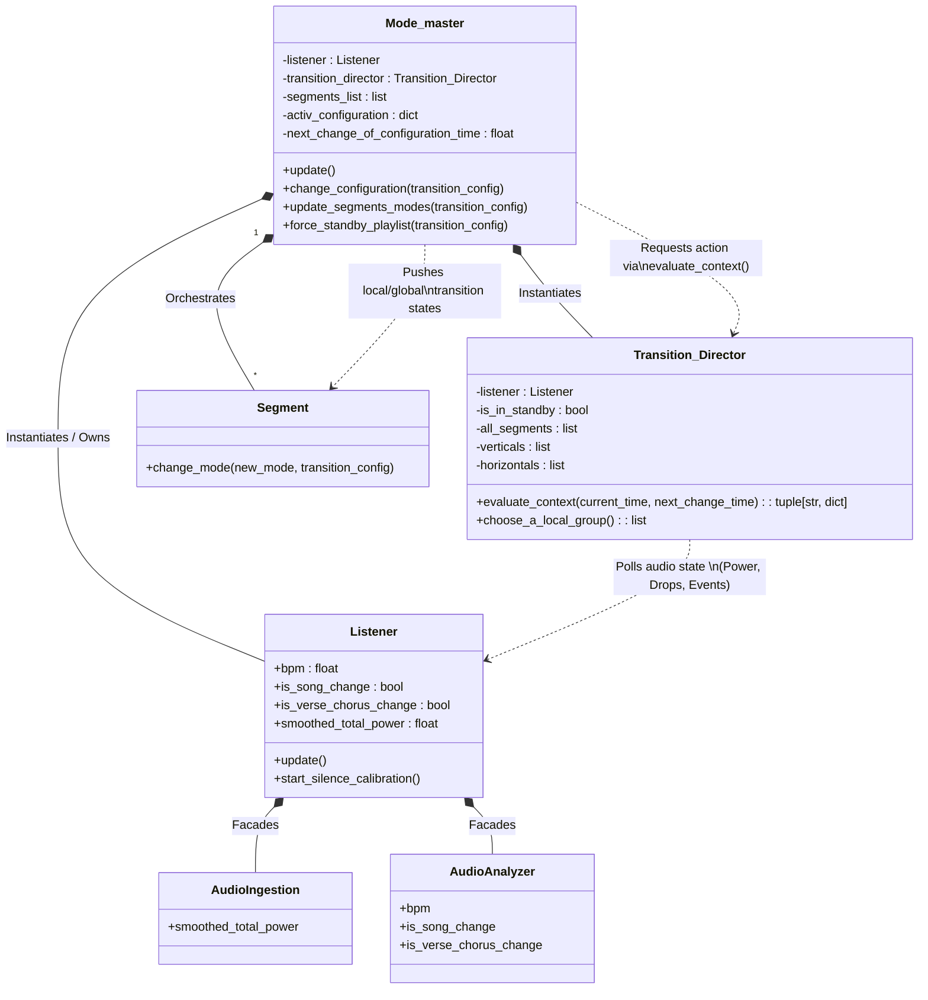

# Core Engine (`/core/`)

The `core` directory is the engine room of Vialactée. It contains the primary modules responsible for asynchronous orchestration, audio DSP processing, and structural event mapping.

## Key Components:

- **`AudioIngestion.py` & `AudioAnalyzer.py`**: The dual-engine audio pipeline. `AudioIngestion` handles the sliding buffers and pure `numpy` vectorization to compute FFTs, Spectral Flux, and ADSR envelopes. `AudioAnalyzer` calculates the Phase-Locked Loop (PLL) beat tracking and structural event logic.
- **`Listener.py`**: The transparent facade orchestrator. It instantiates both Ingestion and Analysis layers and provides a fully backward-compatible API to feed data into the visual modes and transition engine.
- **`Mode_master.py`**: The 30FPS rendering engine. It polls the `Listener` for audio features and routes them to the currently active visual modes, maintaining strict framerates without blocking.
- **`Transition_Director.py` & `Transition_Engine.py`**: Orchestrates large-scale lighting changes based on musical structure (e.g., dropping the lights during a heavy bass drop or changing the animation style at a chorus).
- **`Segment.py`**: A logical abstraction of the physical LED strips, mapping mathematical vectors to physical addresses.

## How it works:
The `Mode_master` runs an asynchronous loop, asking the `Listener` for the current state of the music. Based on rules handled by the `Transition_Director`, it updates the LED `Segment`s using the algorithms defined in the `modes/` directory.

## Core Architecture Diagram

The following diagram visualizes the interaction and structural relationship between `Listener`, `Mode_master`, and `Transition_Director`:

### Interaction within the Execution Loop (`update()`):

1. **Audio Ingestion & Calculation:**
   `Mode_master` fires `listener.update()` every frame. The `Listener` (acting as a facade) processes raw audio through `AudioIngestion` and runs the algorithmic detections in `AudioAnalyzer`.

2. **Context Evaluation:**
   `Mode_master` immediately asks the `Transition_Director` what to do by passing the time state: `transition_director.evaluate_context(current_time, next_change_time)`.
   
3. **Probabilistic Decision:**
   `Transition_Director` looks at the state of the `Listener` (checking variables like `smoothed_total_power`, `is_song_change`, `is_verse_chorus_change`). It determines whether to allow a transition to happen, force the system to go into standby (due to silence), or wait. It then packages its decision into an instruction tuple: `(action, transition_config)`.

4. **Execution:**
   `Mode_master` receives the `action` returned by the director. If the action is `"allow_change"`, the orchestrator executes `change_configuration()` passing along the spatial transition configuration matrix requested by the director to all the underlying physical `Segment` objects.

