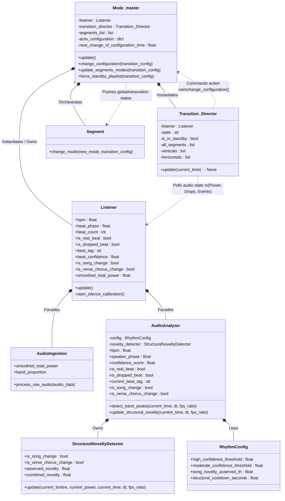

# Core Engine (`/core/`)

The `core` directory is the engine room of Vialactée. It contains the primary modules responsible for asynchronous orchestration, audio DSP processing, beat tracking, and structural event mapping.

## Key Components:

- **`AudioIngestion.py`**: Leaf DSP filterbank engine. Receives raw PCM audio, initializes persisted luminosity/sensibility from `config/app_config.json`, and applies pure `numpy` vectorization to compute FFTs, Mel-band weights (8 bands), Chromagrams (12 pitch classes), and ADSR envelopes.
- **`AudioAnalyzer.py`**: Executes the **Anticipation Flywheel ("Oracle")** engine with an $O(1)$ Pearson template bank, logarithmic tempo-class arithmetic, look-ahead phase back-projection to speaker time, real/dropped beat validation, and frequency-band tagging. Fully decomposed into cohesive pipeline stages (`_compute_spectral_flux`, `_ingest_odf_buffer`, `_run_oracle_sweep`, `_advance_flywheel`).
- **`StructuralNoveltyDetector.py`**: Dedicated structural novelty engine. Autonomously identifies Verse/Chorus boundaries, Seamless Crossfades, and Silence Drops using Short-Term Memory (STM) vs Long-Term Memory (LTM) tension wrapped in dynamic asserved mathematical envelopes.
- **`RhythmConfig.py`**: Centralized, strongly-typed configuration dataclass holding all thresholds, cooldowns, and constants for beat tracking, flywheel trust levels, and structural novelty detection.
- **`Listener.py`**: The transparent facade orchestrator. Instantiates Ingestion and Analysis layers and provides a fully backward-compatible API (`beat_phase`, `beat_count`, `bpm`, `is_real_beat`, `is_dropped_beat`, `beat_tag`, `beat_confidence`, `is_song_change`, `is_verse_chorus_change`) to feed data into the visual modes and transition engine. Manages a 5-second non-causal delay queue to synchronize real-time spectral arrays with the predictive lookahead of the beat tracker.
- **`Mode_master.py`**: The 30FPS rendering engine. Polls the `Listener` for audio features, loads playlist/configuration rotation from `data/configurations.json`, routes state to the currently active visual modes, and exposes JSON-safe state snapshots for the web app.
- **`Transition_Director.py` & `Transition_Engine.py`**: Orchestrates large-scale lighting changes based on musical structure (e.g., dropping the lights during a heavy bass drop or changing the animation style at a chorus).
- **`Segment.py`**: A logical abstraction of the physical LED strips, mapping mathematical vectors to physical addresses.

## How it works:

The `Mode_master` runs an asynchronous loop, asking the `Listener` for the current state of the music. Based on rules handled by the `Transition_Director`, it updates the LED `Segment`s using the algorithms defined in the `modes/` directory. When a `Connector` is attached, it also broadcasts changed state snapshots so Live Deck and Topology mirror automatic backend transitions.

## Core Architecture Diagram

The following diagram visualizes the interaction and structural relationship between `Listener`, `Mode_master`, `Transition_Director`, `AudioAnalyzer`, and `StructuralNoveltyDetector`:

```mermaid
classDiagram
    %% Core Orchestration
    class Mode_master {
        -listener : Listener
        -transition_director : Transition_Director
        -segments_list : list
        -activ_configuration : dict
        -next_change_of_configuration_time : float
        +update()
        +change_configuration(transition_config)
        +update_segments_modes(transition_config)
        +force_standby_playlist(transition_config)
    }

    %% Spatial & Transition Logic Filter
    class Transition_Director {
        -listener : Listener
        -state : str
        -is_in_standby : bool
        -all_segments : list
        -verticals : list
        -horizontals : list
        +update(current_time) : None
    }

    %% Audio Facade & Analyzers
    class Listener {
        +bpm : float
        +beat_phase : float
        +beat_count : int
        +is_real_beat : bool
        +is_dropped_beat : bool
        +beat_tag : str
        +beat_confidence : float
        +is_song_change : bool
        +is_verse_chorus_change : bool
        +smoothed_total_power : float
        +update()
        +start_silence_calibration()
    }

    class AudioIngestion {
        +smoothed_total_power
        +band_proportion
        +process_raw_audio(audio_data)
    }

    class RhythmConfig {
        +high_confidence_threshold : float
        +moderate_confidence_threshold : float
        +song_novelty_asserved_th : float
        +structural_cooldown_seconds : float
    }

    class StructuralNoveltyDetector {
        +is_song_change : bool
        +is_verse_chorus_change : bool
        +asserved_novelty : float
        +combined_novelty : float
        +update(current_timbre, current_power, current_time, dt, fps_ratio)
    }
  
    class AudioAnalyzer {
        -config : RhythmConfig
        -novelty_detector : StructuralNoveltyDetector
        +bpm : float
        +speaker_phase : float
        +confidence_score : float
        +is_real_beat : bool
        +is_dropped_beat : bool
        +current_beat_tag : str
        +is_song_change : bool
        +is_verse_chorus_change : bool
        +detect_band_peaks(current_time, dt, fps_ratio)
        +update_structural_novelty(current_time, dt, fps_ratio)
    }

    %% Hardware & Visual Outputs
    class Segment {
        +change_mode(new_mode, transition_config)
    }

    %% --- Relationships and Interactions ---

    %% Composition / Ownership
    Mode_master *-- Transition_Director : Instantiates
    Mode_master *-- Listener : Instantiates / Owns
    Mode_master "1" *-- "*" Segment : Orchestrates
    Listener *-- AudioIngestion : Facades
    Listener *-- AudioAnalyzer : Facades
    AudioAnalyzer *-- StructuralNoveltyDetector : Owns
    AudioAnalyzer *-- RhythmConfig : Uses

    %% Logic Flow
    Transition_Director ..> Listener : Polls audio state \n(Power, Drops, Events)
    Transition_Director ..> Mode_master : Commands action via\nchange_configuration()
    Mode_master ..> Segment : Pushes global\ntransition states
```

### Interaction within the Execution Loop (`update()`):

1. **Audio Ingestion & Calculation:**
   `Mode_master` fires `listener.update()` every frame. The `Listener` (acting as a facade) processes raw audio through `AudioIngestion`, updates `StructuralNoveltyDetector` for macro-structure, and runs the predictive beat tracking pipeline in `AudioAnalyzer`.
2. **Context Evaluation:**
   `Mode_master` asks the `Transition_Director` to update its state and progress transitions by passing the time state: `transition_director.update(current_time)`.
3. **Probabilistic Decision:**
   `Transition_Director` looks at the state of the `Listener` (checking variables like incoming events and timers). It determines whether to allow a transition to happen. If a transition is needed, it directly commands the `Mode_master` (e.g., via `mode_master.change_configuration()`).
4. **Execution:**
   `Mode_master` receives the `action` returned by the director. If the action is `"allow_change"`, the orchestrator executes `change_configuration()` passing along the spatial transition configuration matrix requested by the director to all the underlying physical `Segment` objects.
