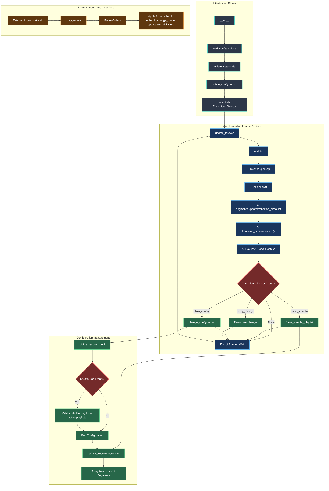

# Mode_master Internal Architecture

The `Mode_master` acts as the central conductor for the entire installation. It manages global state, configurations, playlists, segments, and external commands. 

Here is a visual breakdown of how it operates internally, followed by a detailed explanation of its core loops and logic paths.

## Internal Workflow Explained

### 1. Initialization (`__init__`)
When `Mode_master` starts, it sets up the environment:
*   **`load_configurations()`**: Reads `data/configurations.json` to load all available visual modes, settings, and playlists into memory.
*   **`initiate_segments()`**: Reads `config/segments.json` and creates `Segment` objects for every defined physical hardware strip (h00, v4, etc.).
*   **`initiate_configuration()`**: Seeds the system with an initial random configuration by drawing from the configuration shuffle bag.
*   **`Transition_Director`**: Bootstraps the director responsible for deciding exactly *when* configurations should change based on audio analysis.

### 2. The Main Update Loop (`update()`)
Running at approximately 30 frames per second (`update_forever`), the core loop is strictly ordered:
1.  **Audio Sync**: `listener.update()` fetches the latest audio FFT and volume data.
2.  **Hardware Flush**: `leds.show()` flushes the **previous frame's** buffer to the physical LED strips to ensure minimum latency.
3.  **Segment Execution**: Iterates over `segments_list` calling `update(transition_director)` on each. Segments calculate their new pixel data and perform dual-buffer mixing using the synchronized global transition progress.
4.  **Global Transitions Check**: Ticks `Transition_Director.update()` to advance any ongoing transition progress, then asks `evaluate_context()` if it is time to trigger a new configuration change.
    *   If `force_standby`, it switches to a chill mode (e.g., silence detected).
    *   If `allow_change`, it triggers a new random configuration.
    *   If `delay_change`, it postpones the change slightly because the current audio context (e.g., a drop building up) isn't right for a transition.

### 3. Configuration Management (The Shuffle Bag)
To ensure that all configurations in the allowed playlists are seen before repeating, `Mode_master` uses a **Shuffle Bag** (`pick_a_random_conf()`):
*   It dumps all available configurations into a list and randomizes it.
*   It pops one configuration at a time.
*   When the bag is empty, it refills and reshuffles it.
Once a configuration is picked, `update_segments_modes()` passes the new targets to the segments, skipping any segments that are currently marked as `isBlocked`.

### 4. External Orders (`obey_orders`)
At any time, an external application or network event can inject an order string. `obey_orders` parses these strings (e.g., `change_mode:Segment v4:Plasma Fire`) and overrides the automated flow. It can block segments from participating in global changes, force specific modes, or update global audio sensitivity.
