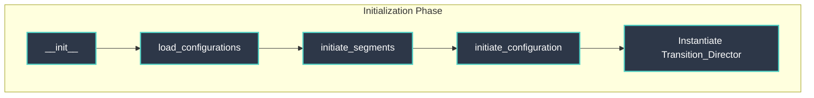
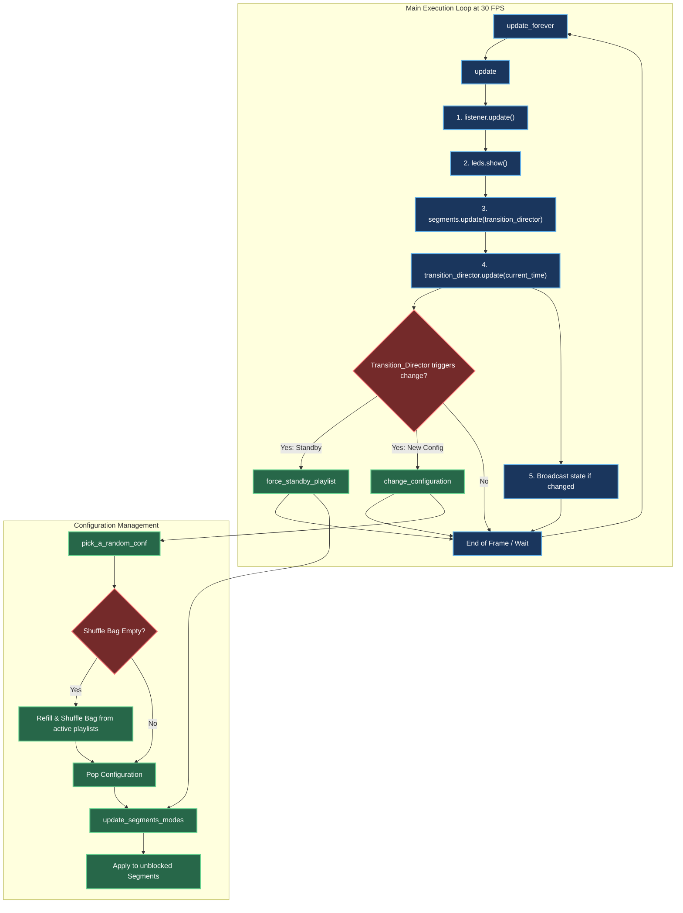
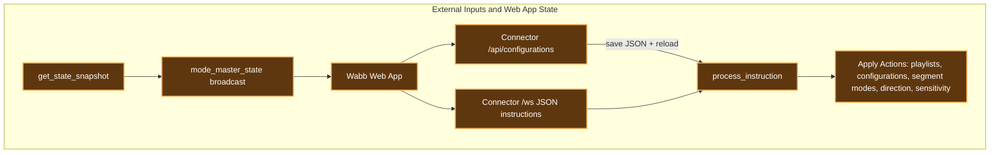

# Mode_master Internal Architecture

The `Mode_master` acts as the central conductor for the entire installation. It manages global state, configurations, playlists, segments, and external commands. 

Here is a visual breakdown of how it operates internally, followed by a detailed explanation of its core mechanisms.

## 1. Flowchart & Architecture

### Initialization

### Main Execution & Configuration

### External Inputs

## 2. Internal Workflow Explained

### 1. Initialization (`__init__`)
When `Mode_master` starts, it sets up the environment:
*   **`load_configurations()`**: Reads `data/configurations.json` to load all available visual modes, settings, and playlists into memory.
*   **`initiate_segments()`**: Reads `config/segments.json` and creates `Segment` objects for every defined physical hardware strip (h00, v4, etc.).
*   **`initiate_configuration()`**: Seeds the system with an initial random configuration by drawing from the configuration shuffle bag.
*   **`Transition_Director`**: Bootstraps the director responsible for deciding exactly *when* configurations should change based on audio analysis.

### 2. The Main Update Loop (`update()`)
Running at approximately 30 frames per second (`update_forever`), the core loop is strictly ordered:
1.  **Audio Sync**: `listener.update()` fetches the latest audio FFT and volume data.
2.  **Hardware Flush**: `leds.show()` flushes the **previous frame's** buffer to the physical LED strips to ensure minimum latency.
3.  **Segment Execution**: Iterates over `segments_list` calling `update(transition_director)` on each. Segments calculate their new pixel data and perform dual-buffer mixing using the synchronized global transition progress.
4.  **Global Transitions Check**: Ticks `transition_director.update(current_time)` to advance any ongoing transition progress and evaluate audio context. The `Transition_Director` has full autonomy to command the `Mode_master` to change configurations (e.g., via `change_configuration()`) when a music event or timer occurs. The `Mode_master` strictly obeys.
5.  **Web State Snapshot**: If a connector is attached, `get_state_snapshot()` is serialized and broadcast only when the visible state changes. This keeps Live Deck and Topology synchronized with automatic transitions without streaming every rendered frame.

### 3. Configuration Management (The Shuffle Bag)
To ensure that all configurations in the allowed playlists are seen before repeating, `Mode_master` uses a **Shuffle Bag** (`pick_a_random_conf()`):
*   It dumps all available configurations into a list and randomizes it.
*   It pops one configuration at a time.
*   When the bag is empty, it refills and reshuffles it.
Once a configuration is picked, `update_segments_modes()` passes the new targets to the segments, skipping any segments that are currently marked as `isBlocked`.

### 4. External Web App Instructions
At any time, the Wabb web app can send JSON instructions through `Connector.py` and `/ws`. `process_instruction()` handles the supported page/action pairs for Live Deck, Topology, Auto-DJ, and System controls.

The web app never owns playlist or configuration names. Both Python and React load them from `data/configurations.json`. Topology **persists** presets only through `POST /api/configurations` from `MODIFY` / `BUILD`; after a save, `Mode_master.load_configurations()` refreshes the in-memory playlist list and the connector broadcasts a fresh snapshot.

**Topology runtime overrides:** `page: "topology"`, `action: "select_segment_mode"` / `"toggle_segment_direction"` call `Segment.execute_mode_swap()` / `change_way()` on the live instances. They do **not** mutate `data/configurations.json` or the in-memory playlist tables.

**Active configuration isolation:** When a configuration is applied (`_apply_configuration`, initial pick, or `change_configuration`), `Mode_master` stores a shallow copy of that preset’s `modes` and `way` dicts on `activ_configuration`. Live segment swaps therefore cannot accidentally rewrite the shared configuration objects loaded from `data/configurations.json`.

### 5. State Snapshot Contract
`get_state_snapshot()` returns a JSON-safe view of:

* Active playlist and enabled playlists.
* Active and queued configuration names.
* Selected transition label and transition lock/progress.
* Luminosity and sensibility values.
* Every segment's id, name, active mode, direction, blocked flag, target mode, and transition status.

This snapshot is sent as a `mode_master_state` WebSocket message and is the authoritative source for what the Live Deck telemetry and Topology map display.
