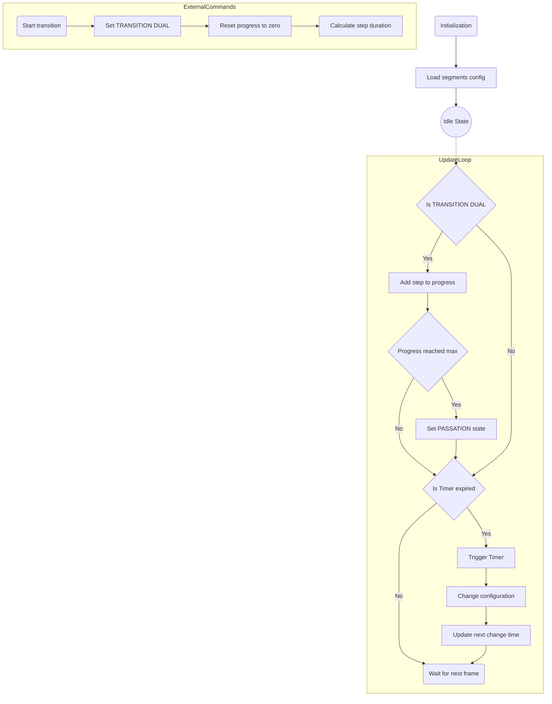
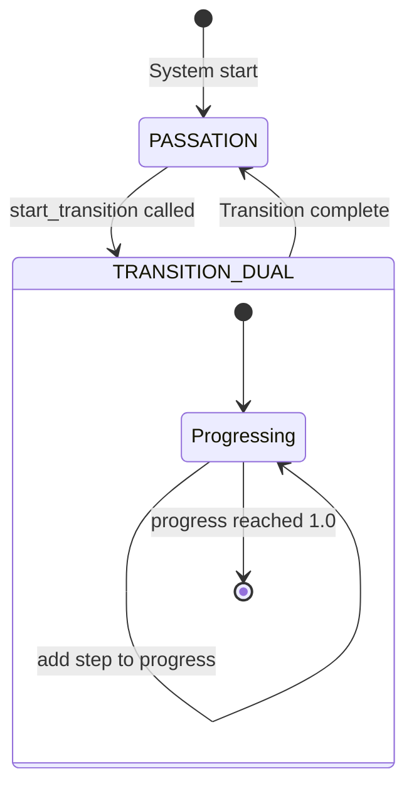

# Transition_Director Internal Architecture

The `Transition_Director` operates as a time-based state machine that directs the `Mode_master` on when to change visual modes. It is responsible for orchestrating the timing and type of transitions across the LED segments.

Here is a visual breakdown of how it operates internally, followed by a detailed explanation of its core mechanisms.

## 1. Flowchart & Architecture

This flowchart details how the class initializes, handles the active `update()` frame loop, and processes timers to trigger new configurations.

This diagram shows the two primary states (`PASSATION` and `TRANSITION_DUAL`) and what causes the director to switch between them.

## 2. Internal Workflow Explained

### 1. Geometry Mapping
On startup, it parses `config/segments.json` to map out which segments are vertical vs horizontal, storing them for transition effects.

### 2. State Management
It switches between `PASSATION` (normal operation/standby) and `TRANSITION_DUAL` (actively crossfading or switching between modes).

### 3. Timer-Based Overrides
In its `update()` loop, it monitors `next_change_time`. When this timer expires, it proactively commands the `mode_master` to execute a global transition (currently default to an `"explosion"` effect for testing) and resets the timer.
