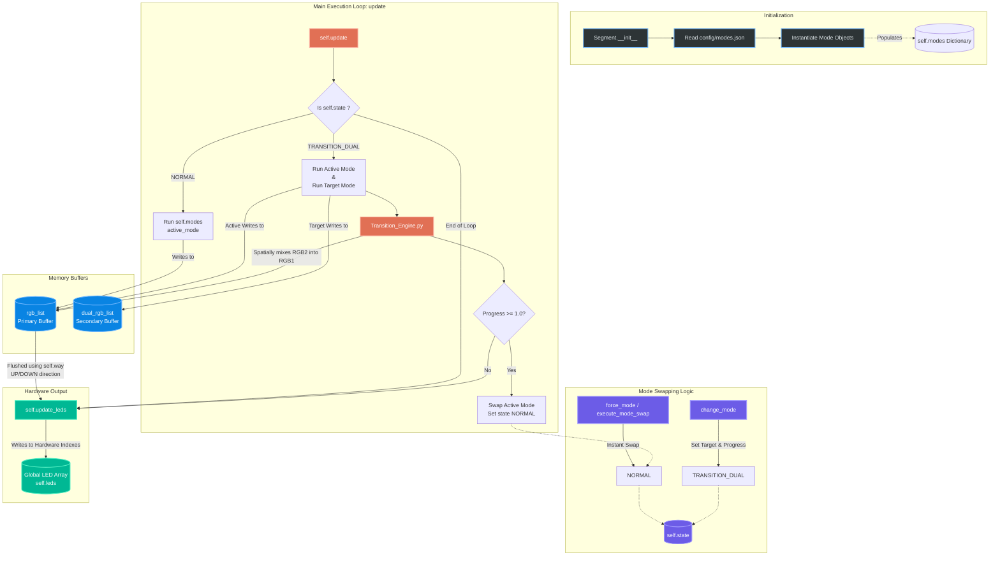

# Segment Internal Architecture

The `Segment` class is the crucial bridge between the mathematical visual `modes` and the physical hardware LEDs. It acts as a local state machine that manages its own buffers, instantiates the modes, handles complex transitions, and ultimately flushes the computed colors to the hardware.

Here is a visual representation of how `Segment.py` works internally:

## Key Mechanisms:

1. **Dynamic Initialization**: On boot, the segment reads `modes.json` and instantiates every allowed visual pattern (e.g. `Rainbow`, `Matrix Rain`). These are stored in the `self.modes` dictionary for $O(1)$ instant lookup.
2. **Dual Buffering**: The segment owns two $N \times 3$ NumPy matrices (`rgb_list` and `dual_rgb_list`).
3. **State Machine**:
   - Under `NORMAL` state, the active mode does its math and directly mutates `rgb_list`.
   - Under `TRANSITION_DUAL` state, the *old* mode continues mutating `rgb_list`, but the *new* mode is temporarily redirected to mutate `dual_rgb_list`.
4. **Transition Engine**: During a transition, the `Transition_Engine` is called. It applies physics and spatial mapping (like a gravity drop or a fade) to smoothly overwrite `rgb_list` with the pixels from `dual_rgb_list`.
5. **Hardware Flush**: At the very end of the `update()` loop, `update_leds()` takes whatever is finalized in `rgb_list`, reverses the direction if `self.way == "DOWN"`, and writes it into the global hardware `self.leds` array to be sent to the Pi/ESP32.
