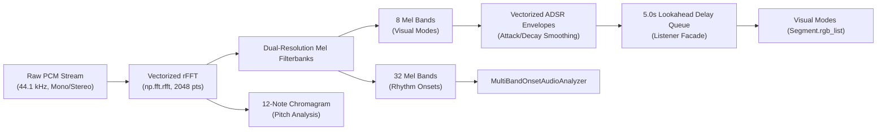

# Audio Pipeline & Feature Extraction Architecture

> **Location:** `docs/architecture/audio_pipeline.md` (Tier 1 Canonical Specification)  
> **Source Files:** [`core/AudioIngestion.py`](../../core/AudioIngestion.py), [`core/Listener.py`](../../core/Listener.py), [`connectors/Local_Microphone.py`](../../connectors/Local_Microphone.py)  
> **Enforcing Axioms:** [AXIOM-01](../axioms/AXIOM-01_FRAME_BUDGET.md), [AXIOM-02](../axioms/AXIOM-02_ZERO_ALLOCATION.md), [AXIOM-05](../axioms/AXIOM-05_LOOKAHEAD_SYNC.md), [AXIOM-09](../axioms/AXIOM-09_PLATFORM_AGNOSTIC_DSP.md)

---

## 1. Pipeline Overview

The audio pipeline transforms raw acoustic PCM stream data into mathematically structured, frequency-separated energy features for both visual animation modes and rhythm analysis.

---

## 2. Ingestion & Dual-Resolution Mel Filterbanks

Implemented in `core/AudioIngestion.py`:
1. **Windowing & FFT:**
   - Real FFT (`np.fft.rfft`) computed on 2048-sample audio frames with Hann windowing.
   - Vectorized matrix multiplications map power spectrum bins into Mel frequency bins.
2. **Dual-Resolution Mel Filterbanks:**
   - **8 Bands (`fft_band_values`):** Preserved for visual lighting modes in `modes/` (Sub-bass, Bass, Low-Mid, Mid, High-Mid, Treble, Brilliance, Air).
   - **32 Bands (`multiband_fft_values`):** Fed into `MultiBandOnsetAudioAnalyzer` to isolate fine-grained transients:
     - Sub-bass: 20–80 Hz
     - Kick fundamental: 60–120 Hz
     - Snare body and crack: 200–4000 Hz
     - Hi-hat shimmer: 8–16 kHz
3. **12-Tone Chromagram:**
   - Pre-computed pitch matrix maps spectral bins to the 12 chromatic semitones (C, C#, D, ..., B).
   - Powers harmonic color calculation in `Synesthesia_mode`.

---

## 3. The 5.0-Second Lookahead Delay Queue

Implemented in `core/Listener.py`:
- Ingested audio is held in a 5.0-second FIFO circular queue.
- Rhythm tracking and novelty detection operate on the incoming live head of the audio ($T_{\text{ingest}}$).
- Visual animations receive the delayed audio features ($T_{\text{ingest}} - 5.0\text{ s}$), aligning visual animations with physical speaker output cone arrival time ($T_{\text{speaker}}$).
- Adheres strictly to **AXIOM-05 (Audio-Visual Latency Bound $< 50\text{ ms}$)**.
