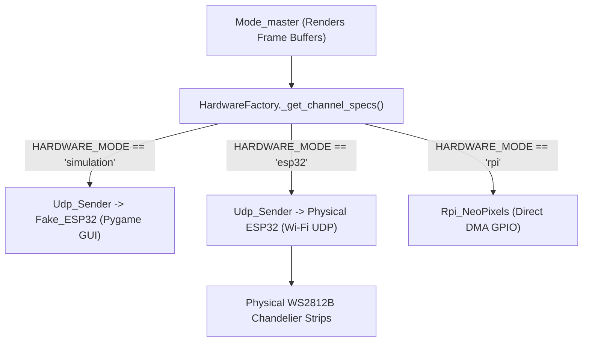

# Hardware Abstraction & Network Streaming Pipeline

> **Location:** `docs/architecture/hardware_abstraction.md` (Tier 1 Canonical Specification)  
> **Source Files:** [`hardware/HardwareFactory.py`](../../hardware/HardwareFactory.py), [`hardware/Udp_Sender.py`](../../hardware/Udp_Sender.py), [`hardware/Fake_leds.py`](../../hardware/Fake_leds.py), [`hardware/Rpi_NeoPixels.py`](../../hardware/Rpi_NeoPixels.py)  
> **Enforcing Axioms:** [AXIOM-03](../axioms/AXIOM-03_HARDWARE_GEOMETRY.md), [AXIOM-04](../axioms/AXIOM-04_NETWORK_PROTOCOLS.md), [AXIOM-09](../axioms/AXIOM-09_PLATFORM_AGNOSTIC_DSP.md)

---

## 1. Hardware Pipeline Architecture

Vialactée cleanly separates visual computation from hardware transmission through a unified hardware abstraction layer:

---

## 2. Dynamic Hardware Profiles

Hardware channels and LED counts are loaded dynamically from the active segments file (`config/segments_full.json` or `config/segments_small.json`):

### Full Profile (`"hardware_profile": "full"`)
- **Total LEDs:** 1,304 physical LEDs across 11 segments.
- **Channel 1 (`segs_1`):** 785 LEDs (UDP port `9001`, GPIO 21 on Pi).
- **Channel 2 (`segs_2`):** 519 LEDs (UDP port `9002`, GPIO 18 on Pi).

### Small Profile (`"hardware_profile": "small"`)
- **Total LEDs:** 249 physical LEDs across 3 segments.
- **Channel 1 (`segs_1`):** 249 LEDs (UDP port `9001`, GPIO 21 on Pi).

---

## 3. Network Transport & UDP Chunking (AXIOM-04)

Pixel frames streamed over Wi-Fi/Ethernet use UDP packets to avoid TCP head-of-line blocking.
- **Datagram Limit:** Maximum 400 LEDs per UDP packet ($400 \times 3 = 1,200\text{ bytes}$ payload + 2 bytes header = **1,202 bytes**).
- **Unfragmented Transmission:** 1,202 bytes sits safely below the standard 1,472-byte Wi-Fi UDP MTU, preventing packet fragmentation and frame loss.
- **Header:**
  - `byte[0]`: Chunk sequence index (0-indexed).
  - `byte[1]`: Total chunks in frame.
  - `byte[2..]`: Packed raw RGB bytes.
