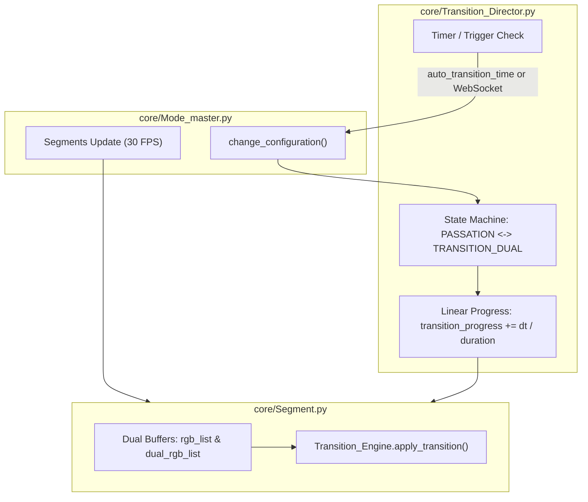

# Transition Director & Spatial Blending Engine

> **Location:** `docs/architecture/transition_director.md` (Tier 1 Canonical Specification)  
> **Source Files:** [`core/Transition_Director.py`](../../core/Transition_Director.py), [`core/Transition_Engine.py`](../../core/Transition_Engine.py)  
> **Enforcing Axioms:** [AXIOM-01](../axioms/AXIOM-01_FRAME_BUDGET.md), [AXIOM-02](../axioms/AXIOM-02_ZERO_ALLOCATION.md), [AXIOM-07](../axioms/AXIOM-07_CODE_GOVERNANCE.md)

---

## 1. Operational Overview

The `Transition_Director` and `Transition_Engine` coordinate seamless, spatial crossfades between visual modes across all physical segments. This prevents jarring visual cuts when switching presets or playlists.

---

## 2. State Machine & Transition Invariants

### States
- **`PASSATION`:** Normal operation. A single mode runs on each segment; output renders directly into `Segment.rgb_list`.
- **`TRANSITION_DUAL`:** Active interpolation. The incoming mode renders into `Segment.rgb_list` while the departing mode renders into `Segment.dual_rgb_list`. The two buffers are spatially blended by `Transition_Engine`.

### Invariants
1. **Synchronized Progress:**
   All physical segments share the exact same `Transition_Director` instance. `transition_progress` is computed once per frame and passed to every segment during `update()`, guaranteeing zero spatial tearing across chandelier strips.
2. **Boolean Transition Property:**
   Exposed via `@property def is_in_transition(self) -> bool: return self.state == "TRANSITION_DUAL"`. Used by `Connector` for telemetry rate limiting (AXIOM-04) and UI state synchronization.

---

## 3. Mathematical Blending Modes (`Transition_Engine.py`)

1. **`fade_in_out`:** Standard linear or cosine crossfade between incoming and departing buffers.
2. **`curtain`:** Center-outward or directional spatial wipe moving across segment LED coordinates.
3. **`wave`:** Sinusoidal spatial wave propagating along the strip, sweeping the incoming mode in its crest.
4. **`explosion`:** Instantaneous 0.0s cut or high-energy flash transition.
5. **`slice`:** Interleaved pixel comb interpolation.
