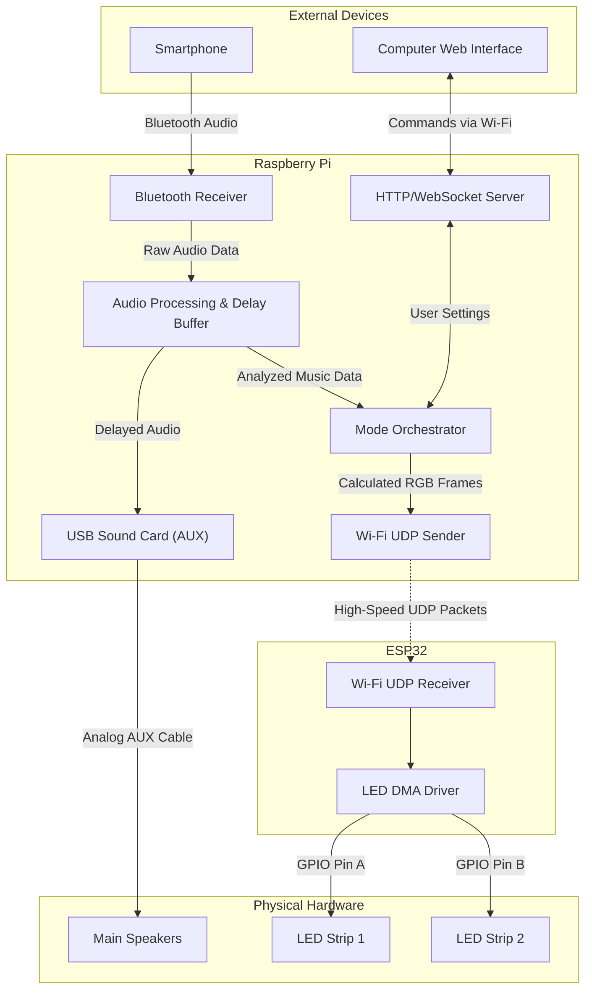

# Hardware Abstraction (`/hardware/`)

The `hardware` directory provides an interface layer between the Python code and the physical light-emitting hardware. 

## Key Components:

- **`HardwareInterface.py`**: The abstract base class defining what a hardware controller must be able to do (e.g., `set_pixel()`, `show()`, array operations).
- **`HardwareFactory.py`**: A factory pattern script that detects the environment and returns the appropriate hardware class. In simulation mode, it automatically launches the `Fake_ESP32` process in the background.
- **`Udp_Sender.py`**: The primary data driver. Instead of blocking the Python event loop with hardware processing, it serializes the computed RGB arrays and broadcasts them as high-speed UDP packets over the network.
- **`Fake_ESP32.py`**: The development receiver. A standalone Python script that mimics the physical ESP32. It listens on local UDP ports for incoming RGB packets and passes them to the Pygame visualizer.
- **`Fake_leds.py`**: Contains `FakeLedsVisualizer`, which draws a Pygame window that perfectly simulates the physical dimensions and segment layout of the chandelier.
- **`Rpi_NeoPixels.py`**: (Legacy/Alternative) Direct GPIO driver using `rpi_ws281x`. Eclipsed by the UDP/ESP32 architecture.

## How it works:
When `Mode_master` finishes computing the colors for a frame, it passes the RGB array to the active Hardware instance (usually `Udp_Sender`). The sender blasts the data over UDP. 

If `HARDWARE_MODE` is `"simulation"`, `HardwareFactory` spawns the `Fake_ESP32` subprocess which receives these local UDP packets and renders them on a PC screen. This perfectly simulates the Raspberry Pi -> Wi-Fi -> ESP32 architecture on a single machine, decoupling the visual rendering from the main `asyncio` audio-processing loop.

## 1. Hardware Pipeline Overview

To achieve perfect synchronization and offload Bluetooth processing, the physical architecture will be wired as follows:

1. **The Brain (Raspberry Pi):**

   * Acts as the primary Bluetooth A2DP Sink to receive the audio stream directly from the user's phone.
   * Vialactée Python code processes the audio instantly for FFT and music analysis.
   * Queues the audio in a 5-second delay buffer and pushes the delayed audio out via a high-quality analog output (e.g., USB Sound Card) directly to the main Speakers.
   * Runs the asynchronous HTTP/WebSocket server for the Wabb-Interface to manage user settings and configuration JSON.
   * Calculates the LED math and broadcasts the RGB frames via Wi-Fi UDP.
2. **LED Controller (ESP32):**

   * Receives pre-calculated RGB UDP packets from the Raspberry Pi over the local Wi-Fi router.
   * Uses a DMA driver to push data in parallel to two WS2812B NeoPixel strips (e.g., 650 LEDs each), achieving 50+ FPS without needing to compute the heavy audio DSP or process Bluetooth.

### Architecture Diagram

