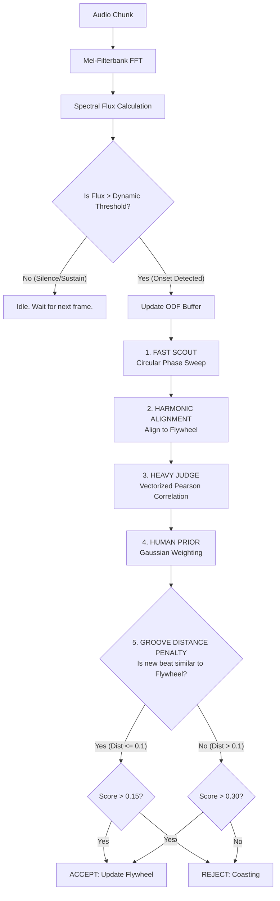

# The Continuous Hybrid Harmonic Tracker
## Algorithmic Architecture & Mathematical Whitepaper

Our beat tracking algorithm is designed to achieve two conflicting goals simultaneously:
1. **Real-time Performance:** Run in `< 0.1` ratio on low-power hardware (Raspberry Pi).
2. **Extreme Robustness:** Ignore noise, survive long drum dropouts, reject polyrhythms, and instantly snap to true tempo changes.

To achieve this, we abandoned continuous heavy processing in favor of an **Event-Driven, 5-Stage Harmonic Pipeline**. 

---

### Global Architecture Diagram

---

### Phase 1: Event-Driven Ingestion (The Trigger)
Instead of running expensive beat-tracking math 60 times a second, we only run it when a rhythmic event happens. 

We calculate the **Spectral Flux** (the difference in energy between the current frame and the previous frame) across customized frequency bands (emphasizing bass/kick and highs/hi-hats).
$$Flux(t) = \sum_{b \in bands} \max(0, Mel_b(t) - Mel_b(t-1))$$

We maintain a smoothed Exponential Weighted Moving Average (EWMA) of the flux:
$$EWMA(t) = 0.95 \cdot EWMA(t-1) + 0.05 \cdot Flux(t)$$

**The Trigger:** We only trigger the Heavy Tracker if $Flux(t) > 1.8 \cdot EWMA(t) + 0.1$. This immediately saves 80% of our CPU cycles.

---

### Phase 2: The Fast Scout & Circular Space
When an onset triggers the tracker, we must look at the last 5 seconds of the Onset Detection Function (ODF) buffer and find the rhythm. 

To solve the "Octave Problem" (e.g., is the song 60 BPM or 120 BPM?), we project all BPMs into a **Logarithmic Circular Space** $[0, 1)$. 
$$Class = (\log_2(\frac{BPM}{60})) \pmod 1$$

In this space, $60$ BPM, $120$ BPM, and $240$ BPM all map to the exact same Class (`0.0`). The Fast Scout sweeps through this $[0, 1)$ space by folding the ODF buffer onto itself and finding the class where the peaks stack up perfectly.

---

### Phase 3: The Flywheel (Inertia)
The tracker maintains a `long_term_class` (LTC). This is the system's "memory" or **Flywheel**. 

When the Fast Scout finds a rhythm (e.g., `Class 0.3`), we calculate the shortest distance around the circle to our Flywheel.
$$Distance = ((Class_{new} - LTC + 0.5) \pmod 1) - 0.5$$
This aligns the new observation to our historical momentum, preventing the system from erratically jumping between equivalent harmonics.

---

### Phase 4: The Heavy Judge (Pearson Correlation)
Once we have an aligned class, we expand it back into specific BPM candidates (e.g., 65 BPM, 130 BPM, 260 BPM). We need to mathematically prove which specific BPM perfectly matches the shape of the music.

We use **Pearson Correlation Coefficient** ($\rho$), which measures the linear correlation between two signals. We compare our ODF buffer ($O$) against a pre-computed "Perfect Beat Template" ($T$)—a repeating sharp triangle wave.

$$\rho = \frac{\sum (O_i - \bar{O})(T_i - \bar{T})}{\sqrt{\sum (O_i - \bar{O})^2 \sum (T_i - \bar{T})^2}}$$

**The O(1) Optimization:** Because our Templates ($T$) are pre-computed, zero-meaned, and unit-variance normalized, the expensive denominator disappears. At runtime, the Pearson correlation simplifies to a blazing-fast single dot product:
$$\rho = \frac{T_{normalized} \cdot O_{centered}}{\sigma_{O}}$$

#### The Human Prior
Mathematics alone cannot distinguish between 130 BPM and 260 BPM if the music is perfectly gridded. To resolve this, we multiply the Pearson score by a **Static Gaussian Prior** centered at 125 BPM (the average human dancing tempo).
$$Prior(BPM) = 0.5 + 0.5 \cdot e^{-0.5 (\frac{BPM - 125}{40})^2}$$
$$Final Score = \rho \cdot Prior(BPM)$$

---

### Phase 5: The Groove Distance Penalty (The Masterstroke)
This is the final logic gate that makes the tracker invincible to polyrhythms and dropouts (our Test 6 breakthrough). 

If the drums drop out, the Pearson score drops, and the tracker enters "Recovery Mode" (Smart Sweep). During the dropout, an acoustic guitar might play a polyrhythm. The Fast Scout will find this guitar, and the Judge will score it. **How do we reject it?**

We calculate the circular distance between the new guitar beat and our Flywheel's locked groove.
1. **If Distance $\le 0.1$ (Harmonically Related):** We require a low score of **$0.15$** to accept. This means "The drums of our current song have returned, let's lock back on easily."
2. **If Distance $> 0.1$ (Completely New Tempo):** We require a massive score of **$0.30$** to accept. This tells the system: "This tempo is mathematically unrelated to our groove. It is likely a polyrhythm or vocal solo. I will *only* abandon my Flywheel if this new signal is an undeniably massive drum beat."

Because an acoustic guitar polyrhythm only scores $\sim0.20$, it fails the $0.30$ requirement. The tracker mathematically rejects the noise and coasts on the Flywheel until the true drums return.
