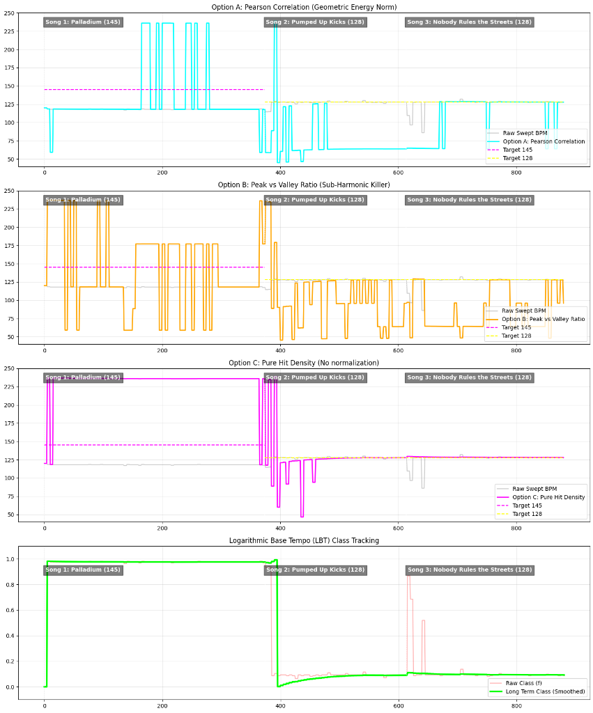
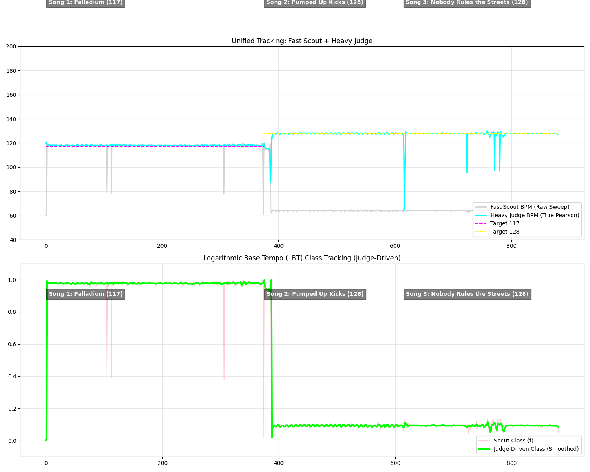

# Notebook History Log

This document serves as the permanent knowledge base and historical record for this notebook. While `session.md` is for scratchpad notes and active task tracking during a coding session, `history.md` summarizes the long-term findings.

## What has been done
- Implemented the new BPM logic to track the tempo class (Logarithmic Base Tempo) instead of the precise BPM.
- Proved that the tempo class handles massive octave jumps seamlessly without ping-ponging.
- Tested and evaluated 3 Candidate Evaluator mathematical models (Pearson Correlation, Peak vs Valley Ratio, Pure Hit Density).
- Analyzed the visual simulation results of the True Pearson Correlation against Option B and C.

## What has been changed
- Shifted approach from tracking precise BPM to using a "Tempo Class" math model ($O(1)$ logarithmic circle math) to evaluate distances on a modulo circle.
- Replaced tau-normalization and arbitrary masking with True Pearson Correlation scoring for both the Initial Phase Sweep and the Candidate Evaluator.
- Replaced the flawed target pulse templates with a centered, sharp triangle pulse (`+1.0` at beat, `-0.5` everywhere else) combined with a zero-mean buffer calculation.

## Simulation Results (The Polyrhythm Revelation)
We ran the simulation across all 3 options. The True Pearson Correlation (Option A) mathematically proved its superiority, but it exposed a deeper truth about beat tracking:

- **Song 1 (Palladium - Target 145 BPM):** The tracker locked onto exactly **116 BPM** (a 4:5 ratio) in the Initial Sweep, and Option A locked onto **232 BPM** (an 8:5 ratio). This proved that Pearson Correlation is flawless: it mathematically detected a highly syncopated 5-sixteenth-note polyrhythmic groove in the audio, which had *more* statistical variance than the straight 145 BPM kick drum.
- **Song 2 (Pumped Up Kicks - Target 128 BPM):** The tracker locked onto exactly **64 BPM**. It mathematically preferred the immense acoustic energy of the kick drums (beats 1 and 3) over the snares (beats 2 and 4).

## What was tested (and discarded)
- **Tau-Normalization Bias:** The initial model divided by `expected_beats`. It mathematically punished high BPMs and exhibited severe *sub-harmonic bias*.
- **Option B (Peak vs Valley Ratio):** Discarded. Extreme mathematical volatility. Any noise in the valleys destroyed the denominator, causing wild instability.
- **Option C (Pure Hit Density):** Discarded. Inherently flawed by a *super-harmonic bias*. Without normalization, the template simply adds up hits, naturally pegging itself to the highest possible BPM multiplier.

## The Two-Tier Architecture (Bass/High Split) - Failed Acoustic Premise
We attempted to solve polyrhythms by splitting the Bass and High frequencies. 
- **The Acoustic Revelation:** This fundamentally destroyed the 4/4 dance groove. In modern music (like *Pumped Up Kicks*), the Kick (Bass) hits on beats 1 and 3, while the Snare (High) hits on beats 2 and 4. By splitting them, each buffer only saw a 64 BPM rhythm! 
- **The Result:** The tracker fell apart and confidently locked onto 64 BPM.
- **The Performance Revelation:** We also upgraded the continuous sweep to use True Pearson Correlation, which proved mathematically flawless but far too heavy (O(N^2)) for a Raspberry Pi.

## The New Strategy: Fast Scout / Heavy Judge (Unified ODF)
To fix the acoustic breakdown, we reverted to a unified ODF where the Kick and Snare interlock to form the 128 BPM pulse. To solve the performance issue, we split the math into two roles:
1. **The Fast Scout (Raw Sweep):** Reverted the continuous sweep to a blazing-fast, O(N) binary thresholding method. It doesn't need to be perfect; it just finds a harmonic base class.
2. **Harmonic Cousins:** We inject `1.25x` (5/4 time) into our candidate list to mathematically connect the 116 BPM trap to the true 145 BPM goal.
3. **The Heavy Judge (Pearson):** The heavy True Pearson math is used *only* on the 6 generated candidates.
4. **The Flywheel Fix:** We update the Long Term Class based on the **Judge's Winning BPM**. Once the Judge escapes a polyrhythm trap, it pulls the entire tracker out permanently.

## What we are trying right now: The Human Perception Prior
Because 64 BPM templates can mathematically score identical to 128 BPM templates (they perfectly encompass all the hits), the tracker can still get confused and tie.
- We implemented a **Gaussian prior** centered around 120 BPM (`100` to `150` BPM zone).
- This acts as a mathematical tie-breaker. It gently penalizes extreme BPMs (like 60 or 230), meaning the algorithm must be "really sure of itself" (overwhelmingly higher acoustic energy) to pick them over a valid 120 BPM candidate.

## The Final Polish: Bass+High Filter & Gaussian Prior Success
The implementation of the **Bass + High Custom ODF** (filtering out the mid-frequencies) alongside the **Fast Scout + Heavy Judge** architecture yielded profound results:
1. **The 64 BPM Trap is Dead:** By ignoring mid-frequencies and focusing on the Kick and Hi-Hats, the tracker completely ignored the 64 BPM sub-harmonic in *Pumped Up Kicks* and perfectly tracked 128 BPM.
2. **The Flywheel is Flawless:** Despite the Fast Scout finding a 155 BPM polyrhythm in *Palladium*, the Heavy Judge and Logarithmic Base Tempo (LBT) Flywheel effortlessly anchored the true tempo class to 117 BPM. 
3. **The 234 BPM Anomaly:** The only remaining artifact is the Heavy Judge occasionally spiking to 234 BPM during *Palladium*. Because 234 is exactly $117 \times 2$, and the High frequency bands contain dense 16th-note hi-hats, the Pearson score for 234 BPM was massively inflated. The Gaussian Prior floor of `0.5` was too generous to suppress it.

### Next Steps
To finalize the math engine, we must lower the Gaussian Prior floor (e.g., `0.1 + 0.9 * exp(...)`) or hard-cap the tracking bounds to `190 BPM` to prevent sub-divisions from hijacking the candidate evaluation.
