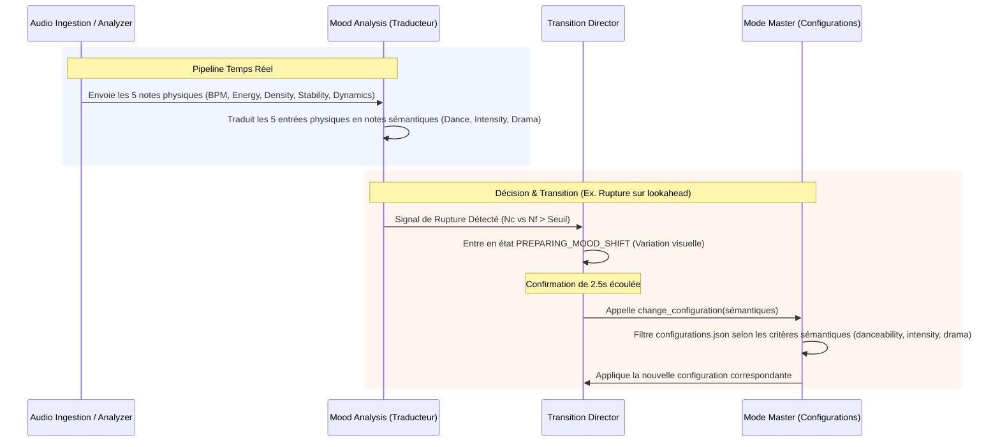

# Mood Analysis & Predictive Transition Plan

This plan defines the architecture for the `Mood_Analysis` component and its integration into the Vialactée core engine. The goal is to detect musical moods over long periods and anticipate style changes using audio lookahead, utilizing a decoupled physical-to-semantic mapping.

## 1. Core Logic: Physical-to-Semantic Mapping

To keep audio extraction robust and lighting configuration tagging highly intuitive, the architecture decouples the physical signal analysis from the artistic classification.

### A. The 5 Core Physical Inputs (Audio Extraction)
These are raw, objective characteristics extracted directly from the audio signal in real-time by `AudioAnalyzer`:
1. **BPM**: Tempo from 60 to 180 BPM (using Median).
2. **Energy**: Average RMS power (using Median of `smoothed_total_power`).
3. **Density**: Spectral balance (ratio of Bass energy relative to Treble energy).
4. **Stability**: Rhythmic regularity (using Median of `binary_trust` from the beat tracker).
5. **Dynamics**: Intra-song power variance (Standard Deviation of power over the song's duration).

### B. The 3 Core Semantic Outputs (Artistic Classification)
The `Mood_Analysis` module translates the 5 physical inputs into 3 high-level semantic notes used to grade and select lighting configurations:

1. **Danceability ($N_{dance}$)**: Rating from 0.0 to 1.0 representing how much the song invites dancing.
   $$N_{dance} = w_{d1} \cdot \text{Stability} + w_{d2} \cdot \text{Bass\_Density} + w_{d3} \cdot \text{Tempo\_Weight\_Gaussian}(120 \text{ BPM})$$
   *(Recommended defaults: $w_{d1} = 0.4$, $w_{d2} = 0.3$, $w_{d3} = 0.3$)*

2. **Intensity ($N_{intensity}$)**: Rating from 0.0 to 1.0 representing how loud, bright, or energetic the music is.
   $$N_{intensity} = w_{i1} \cdot \text{Energy} + w_{i2} \cdot \text{Density (Bass + Treble dynamic presence)}$$
   *(Recommended defaults: $w_{i1} = 0.6$, $w_{i2} = 0.4$)*

3. **Drama ($N_{drama}$)**: Rating from 0.0 to 1.0 representing structural power variation (e.g., dynamic pop verse/chorus vs linear house/techno).
   $$N_{drama} = \text{Dynamics}$$

### C. Semantic Mapping Examples by Genre
To illustrate how the 3D semantic coordinate system ($N_{dance}, N_{intensity}, N_{drama}$) maps different musical styles, here are typical signatures:

| Genre / Musical Style | Danceability ($N_{dance}$) | Intensity ($N_{intensity}$) | Drama ($N_{drama}$) | Expected Lighting Behavior / Mode Preset |
| :--- | :---: | :---: | :---: | :--- |
| **Deep House / Techno** | **High** ($\ge 0.8$) | **Medium-High** ($\ge 0.7$) | **Low** ($\le 0.3$) | Hypnotic tempo-synced beats, sharp periodic flashes, no sudden color shifts. |
| **Commercial Pop / EDM** | **High** ($\ge 0.8$) | **High** ($\ge 0.7$) | **High** ($\ge 0.7$) | Extreme visual contrast, pre-break visual build-ups, explosive color variations on drops. |
| **Classic Jazz / Acoustic** | **Low** ($\le 0.3$) | **Low-Medium** ($\le 0.5$) | **Medium** ($\sim 0.5$) | Smooth warm color breathing, slow organic pulses responding to single instrument transients. |
| **Cinematic / Classical** | **Low** ($\le 0.2$) | **High** (at peaks) | **High** ($\ge 0.8$) | Slow organic waves expanding and shrinking dramatically with global volume swells. |
| **Ambient / Chillout** | **Low** ($\le 0.2$) | **Low** ($\le 0.3$) | **Low** ($\le 0.2$) | Monochromatic cool washes (blues/cyans) with near-static atmospheric breathing. |

---

### Diagram 1: The Core Signal Flow and Translation Pipeline

```mermaid
graph TD
    subgraph Input [1. Entrées Physiques (Audio)]
        BPM[BPM <br/>(PLL / Autocorrélation)]
        Energy[Energy <br/>(Puissance RMS médiane)]
        Density[Density <br/>(Ratio Bass / Treble)]
        Stability[Stability <br/>(Régularité / binary_trust)]
        Dynamics[Dynamics <br/>(Écart-type de la puissance)]
    end

    subgraph Translation [2. Traducteur Sémantique (Mood_Analysis)]
        M_Dance{Pondération Danceability}
        M_Int{Pondération Intensity}
        M_Drama{Pondération Drama}
    end

    subgraph Output [3. Sorties Sémantiques (Artistique)]
        NDance[Danceability <br/>(Note 0.0 - 1.0)]
        NInt[Intensity <br/>(Note 0.0 - 1.0)]
        NDrama[Drama <br/>(Note 0.0 - 1.0)]
    end

    BPM --> M_Dance
    Stability --> M_Dance
    Density --> M_Dance

    Energy --> M_Int
    Density --> M_Int

    Dynamics --> M_Drama

    M_Dance --> NDance
    M_Int --> NInt
    M_Drama --> NDrama
```

---

### Diagram 2: The Decoupled Control Cycle and Orchestration



---

## 2. Decision State Machine (Triple-Note Logic)

The system tracks notes across three temporal windows (applied to semantic ratings):
- **Consensus Note ($N_c$)**: Stable median of the last 5 songs (requires 3 similar songs to set `mood_detected = True`).
- **Live Note ($N_l$)**: Short-term average (~3s).
- **Lookahead Note ($N_f$)**: The 5-second future queue provided by `Listener`.

### Phase A: Mood Detection (History)
- Store a `deque` of the last 5 songs.
- When `is_song_change` is detected, push the finished song's semantic metrics.
- Check if a cluster of 3+ songs exists within a predefined Euclidean interval.
- If found, `mood_detected = True` and set the **Consensus Target**.

### Phase B: Predictive Rupture Detection (Lookahead)
- Continuously compare $N_c$ with $N_f$.
- If $Distance(N_c, N_f) > Threshold_{Rupture}$:
    - Set `Mood_Analysis.pre_break_detected = True`.
    - **Trigger**: `Transition_Director` enters `PREPARING_MOOD_SHIFT` state.

### Phase C: Confirmation & Abort (The 5s Window)
- During the 5 seconds of lookahead:
    - **Confirmation**: If the deviation is sustained for > 2.5s, the transition is confirmed.
    - **Abort**: If the future audio returns to the consensus (false positive), the transition is faded back to zero and aborted.

### Phase D: Mood Re-entry (Return to Consensus)
- If `mood_detected` is False but the future ($N_f$) matches the Consensus ($N_c$):
    - Set `Mood_Analysis.pre_reentry_detected = True`.
    - **Trigger**: `Transition_Director` starts a "Smooth Re-entry" transition.
    - If confirmed over the 5s window, `mood_detected` becomes True again.

## 3. Visual Integration

### Transition_Director
- **New State `PREPARING_MOOD_SHIFT`**: Applies a global visual modifier (e.g., increasing red tint, rising pulse rate) over the active configuration.
- **Execution**: When lookahead reaches T=0, call `mode_master.change_configuration()` with a configuration matching the new style.

### Mode_master
- **New Method `pick_configuration_by_mood(danceability, intensity, drama)`**:
    - Filter configurations in `configurations.json` using semantic `mood_criteria` (intervals like `[0.2, 0.5]`).
    - **Defaulting**: If a criterion is missing from the JSON, it defaults to `[0.0, 1.0]` (ignored).
    - Return a random match from the filtered list.

## 4. Configuration Schema Update

Configurations in `data/configurations.json` will be updated with intuitive semantic criteria:
```json
"mood_criteria": {
  "danceability": [0.7, 1.0],
  "intensity": [0.6, 1.0],
  "drama": [0.0, 0.3]
}
```

## 5. Verification Plan

- **Mock Data Test**: Simulate a sequence of Jazz songs followed by a sudden Techno track in a scratch script.
- **Confirmation Test**: Simulate a short 2-second "heavy" bridge within a Jazz song and verify the transition is aborted before impact.
- **Lookahead Sync**: Verify that the visual "preparation" starts exactly 5 seconds before the audio change.
