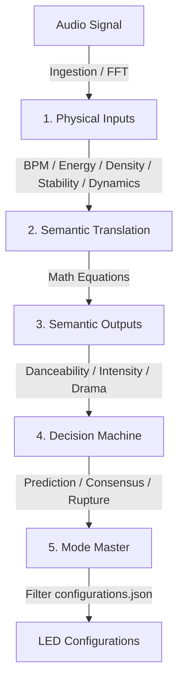

# Handover & Architecture Walkthrough

This document serves as a complete handover guide for the next agent or developer resuming work on the **Vialactée Mood Analysis and Predictive Transition** module. 

## 1. Executive Summary & Current State
The design phase is **100% complete and fully approved**. The architecture has been refined to decouple signal processing (objective physics) from lighting configuration selection (artistic semantics). 

All design specifications, formulas, and orchestration flows are fully documented in the finalized plan:
*   [playground/Mood_Architecture_Test/implementation_plan.md](file:///c:/Pierre/Vialact%C3%A9e/vialactee/playground/Mood_Architecture_Test/implementation_plan.md)

No changes have been made to the production code yet. The next agent can safely proceed directly to the **execution phase**.

---

## 2. Decoupled Architecture Blueprint

The system splits into a clear pipeline, transforming raw audio dynamics into human-interpretable lighting characteristics:



### Key Equations to Implement in `Mood_Analysis.py`:
1.  **Danceability ($N_{dance}$)**:
    $$N_{dance} = 0.4 \cdot \text{Stability} + 0.3 \cdot \text{Bass\_Density} + 0.3 \cdot \text{Tempo\_Weight\_Gaussian}(120 \text{ BPM})$$
2.  **Intensity ($N_{intensity}$)**:
    $$N_{intensity} = 0.6 \cdot \text{Energy} + 0.4 \cdot \text{Density}$$
3.  **Drama ($N_{drama}$)**:
    $$N_{drama} = \text{Dynamics}$$

---

## 3. Step-by-Step Checklist for the Next Agent

Here is the exact step-by-step roadmap to implement this feature:

### Step 1: Create the `Mood_Analysis.py` Component
*   **Path**: `core/Mood_Analysis.py`
*   **Functionality**:
    *   Maintain a `deque` history of the last 5 songs.
    *   Implement the Euclidean clustering algorithm to determine the **Consensus Note** ($N_c$) once 3 similar songs match.
    *   Calculate real-time **Live Notes** ($N_l$) and **Lookahead Notes** ($N_f$) using the equations above.
    *   Expose variables: `pre_break_detected` (True if future diverges from consensus) and `pre_reentry_detected`.

### Step 2: Integrate with `Transition_Director.py`
*   **Path**: `core/Transition_Director.py`
*   **Functionality**:
    *   Add a new state: `PREPARING_MOOD_SHIFT`.
    *   Incorporate the **Confirmation / Abort** timer: when `pre_break_detected` is triggered, start the visual transition (e.g., increasing a red tint or speed).
    *   If the divergence is sustained for $> 2.5$ seconds, confirm the transition at $T=0$. If not, fade back and abort.

### Step 3: Implement Curation Filtering in `Mode_master.py`
*   **Path**: `core/Mode_master.py`
*   **Functionality**:
    *   Create `pick_configuration_by_mood(danceability, intensity, drama)`.
    *   Parse the optional `mood_criteria` ranges in `configurations.json`.
    *   Pick a random matching preset from the filtered subset.

### Step 4: Update `configurations.json`
*   **Path**: `data/configurations.json`
*   **Action**: Tag existing visual configurations with semantic criteria, e.g.:
    ```json
    "mood_criteria": {
      "danceability": [0.7, 1.0],
      "intensity": [0.6, 1.0],
      "drama": [0.0, 0.3]
    }
    ```

### Step 5: Test & Verify
*   Run the mock simulation script in the `playground` to confirm lookahead timing sync and abort-handling under a 5-second queue window.
