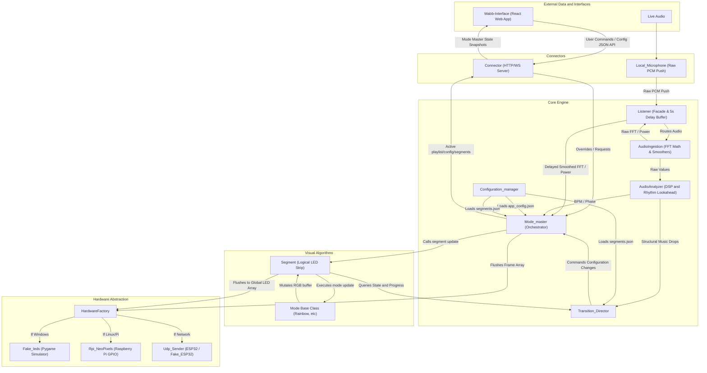

# Vialactée Project Overview & AI Guidelines

Welcome to the **Vialactée** project! If you are an AI agent working on this codebase, **this is your primary entrypoint.** Read this file completely before taking any action.

Vialactée is an asynchronous Python orchestration server designed to run on a Raspberry Pi and control a 1,304-LED music-reactive chandelier. It listens to live audio in real-time, performs deep algorithmic analysis (beat detection, frequency extraction, structural event detection), and drives the physical LED arrays using mathematically precise visual modes.

It features a non-causal audio lookahead buffer, seamless asynchronous orchestration, and an interactive Web Interface for real-time control.

---

## 1. Architecture Flow

---

## 2. General Project Structure

Here is a breakdown of the core directories in this project:

- **`/core`**: The brain of the project. Contains the algorithmic engines, asynchronous managers, the Audio Pipeline (`AudioIngestion`, `AudioAnalyzer`, and the `Listener` facade), and the Transition Director.
- **`/modes`**: The visual behavior library. Each file here defines a unique lighting animation pattern powered by numpy matrix math.
- **`/config`**: JSON files and managers detailing the hardware geometry and global settings.
- **`/connectors`**: The external communication handlers. This includes the HTTP/WebSocket server that talks to the web interface, serves `/api/configurations`, and broadcasts mode-master state, as well as the microphone stream capture tool (`Local_Microphone.py`).
- **`/hardware`**: Hardware abstractions. Allows switching seamlessly between testing on a PC (with Pygame simulated LEDs or UDP Fake ESP32) and running on real hardware (Raspberry Pi GPIO or real ESP32s over network).
- **`/wabb-interface`**: A React-based web application serving as the remote controller for the user to change playlists, transition modes, or tweak per-mode settings on the fly. Playlist and configuration names are loaded from `data/configurations.json` through `/api/configurations`; they must not be hardcoded in React.
- **`/.agents`**: Core context, architectural rules, and technical specifications designed for AI agents working on the codebase.

---

## 3. Task-Based Navigation Map

Do not guess how the architecture works. Depending on the task you have been given, **you must read the corresponding files** before writing code:

- **If you are modifying or creating a Visual Mode (LED animation):**

  - 👉 Read `modes/README.md` (if it exists) and review an existing mode to understand the `run()` loop and numpy matrix structure.
- **If you are working on Beat Detection or Rhythm Tracking:**

  - 👉 Read `.agents/docs/rhythm_tracker_architecture.md`. Understand the non-causal Phase Inertia Flywheel before touching DSP code.
- **If you are working on Music Events (Drops, Verse/Chorus detection):**

  - 👉 Read `.agents/docs/music_events_architecture.md`.
- **If you are working on Transitions between modes:**

  - 👉 Read `.agents/docs/transition_architecture.md`.
- **If you are touching the Main Orchestrator or Async loops:**

  - 👉 Read `.agents/AGENT.md` to understand our `asyncio` constraints and frame-independent math requirements.
- **If you are modifying Web App playlists, configurations, Mode Settings, Live Deck, or Topology state:**

  - 👉 Read `wabb-interface/README.md`, `wabb-interface/design rules/topology.md`, `connectors/README.md`, and `core/precisions/mode_master.md`. Keep `data/configurations.json` as the source of truth and preserve the `/ws` state snapshot flow. Topology **LIVE** uses instructions for runtime segment mode/direction only; persisting presets uses `POST /api/configurations` from **MODIFY** or **BUILD** only. Per-mode tuning belongs to configuration-scoped `modeSettings` and flows through `Mode_master` over `/ws`.

---

## 4. Rules of Engagement (Pre & Post Task)

### 🛑 BEFORE Doing a Task:

1. **Locate the Context:** Find the relevant `.md` file from the navigation map above and read it.
2. **Check Configuration:** Never hardcode paths, pins, or IPs. Check `config/app_config.json` to see if a variable already exists.
3. **Verify Dependencies:** Understand that this project must run on both Windows (Pygame simulator) and Raspberry Pi (NeoPixels). Ensure your imports do not break the `HardwareFactory.py` abstraction.

### ✅ AFTER Doing a Task:

1. **Self-Correction & Linting:**
   - Did you use blocking synchronous code (`time.sleep`)? If so, remove it and use `asyncio.sleep` or delta-time math.
   - Are your calculations frame-independent (using `fps_ratio`)?
2. **Update Documentation:** If you changed how a core algorithm works, added a new feature, or changed a configuration schema, **you must update the relevant `.md` file in `.agents/docs/`**.
3. **Simulator Check:** If possible, confirm that the code will execute properly under the `Fake_leds` Pygame simulator.
4. If you made temporary python files, remember to delete them or to put them.
