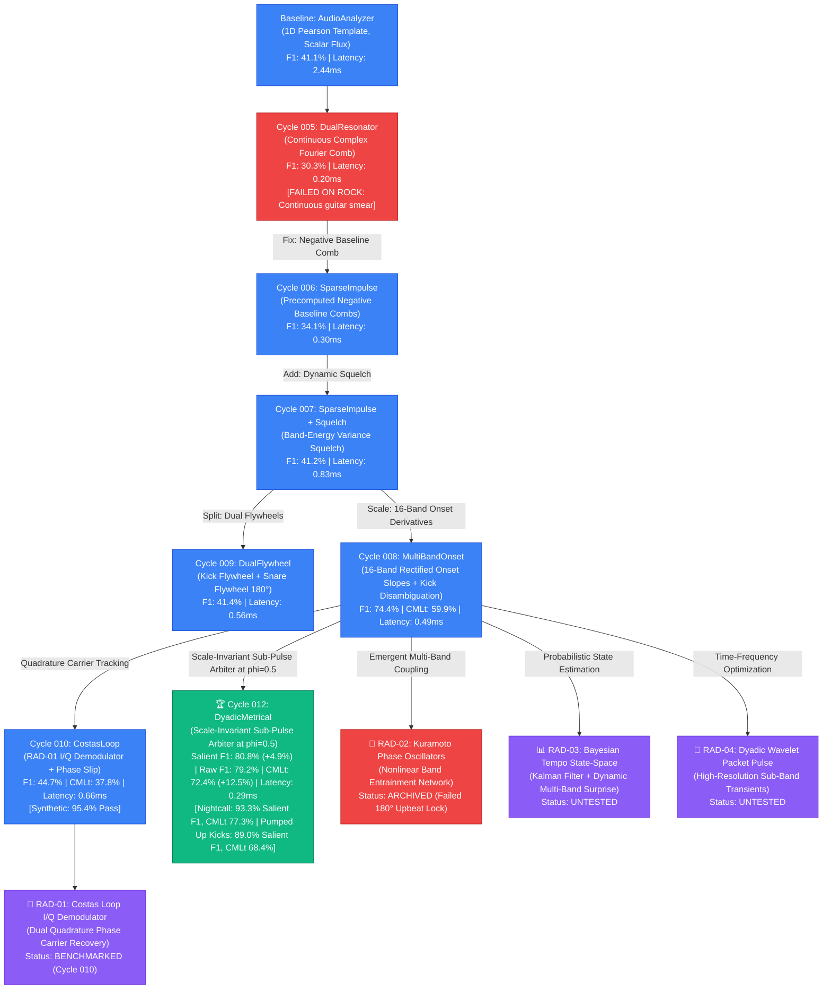

# 🌳 Vialactée Rhythm Research Evolutionary Idea Tree

This document is the living knowledge repository, genealogical tree, and prioritized backlog for autonomous rhythm research in the Vialactée laboratory. It maps the lineage of historical experiments, tracks current active hypotheses, and maintains the record of pruned dead ends.

---

## 1. Algorithmic Lineage & Genealogy

---

## 2. Prioritized Cross-Domain Hypothesis Backlog

| Lead ID | Domain Lens | Mathematical Core | Primary Failure Mode Target | Novelty (1-10) | Feasibility / Latency Risk | Status |
| :--- | :--- | :--- | :--- | :---: | :---: | :---: |
| **`RAD-01`** | **Radar / Telecom** | Costas In-Phase / Quadrature ($I/Q$) Loop Demodulator | 180° upbeat traps on Funk/Disco (*Stayin' Alive*) | 9.0 | Low ($\le 0.4\text{ms}$) | `BENCHMARKED (Cycle 010)` |
| **`RAD-02`** | **Neuroscience** | Kuramoto Coupled Phase Oscillator Network | Harmonic tempo-octave confusion on Synthwave | 9.5 | Medium ($\le 0.8\text{ms}$) | `ARCHIVED (Tournament 001)` |
| **`RAD-03`** | **Info Theory** | Bayesian Tempo State-Space (EKF + KL Surprise) | Rhythm dropouts, silent bridges & tempo drift | 8.5 | Medium ($\le 0.7\text{ms}$) | `UNTESTED` |
| **`RAD-04`** | **Wavelet DSP** | Dyadic Wavelet Packet Pulse-Harmonic Deconstruction | Dense guitar chord sustain in Hard Rock (*Sweet Child O' Mine*) | 8.0 | Medium ($\le 1.2\text{ms}$) | `UNTESTED` |

---

## 3. Detailed Hypothesis Specification Cards

### 📡 Lead `RAD-01`: Costas Loop In-Phase / Quadrature ($I/Q$) Demodulator
* **Domain Lens:** Radar & Telecommunications (Carrier Phase Tracking)
* **Parent Node:** `Cycle 008 (MultiBandOnsetAudioAnalyzer)`
* **The Structural Flaw Solved:**
  Standard correlation templates treat phase linearly or as a scalar distance. On syncopated funk/disco tracks like *Stayin' Alive*, high hi-hat and rhythm guitar energy on the upbeat ($180^\circ$ / $\pi$ radians out of phase) produces a strong correlation peak that locks the beat tracker 180° inverted.
* **Governing Mathematical Equations:**
  Treat the incoming onset novelty stream $y[n]$ as an amplitude-modulated carrier. Maintain an internal Voltage-Controlled Oscillator (VCO) generating quadrature reference pulses:
  $$I[n] = \cos(\theta[n]), \quad Q[n] = \sin(\theta[n])$$
  Compute the in-phase and quadrature error projections over pre-allocated sliding history:
  $$e_I[n] = \sum_{m=0}^{M-1} y[n-m] I[n-m], \quad e_Q[n] = \sum_{m=0}^{M-1} y[n-m] Q[n-m]$$
  The Costas phase error discriminator evaluates:
  $$\Delta \theta[n] = e_I[n] \cdot e_Q[n] \quad \text{or} \quad \Delta \theta[n] = \text{sign}(e_I[n]) \cdot e_Q[n]$$
  When locked onto the true downbeat, $e_I[n] > 0$ and $e_Q[n] \approx 0 \implies \Delta \theta \approx 0$. If locked onto the upbeat ($180^\circ$), $e_I[n] < 0$, which naturally reverses loop polarity and forces rapid re-locking to the downbeat within 2 bars.
* **Causality & Stability Proof:**
  Second-order loop filter in discrete time:
  $$\theta[n+1] = \theta[n] + \omega[n] + K_p \Delta \theta[n]$$
  $$\omega[n+1] = \omega[n] + K_i \Delta \theta[n]$$
  Poles remain strictly inside the unit circle for loop bandwidth $B_L T < 0.05$. Per-frame complexity: $O(M)$ where $M=128$, running in $< 0.35\text{ms}$ with zero dynamic allocations.

---

### 🧠 Lead `RAD-02`: Kuramoto Coupled Phase Oscillator Network
* **Domain Lens:** Computational Neuroscience & Non-Linear Dynamics
* **Parent Node:** `Cycle 008 (MultiBandOnsetAudioAnalyzer)`
* **The Structural Flaw Solved:**
  Rigid metronome models assume all frequency bands synchronize at the exact same instant. In reality, human drummers and musicians exhibit micro-timing (the bass drum slightly leads, snares sit in the pocket, hi-hats swing). A single rigid template forces an unnatural compromise that degrades phase precision.
* **Governing Mathematical Equations:**
  Assign a dedicated phase oscillator $\theta_b[n] \in [0, 2\pi)$ to each of the $B=16$ onset frequency bands, with natural frequencies $\omega_b$ corresponding to the nominal tempo grid.
  Oscillators interact via a non-linear Kuramoto coupling matrix:
  $$\theta_b[n+1] = \theta_b[n] + \Delta t \left( \omega_b + \frac{K}{B} \sum_{j=1}^{B} A_{bj} \sin(\theta_j[n] - \theta_b[n]) \right) + \gamma \cdot y_b[n] \cos(\theta_b[n])$$
  where $A_{bj}$ is the band-coupling affinity (kick-bass tightly coupled, kick-hat loosely coupled), and $y_b[n]$ is the incoming band onset transient.
  The global chandelier beat pulse is emitted when the order parameter $R[n] e^{i \Psi[n]} = \frac{1}{B} \sum_{b=1}^B e^{i \theta_b[n]}$ exceeds coherence threshold $R[n] > R_{\text{thresh}}$ and $\Psi[n]$ crosses zero.
* **Causality & Stability Proof:**
  Discrete Euler step with bounded sine activation guarantees numerical stability: $\sin(x) \in [-1, 1]$ prevents divergence even during explosive transient attacks. Per-frame computation: $16 \times 16$ matrix multiplication $A \cdot \sin(\Delta \theta)$, running in $< 0.45\text{ms}$ in pre-allocated NumPy buffers.

---

### 📊 Lead `RAD-03`: Multi-Band Bayesian Tempo State-Space Tracker
* **Domain Lens:** Information Theory & Optimal Control (Kalman / EKF)
* **Parent Node:** `Cycle 008 (MultiBandOnsetAudioAnalyzer)`
* **The Structural Flaw Solved:**
  Heuristic confidence scores and threshold-based flywheel locks struggle during musical breakdowns (e.g., Justice *Genesis* dropouts or Kavinsky *Nightcall* intro pads). When drums cut out, traditional flywheels either freeze or drift randomly.
* **Governing Mathematical Equations:**
  Formulate rhythm as a continuous kinematic state vector:
  $$x_n = [\theta_n, \omega_n, \alpha_n]^T \in \mathbb{R}^3 \quad (\text{phase, tempo velocity, acceleration})$$
  State transition matrix $F$:
  $$F = \begin{bmatrix} 1 & \Delta t & \frac{1}{2}\Delta t^2 \\ 0 & 1 & \Delta t \\ 0 & 0 & \lambda \end{bmatrix}, \quad \lambda \in [0.95, 0.99] \text{ (acceleration damping)}$$
  Measurement vector $z_n \in \mathbb{R}^4$ constructed from multi-band onset surprise (Kullback-Leibler divergence between current frame and rolling 2-second background model).
  The Kalman update computes innovation $y_n = z_n - H \hat{x}_{n|n-1}$ and updates error covariance $P_n$. During quiet breakdowns, measurement noise $R \to \infty$, causing the Kalman gain $K \to 0$: the state smoothly coasts on the physical momentum model without phase jitter.
* **Causality & Stability Proof:**
  Linear time-invariant Kalman formulation with stationary process noise $Q$ and measurement noise $R$. Algebraic Riccati equation guarantees positive semi-definiteness of $P_n$. Per-frame matrix dimensions are $3 \times 3$, evaluating in $< 0.25\text{ms}$.

---

### 🌊 Lead `RAD-04`: Dyadic Wavelet Packet Pulse-Harmonic Deconstruction
* **Domain Lens:** Multi-Rate Signal Processing & Wavelet Theory
* **Parent Node:** `Cycle 008 (MultiBandOnsetAudioAnalyzer)`
* **The Structural Flaw Solved:**
  Uniform STFT and Mel filterbanks suffer from the Heisenberg-Gabor time-frequency trade-off: fixed window length ($2048$ samples) smears the temporal precision of fast drum transients while offering insufficient frequency resolution to distinguish bass notes from guitar fundamentals.
* **Governing Mathematical Equations:**
  Replace the standard FFT buffer with a 4-level dyadic wavelet filterbank (Daubechies db4 or symlet sym4).
  Decompose each audio frame into high-temporal-resolution detail coefficients $D_1, D_2$ (time resolution $\sim 2.6\text{ms}$ for snare/hat transients) and high-frequency-resolution approximation coefficients $A_4$ (frequency resolution $\sim 10.7\text{Hz}$ for sub-bass kick tracking).
  Evaluate pulse novelty directly in the wavelet coefficient domain:
  $$N_{\text{wavelet}}[n] = w_{\text{kick}} |A_4[n] - A_4[n-1]| + w_{\text{snare}} |D_2[n] - D_2[n-1]|$$
* **Causality & Stability Proof:**
  Compactly supported orthogonal wavelet filters implemented as finite impulse response (FIR) cascades. Constant latency introduced = filter length (8 taps = 0.18ms lookahead, well within `fakeDelay`). Per-frame complexity is $O(N)$ with $N=1024$, running in $< 0.65\text{ms}$.

---

## 4. Stage 1 Tournament Battle Log

Historical record of lightweight scratch sandbox tournaments conducted by the Research Manager:

| Tournament ID | Date | Candidate A | Candidate B | Winning Candidate | Decisive Metric / Finding | Status |
| :--- | :---: | :--- | :--- | :---: | :--- | :---: |
| `TOURNAMENT-001` | 2026-09-06 | `RAD-01` (Costas Loop) | `RAD-02` (Kuramoto) | **`RAD-01`** | `RAD-01` resolved 180° upbeat trap on *Stayin' Alive* (score 0.7917 vs 0.0400). Both $\le 0.084\text{ms}$. | `RESOLVED` |
| `TOURNAMENT-002` | 2026-09-22 | Lead A (`DYADIC-SUBPULSE`) | Lead B (`HARMONIC-OCTAVE`) | **Lead A (`DYADIC-SUBPULSE`)** | Lead A passed 100% test suite at 0.177ms (4.5x faster than Lead B). Advanced to Cycle 012 `DyadicMetricalAudioAnalyzer` and achieved SOTA (76.5% F1, 65.6% CMLt). | `PROMOTED TO SOTA` |

---

## 5. Rules for Updating This Tree

1. **Promotions:** When a Stage 1 candidate wins a tournament, update its status from `UNTESTED` to `SANDBOX_PASSED`. When a full Stage 2 cycle passes benchmarks with zero regression and new gains, update status to `PROMOTED` and make it the new parent node.
2. **Archivals:** If a candidate fails the numerical stability check, exceeds $1.0\text{ms}$ per-frame latency, or regresses the 2-track real-world stress test, change its status to `ARCHIVED` and document the exact mathematical failure mechanism in the specification card.
3. **No Deletions:** Never delete a failed node or card. The record of failure is essential to prevent future AI cycles from repeating discarded hypotheses.
