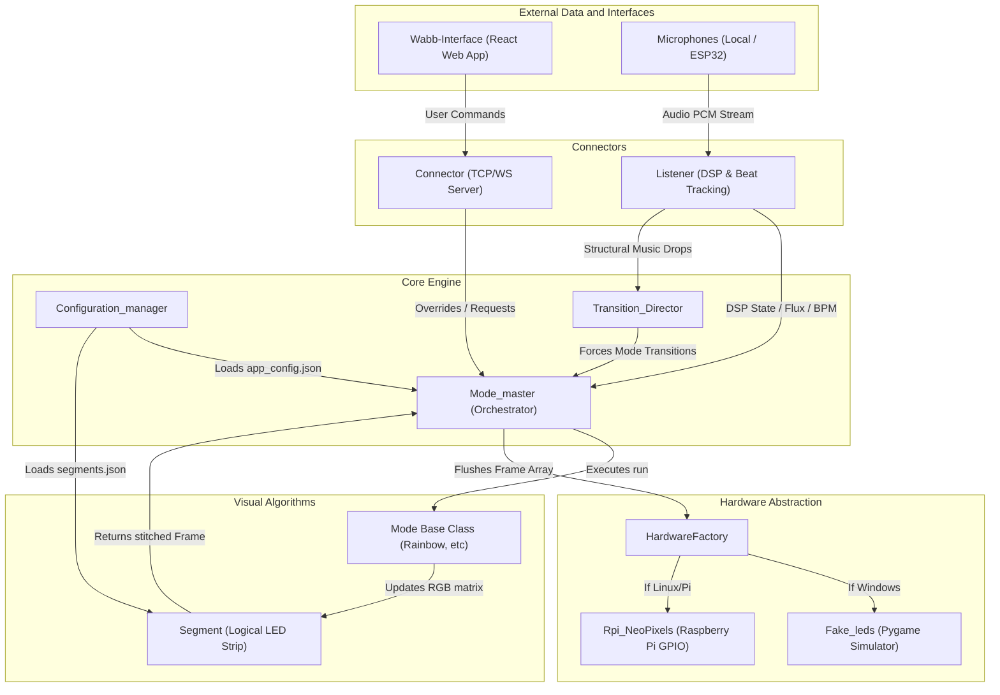

# Vialactée Class Architecture

```mermaid
graph TD
    %% External Inputs
    subgraph Inputs [External Data and Interfaces]
        Wabb["Wabb-Interface (React Web App)"]
        Mic["Microphones (Local / ESP32)"]
    end

    %% Network and Audio Ingestion
    subgraph Connectors [Connectors]
        Conn["Connector (TCP/WS Server)"]
        Listener["Listener (DSP & Beat Tracking)"]
    end

    Wabb -->|User Commands| Conn
    Mic -->|Audio PCM Stream| Listener

    %% Core Processing Engine
    subgraph Core [Core Engine]
        Config["Configuration_manager"]
        ModeMaster["Mode_master (Orchestrator)"]
        TransDir["Transition_Director"]
    end

    Conn -->|Overrides / Requests| ModeMaster
    Listener -->|DSP State / Flux / BPM| ModeMaster
    Listener -->|Structural Music Drops| TransDir
    TransDir -->|Forces Mode Transitions| ModeMaster

    %% Animation and Visuals
    subgraph Visuals [Visual Algorithms]
        Mode["Mode Base Class (Rainbow, etc)"]
        Seg["Segment (Logical LED Strip)"]
    end

    Config -->|Loads app_config.json| ModeMaster
    Config -->|Loads segments.json| Seg

    ModeMaster -->|Executes run| Mode
    Mode -->|Updates RGB matrix| Seg
    Seg -->|Returns stitched Frame| ModeMaster

    %% Hardware Output Layer
    subgraph Hardware [Hardware Abstraction]
        HwFac["HardwareFactory"]
        Fake["Fake_leds (Pygame Simulator)"]
        Rpi["Rpi_NeoPixels (Raspberry Pi GPIO)"]
    end

    ModeMaster -->|Flushes Frame Array| HwFac
    HwFac -->|If Windows| Fake
    HwFac -->|If Linux/Pi| Rpi
```
